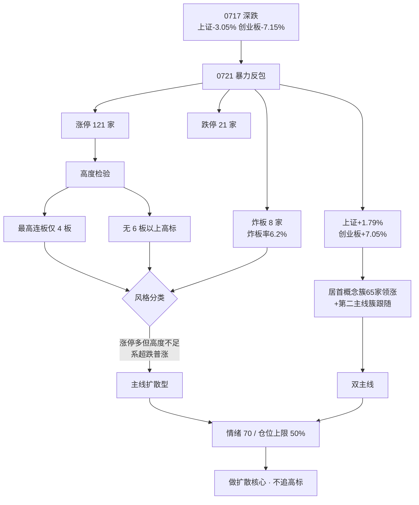

# 2026年7月22日 · **风格研判**

> **数据源新鲜度**: partial 🟡
> **降级状态**: true（global_severity=3 严重降级）
> **置信度**: 0.55

## 一句话结论

超跌反包首日普涨，**主线扩散型 + 情绪 70 + 双主线**，仓位上限 50%，做扩散不追高。

## 详细分析

昨日（0721）盘面是一次**暴力超跌反包**：上证 +1.79% 收 3864、创业板指 +7.05% 收 3686，而前一交易日（0717）两指分别深跌 -3.05% / -7.15%。这是典型的**急跌后 V 型修复**，情绪从冰点快速回补。

从连板结构看，涨停 **121** 家、跌停仅 **21** 家、炸板 **8** 家（炸板率≈6.2%，封板质量极高），但**最高连板只有 4 板**、无 6 板以上情绪高标。涨停家数虽远超"主线扩散型"指导区间（30–50），却是**超跌普涨**而非情绪型高标接力所致——高度不够、梯队以首板为主，因此不归入连板情绪型，而是判为**主线扩散型**。

主线上，居首概念簇单日涨停 **65** 家断层领涨，且其多个分支同步扩散，构成一条**科技大主线**；另有一簇制造/新能源相关板块组成第二主线，故记为**双主线**（近似代理，具体板块名交由 R2 判定）。

情绪面出现**盘面强度与 KOL 表态背离**的关键信号。顶级 KOL 判为"见底日、适合底部布局"，但同时明确警示：强势板块估值泡沫、这波多数票只是**反弹别追前高**、控制仓位**留不到一半**、上证周线若收不上去仍可能**二次探底**。强反弹叠加大佬谨慎，指向"能做但要克制"。

综合给出**仓位上限 50%**：反弹第一天持续性未验证，只做扩散最强主线的核心方向，规避追高标。

## 关键证据

- 证据 1：涨停 121 / 跌停 21 / 炸板 8（炸板率≈6.2%）· 来源 tushare.limit_list_d(20260721)
- 证据 2：最高连板 4 板、无 6 板以上高标、梯队以首板为主 · 来源 tushare.limit_list_d up_stat(20260721)
- 证据 3：上证 +1.79% / 创业板指 +7.05%，前一交易日曾 -3.05% / -7.15% 深跌 · 来源 tushare.index_daily
- 证据 4：最强概念簇涨停 65 家断层第一，多分支扩散 · 来源 tushare.limit_cpt_list(20260721)
- 证据 5：KOL 判"见底日/超跌反弹"但警示估值泡沫、别追前高、控仓留半仓 · 来源 wechat_cli_5groups

## 风格判定链路

## 推理深度三问

**大资金意图**：这是一次**救市资金驱动的超跌修复**而非增量情绪主动进攻。炸板率低至 6.2%、封板质量高，说明有稳定承接盘（KOL 提及救市主力"是钱不是纸钱"、融资盘高峰已过、约 3100 亿融资盘出清）。资金在冰点区域托底吸筹，意图是修复流动性、稳定预期，而非推动新一轮高度赛。

**为什么走强**：短期超跌严重 + 外部相关市场共振（隔夜海外相关指数与科技龙头普涨）催化情绪修复，居首概念簇 65 家涨停是外部映射 + 超跌反弹叠加的结果。

**逻辑够不够硬**：**不够硬**。三点存疑——① 反弹仅第一天，持续性未验证；② 顶级 KOL 明确判"只是反弹、别追前高、缓跌"，与盘面强度背离；③ 领涨概念簇估值泡沫 + 全球产业链同步高位调整的风险未消除。因此定性为"可参与的超跌反弹"，而非"可重仓的主升行情"。

## 数据源审计

| 源 | 状态 | 抓取时间 | 记录数 | 备注 |
|---|---|---|---|---|
| tushare (MCP) limit_list_d | 🟢 ok | 2026-07-22 | 150+ | 涨跌停炸板主源 |
| tushare (MCP) limit_cpt_list | 🟢 ok | 2026-07-22 | 20 | 最强板块代理 |
| tushare (MCP) index_daily | 🟢 ok | 2026-07-22 | - | 上证/创业板 |
| wechat_cli_5groups | 🟢 ok | 2026-07-22 | 578 | KOL 情绪交叉 |
| wechat_official_20 | 🔴 error | - | 0 | 23/23 invalid session |
| weflow_snapshot | 🔴 error | - | 0 | timeout 45s |

## 不确定性 / 反证

- **情绪浓度虚高风险**：涨停 121 家看似火爆，但连板高度仅 4、无高标，普涨多为超跌反弹，真实赚钱效应可能弱于家数暗示。
- **背离信号未消化**：盘面强 vs KOL 谨慎（留半仓等确认），二者若持续背离，倾向以谨慎为准。
- **降级影响判定**：公众号 23/23 全灭 + weflow 超时，情绪面仅单源（5 群），交叉验证不足，置信度压至 0.55。
- **持续性风险**：反弹第一天，若次日分歧走弱应迅速降档至震荡分化型。

## 与其他 R/D/E 的关系

- 依赖：本 skill 为链路起点，仅读本地 raw + tushare/xtick，不依赖其他 R 的 artifact。
- 被消费：`style` / `main_lines_count` / `position_cap_suggestion` → R2、D1；`sentiment_score` → R3 基准；R6 与 R2 一致性反证。

## Sub-Agent 元数据

- skill: analyze_style_v1
- artifact: data/research/20260722/R1_style.json
- 生成耗时: ~90 秒
- model: ark-code-latest
