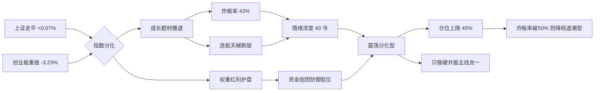

# 2026年7月23日 · **风格研判**

> **数据源新鲜度**: ok
> **降级状态**: false
> **置信度**: 0.75

## 一句话结论

**震荡分化型** · 情绪浓度 **40** · 权重稳而成长杀跌、炸板率偏高，仓位上限 **45%**，只做硬共振主线龙一。

## 详细分析

昨日(基准交易日)市场呈现典型的**震荡分化偏退潮**结构。指数层面严重背离——上证收 `3867.03` 仅微涨 `+0.07%` 走平，而创业板指收 `3566.73` 重挫 `-3.23%`，权重护盘、成长杀跌的分化格局一目了然，这是资金从高位题材撤退、抱团低位与红利防御的信号。

情绪面偏冷。全市场涨停 `47` 家，数量尚可但**炸板率高达 43%**(炸板 `36` / (涨停 `47` + 炸板 `36`))，意味着接近一半的封板资金盘中被打开，承接意愿弱、分歧巨大。连板天梯更是**断层严重**：最高 5 板仅 `1` 只，4 板 `1` 只，3 板 `1` 只，随后直接断到 2 板 `9` 只——高位缺乏连续晋级的领涨梯队，说明市场没有能凝聚人气的"高标龙头"，赚钱效应难以自我强化。

主线维度上，涨停最强板块中 `up_nums≥8` 的有 `7` 个(风电、中报预增、绿色电力、东数西算算力、芯片、数据中心、机器人)，表面看是"三主线以上"，但这些板块昨日 `pct_chg` **全部收绿**(芯片 -1.60%、机器人 -1.51%、数据中心 -0.87% 等)，属于资金退潮而非扩散的假繁荣。真实健康主线数量存疑，须以 R2 硬共振结果为准，R1 不作板块定性。

KOL 情绪同步谨慎。焦点投研群昨夜整体基调是普遍亏损、"应该缩仓"，有观点强调"上证突破 3970 这个盘子才算稳"、并预期本轮回调最低点在 3600 上方(20 月线附近)。文本情绪与量化数据交叉验证——**分歧、防御、等待企稳**是当前主导心态。

综合风格 + 情绪，给出今日总仓上限 **45%**：不满仓、不追高、只在能通过多源硬共振验证的主线里做龙一，且随时准备在炸板率升破 50% 时降档。

## 风格判定链条(推理深度三问)

- **大资金意图**: 权重红利护盘、成长题材撤退，主力在指数点位敏感区(上证逼近前高 3970 未破)选择"稳指数、杀情绪"，用低位防御筹码对冲高位题材风险，对手盘是追高的散户与融资盘(德明利爆仓、剑桥科技跌停等昨日已现)。
- **为什么弱**: 位置上创业板处相对高位遭获利了结；催化上无新增硬政策/硬业绩驱动全市场，仅结构性绿电考核(8月1日)等局部题材；筹码上炸板率 43% + 连板断层，显示高位筹码松动、承接断档，情绪由热转分歧。
- **逻辑够不够硬**: 硬。四个独立源共振——量化(涨停47/炸板43%/连板断层)、指数(上证+0.07% vs 创业板-3.23%)、板块(up_nums≥8 却全绿)、KOL(缩仓/等企稳)一致指向震荡分化偏退潮。可能的证伪路径：若今日创业板企稳反包 + 炸板率回落至 20% 以下 + 出现新高标承接，则需上修至主线扩散型。

## 关键证据

- 证据 1: 涨停 `47` 家 / 跌停 `8` 家 / 炸板 `36` 家，炸板率 `43.4%` · 来源 tushare.limit_list_d
- 证据 2: 连板天梯 5板1只 / 4板1只 / 3板1只 / 2板9只，高位梯队断层 · 来源 tushare.limit_step
- 证据 3: 上证 `+0.07%` 走平 vs 创业板指 `-3.23%` 重挫，权重/成长严重分化 · 来源 tushare.index_daily
- 证据 4: up_nums≥8 板块 7 个但 pct_chg 全部收绿，退潮特征 · 来源 tushare.limit_cpt_list
- 证据 5: 焦点投研群昨夜普遍亏损、"应缩仓"、待上证站稳 3970 · 来源 wechat_cli_5groups(匿名)

## 风格传导示意

## 数据源审计

| 源 | 日期 | 状态 | 备注 |
|---|---|:--:|---|
| tushare.limit_list_d | 2026-07-22 | 🟢 | 涨47/跌8/炸36 · 涨跌停炸板 |
| tushare.limit_step | 2026-07-22 | 🟢 | 12 条 · 连板天梯 |
| tushare.index_daily | 2026-07-22 | 🟢 | 2 条 · 上证/创业板指 |
| tushare.limit_cpt_list | 2026-07-22 | 🟢 | 20 条 · 涨停最强板块 |
| wechat_official_20 | 2026-07-23 | 🟢 | 115 篇 |
| wechat_cli_5groups | 2026-07-23 | 🟢 | 480 条 · 5 焦点群(匿名) |
| agentqmt_qmt | 2026-07-23 | 🔴 | DOWN · R1 不依赖，不影响风格研判 |

## 不确定性 / 反证

风格判定最大不确定性在**主线数量**：limit_cpt_list 呈现 7 条 up_nums≥8 板块，但全部收绿，究竟是"多主线扩散"还是"全面退潮"边界模糊，本 skill 以退潮态谨慎处理并将定性交由 R2 硬共振复核。此外炸板率 43% 已逼近退潮型阈值(50%)，若今日续升即需即时降档；反向若创业板企稳反包则可能被证伪为主线扩散型。R1 仅出风格层，不出板块/个股，具体主线与标的以 R2/R5 为准。

## 与其他 R/D/E 的关系

- 依赖: data/raw/20260723/manifest.json、wechat_cli_5groups.jsonl、wechat_official_20.jsonl、tushare MCP(limit_list_d/limit_step/index_daily/limit_cpt_list)
- 被消费: R2(style + main_lines_count + position_cap_suggestion)、R3(sentiment_score 基准)、R6(与 R2 一致性反证)、D1(position_cap_suggestion → exec_pool 总仓上限)、E1(风格印证复盘)

## Sub-Agent 元数据

- skill: analyze_style_v1
- artifact: data/research/20260723/R1_style.json
- 生成耗时: ~90 秒
- model: ark-code-latest
