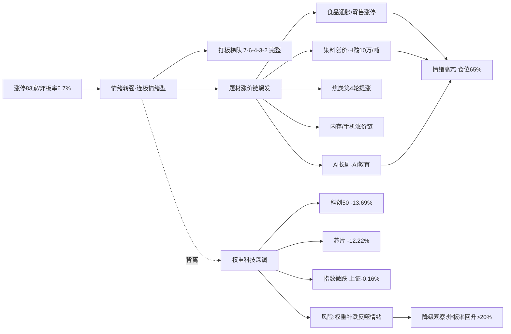

# 九月二日 · 风格研判

> **数据源新鲜度**: ok
> **降级状态**: false
> **置信度**: 70%

## 一句话结论

今日市场为**连板情绪型**：涨停 83 家、连板最高 7 板、炸板率骤降至 6.7%，打板梯队完整、情绪显著转强，建议仓位上限 **65%**，聚焦题材龙头、严控权重科技追高。

---

## 一、情绪的温度：一夜之间，分歧变成了共识

九月一日，市场交出了一份罕见的答卷。八十三只个股封住涨停，**跌停板上一只都没有**，炸板率从前一日的 25.4% 骤降到 6.7%。这是一个质变——前一天还是"有人冲锋、有人撤退"的拉锯战，今天变成了几乎一致的多头共识。

六只炸板意味着什么？意味着今天敢冲板的资金，绝大多数都拿到了结果。打板的人尝到了甜头，观望的人开始眼红。这种"买到就是赚到"的体验，是情绪周期里最珍贵的燃料。

连板天梯上，海鸥住工登上了七板的高度，捷荣技术、万向德农并列六板，往下是四板、三板、二板层层递进。七、六、四、三、二——这个梯队说完整也完整，说健康也健康。它不是一枝独秀的高标孤立，而是有厚度、有层次的接力结构。情绪不是靠一只妖股撑起来的，是靠一整条产业链的赚钱效应撑起来的。

全市场五千五百多只股票，三千三百八十七只上涨，两千零四十只下跌，涨跌比 1.66，中位数涨 0.57%。这是普涨的格局——但请记住，中位数只有 0.57%，而涨停有 103 家（含 20cm 板）。这意味着市场的钱，并没有均匀地洒向每一个角落，而是**高度集中地砸向了少数最热的题材**。

## 二、六簇画像：打板的盛宴，科技的寒冬

把二十二个同花顺风格板块和二十只 ETF 放进六簇聚类，市场的两极分化一目了然。

**极致打板簇**和**高位连板簇**是今天最刺眼的存在。非 ST 三板以上表现 30 日累计暴涨 314.96%，非 ST 二板表现 +118.5%，打二板以上表现 +121.31%。打板表现 +30.68%，打首板表现 +24.9%，高贝塔值 +27.12%。这一串数字说明什么？说明**打板生态正处于亢奋期**，越高位越有人接，越高板越有人买。这是连板情绪型市场的典型画像。

**主流轮动簇**是市场的大本营，36 只标的挤在一起，平均 30 日收益 5.06%。这里面有行业龙头、有宽基指数、有军工医药，不温不火，是市场的底色。

**防御价值簇**里是银行和消费，银行 ETF 30 日 +7.07%，是慢牛型资金的避风港。**资源独立强势簇**里煤炭 ETF +12.67%，与有色 ETF（+13.13%）共同构成涨价链的实体支撑。

最值得注意的是**新高失效簇**——创历史新高指数 30 日 -8.39%，百元股 -3.64%。前一天我们还担心"新高模式失效"，今天这个结论被继续验证。市场的钱不去追新高、不去买百元股，而是全部涌向了打板梯队和涨价题材。这是一种非常"情绪市"的资金偏好：**要的是确定性溢价，不要的是趋势追高**。

而 ETF 的 30 日榜，把"资源强、科技弱"写在了脸上：

| 领涨（30日） | 涨幅 | 领跌（30日） | 跌幅 |
|---|---|---|---|
| 有色ETF | +13.13% | 科创50 | -13.69% |
| 煤炭ETF | +12.67% | 芯片ETF华夏 | -13.45% |
| 银行ETF | +7.07% | 芯片ETF | -12.22% |
| 房地产 | +6.54% | 半导体 | -9.98% |
| 中证1000 | +6.42% | 通信ETF | -5.57% |

## 三、ETF 望远镜：资金用脚投票的方向

如果风格指数是显微镜，ETF 就是望远镜。二十只主流 ETF 的 30 日走势，把资金的真实意图暴露无遗。

领涨的三只，有色、煤炭、银行——清一色的资源与金融。这说明在情绪亢奋的背后，有一批中线资金在悄悄配置周期资源。银行 +7.07% 尤其值得注意，它是"情绪好+防御不崩"的典型组合，说明市场的风险偏好虽然高，但并没有疯狂到抛弃一切防御资产。

领跌的五只，科创50、芯片、半导体、通信——清一色的科技成长。科创50 30 日 -13.69%，芯片 ETF -12.22%，半导体 -9.98%。这是一个极其重要的背离信号：**短线情绪集中在打板题材，但科技权重仍在深调**。

昨天（9月1日）这一天，这种背离被演绎到极致：半导体 -2.65%、芯片 -2.5%、科创50 -2.08%、通信 -1.49%，而与此同时打板系列继续爆发——非 ST 三板以上 +8.51%、非 ST 二板 +5.87%、打二板以上 +4.24%。市场出现了罕见的"指数跌、情绪炸"的极端结构。

## 四、外盘的风声

昨夜的美股，科技股内部剧烈分化。苹果涨 2.61%、Meta 涨 1.08%，但特斯拉跌 3.22%、AMD 跌 2.36%、美光跌 2.64%、康宁跌 2.13%、亚马逊跌 1.87%、英伟达跌 1.51%。标普 500 跌 0.71%，纳指跌 1.03%，恒指跌 0.93%。

这是一个微妙的信号：美股 AI 硬件链（英伟达、AMD、美光）在回调，但消费电子（苹果）和平台软件（Meta）在走强。这和 A 股昨天"科技权重杀跌、消费电子涨价链爆发"的格局，竟然有几分呼应——**钱在从"卖铲子的"切向"用铲子的"**。

恒指跌 0.93% 对 A 股是一个温和的压制信号，但韩国涨 0.23%、日经跌 0.15%，亚太整体平稳。人民币汇率和商品期货数据缺失（源 down），是一个小遗憾。

对 A 股而言，外盘的含义是：**科技权重短期缺乏外援**，但涨价链、题材方向相对独立。内存涨价链、华为手机涨价链甚至能与美股的消费电子走强形成共振。

## 五、KOL 的温度：题材狂欢，大佬谨慎

题材群昨天的热度几乎是沸腾的。AI 长剧《后西游记》在芒果 TV 上线，制作成本比真人剧低 80%，10 月将迎来加速期；AI 教育（竞业达三连板、新开普）、AI4S（国资委特训班）持续发酵；食品通胀（日本九月 4531 种商品涨价、零售批量涨停）、染料涨价（H 酸涨到 10 万/吨、亚邦/安诺其）、焦炭第四轮提涨、内存涨价、华为手机集体涨价带动旧机回收暴涨（百邦科技/普路通/星星科技/道明光学）……题材多到数不过来。

但注意，最资深的声音却很谨慎。颜晓滨在晚间反复强调："硬件分化""难度增大""反转形态还没出现""真正的大牛股必须是会反转的"。他还点出：**需要中际旭创和宇树科技企稳，科技才有起色**。

这是一个很重要的分歧信号：题材群的热度来自中短线游资，而资深 KOL 对科技硬件的判断是"分化、谨慎"。盘面 83 家涨停的狂热，和"反转形态还没出现"的冷静，形成了鲜明的对照。这正是我在风格判定里强调的——**情绪强，但结构不健康，指数与情绪背离**。

## 六、风格判定：连板情绪型

综合所有维度，我把今日市场判定为**连板情绪型**。

判据三条全部命中：连板高度 7 板（≥6）✅，涨停 83 家（≥50）✅，炸板率 6.7%（<20%）✅。打板系列 30 日收益极端（非 ST 三板以上 +314.96%），说明打板生态正处于亢奋期。这不是普通的情绪回暖，而是**打板赚钱效应全面兑现的情绪高潮**。

为什么情绪浓度只给 78 而不是更高？因为结构有瑕疵：上证微跌、科创50 大跌 2.19%，权重科技与题材热度背离；颜晓滨 KOL 明确谨慎；美股 AI 硬件链回调。情绪高涨是真，但**这种高涨建立在小票和题材之上，基础并不牢靠**。

仓位上限建议 65%。这是一个进可攻退可守的位置：打板情绪还在，可以积极参与题材龙头；但权重科技的拖累、外盘的压制、KOL 的谨慎，都不支持满仓豪赌。留出 35% 的缓冲，是为了应对随时可能到来的高低切换。

## 七、关键证据

- **涨停数据**: 涨停 83 / 跌停 0 / 炸板 6 / 炸板率 6.7%（前一日 25.4%）· 来源 tushare.limit_list_d
- **连板结构**: 最高 7 板（海鸥住工），6 板 2 只，4 板 1 只，3 板 5 只，2 板 9 只 · 来源 tushare.limit_step
- **大盘表现**: 上证 -0.16%、创业板 -1.32%、科创50 -2.19%；全市场 3387 涨/2040 跌，中位 +0.57% · 来源 tushare.index_daily + tushare.daily
- **风格聚类**: 极致打板簇（非ST三板以上 30日 +314.96%）vs 新高失效簇（创历史新高 -8.39%）· 来源 tushare.ths_daily
- **ETF 分化**: 有色 +13.13%/煤炭 +12.67%/银行 +7.07% vs 科创50 -13.69%/芯片 -12.22% · 来源 tushare.fund_daily
- **外盘**: 标普 -0.71%、纳指 -1.03%；苹果 +2.61% vs 特斯拉 -3.22%/美光 -2.64% · 来源 tushare.index_global + us_daily
- **KOL**: 颜晓滨"硬件分化/反转形态还没出现"；题材群 AI长剧/食品通胀/染料/焦炭/内存涨价热炒 · 来源 wechat_cli_5groups

## 八、风险与不确定性

**最大的风险是指数与情绪的背离**。上证微跌、科创50 大跌 2.19%，如果权重科技继续补跌，这种"指数跌、情绪炸"的结构随时可能反噬——历史上这样的结构往往持续不了太久，要么情绪把指数带起来，要么指数把情绪拖下去。

**第二个风险是打板高标的位置**。非 ST 三板以上 30 日已经 +315%，这种极致的赚钱效应意味着高位筹码极度拥挤，随时可能迎来高低切换。一旦高标断板，整个梯队都可能连锁退潮。

**第三个风险是外盘传导**。美股 AI 硬件链（英伟达、AMD、美光）持续回调，恒指也走弱，A 股科技权重短期缺乏外援。

**第四个风险是涨价链的脆弱性**。食品、染料、焦炭、内存的涨价依赖商品价格，一旦期货/现货回调，题材会快速退潮。

**第五个风险是 KOL 分歧**。颜晓滨的谨慎表态与盘面的狂热背离，这种"群众狂欢、大佬观望"的格局，历史上常是情绪见顶的前兆，需要高度警惕。

**观察指标**：若上午炸板率回升到 20% 以上，说明打板赚钱效应衰减，情绪将快速从连板情绪型降级到主线扩散型甚至震荡分化型；若科创50 等权重止跌企稳并与题材共振上行，则是情绪延续的最强信号。

## 九、与其他 R/D/E 的关系

- **上游依赖**: 无（R1 是研究链路起点，仅依赖原始数据 + style_snapshot）
- **下游消费**:
  - R2（主线板块）: 消费 style / main_lines_count / position_cap_suggestion
  - R3（情绪热度）: 消费 sentiment_score 作为基准
  - R6（反证）: 与 R2 做一致性反证
  - D1（主决策）: 消费 position_cap_suggestion → 执行池总仓上限

## 数据源审计

| 源 | 日期 | 状态 | 备注 |
|---|---|:--:|---|
| tushare/ths_daily | 2026-09-01 | 🟢 | 22 风格板块 · 30日窗口 |
| tushare/fund_daily | 2026-09-01 | 🟢 | 20 ETF · 30日窗口 |
| tushare/limit_list_d | 2026-09-01 | 🟢 | 89 条 · 涨停83/跌停0/炸板6 |
| tushare/limit_step | 2026-09-01 | 🟢 | 18 条 · 连板天梯 |
| tushare/index_daily | 2026-09-01 | 🟢 | 上证/创业板/沪深300/科创50/中证500/1000 |
| tushare/daily | 2026-09-01 | 🟢 | 5546 只 · 全市场分布 |
| tushare/index_global + us_daily | 2026-09-01 | 🟢 | 5 指数 + 14 美股 |
| wechat_cli_5groups | 2026-09-01 | 🟢 | 497 条 · 5 焦点群（匿名） |
| weflow_analytics | — | 🔴 | DOWN · ngrok 离线 |
| fx (USDCNH/DXY) | — | 🔴 | 缺失 · 源 down |
| SOX/HSTECH | — | 🔴 | 无数据 |

## 不确定性 / 反证

- **指数与情绪背离的可持续性存疑**：83 家涨停但上证微跌、科创50 大跌，这种结构历史上较脆弱，可能是情绪顶部信号而非起点。
- **KOL 分歧未计入高分**：颜晓滨"反转形态还没出现"的谨慎，与盘面狂热背离，若他判断正确，情绪浓度 78 可能高估了。
- **打板高标的统计幸存者偏差**：非 ST 三板以上 30 日 +315% 是极度右偏的分布，个别妖股拉高了整体，不代表平均打板收益。
- **缺 fx/商品数据**：无法验证汇率与大宗商品对资源链的支撑。
- **风格聚类为近似代理**：板块聚类基于收益序列相关性，非 R2 的真实主线判定。

## Sub-Agent 元数据

- skill: analyze_style_v1
- artifact: data/research/20260902/R1_style.json
- 生成耗时: 约 6 分钟
- model: deepseek-v4-flash-260425
- 聚类方法: K-means/层次聚类 6簇 · 相关距离 · 特征=30日收益序列
- 覆盖: 22 同花顺风格板块 + 20 ETF + 5 外盘指数 + 14 美股
