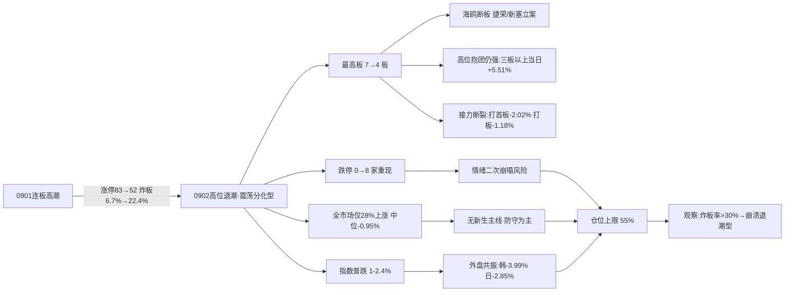

# 九月三日 · 风格研判

> **数据源新鲜度**: ok
> **降级状态**: false
> **置信度**: 70%

## 一句话结论

昨日（9月2日）市场进入**震荡分化型**（高位退潮期）：涨停从 83 家收缩到 52 家、炸板率从 6.7% 飙升至 22.4%、跌停板重现 8 家、最高连板从 7 板塌至 4 板、全市场仅 28% 个股上涨、指数普跌 1–2.4%。建议仓位上限 **55%**，防守为主、严禁追高、等待低位新方向。

---

## 一、情绪的温度：一夜之间，高潮变成了退潮

如果你只看昨天（9月1日）的盘面，你会以为这是一个打板的黄金时代——83 家涨停、炸板率 6.7%、七板高标、梯队完整。但今天（9月2日）的市场，用最直白的方式告诉所有人：**那场高潮正在退去**。

涨停家数从 83 收缩到 52，缩水近四成；炸板的家数从 6 只扩大到 15 只，炸板率从 6.7% 一跃到 22.4%——这个数字已经越过了我们一直盯着的 20% 警戒线。更刺眼的是，跌停板出现了，8 家非 ST 个股封死跌停，全市场口径下更是有 13 只。而昨天，跌停板上一只都没有。

连板天梯是情绪最诚实的温度计。昨天还是"7 板海鸥住工、6 板捷荣技术/万向德农"的完整梯队，今天海鸥住工直接断板，捷荣技术、新塞等高位票接连被立案调查。最高高度从 7 板塌到了 4 板——只剩竞业达、国芳集团两只 4 板票勉力支撑，往下是 3 板 4 只、2 板 8 只。梯队还在，但**顶部已经空了，接力明显断裂**。

全市场五千五百多只股票，只有一千五百四十一只上涨，三千九百零一只下跌，涨跌比从昨天的 1.66 直接倒挂到 0.39，中位数跌了 0.95%。宽基指数全线飘绿：上证 -0.97%、深成 -1.88%、创业板 -2.39%、科创50 -1.82%、沪深300 -1.38%。这不是普跌中的分化，而是**几乎没有抵抗的退潮日**。

## 二、六簇画像：高位的抱团，中低位的断裂

把二十二个同花顺风格板块和二十只 ETF 放进六簇聚类，退潮的结构看得一清二楚——**钱没有离场，但全部缩到了最高的那几层**。

极致打板簇和高位连板簇依然是全场最扎眼的存在：非 ST 三板以上表现 30 日累计 +305.78%，非 ST 二板 +115.21%，打二板以上 +109.21%。更值得注意的是，在指数普跌、全市场只有 28% 个股上涨的这一天，这两簇**当天还在逆势收红**——非 ST 三板以上当天 +5.51%，非 ST 二板 +3.52%。高位股抱团抱得死死的，跌不下来。

但抱团之外的接力层，已经明显断裂。主流轮动簇（36 只标的，市场的绝对大本营）当天平均 -1.22%；打首板表现 30 日还有 +21.13%，当天却跌了 2.02%；打板表现当天 -1.18%、高贝塔值 -1.24%。**打首板的人今天接的是飞刀**——这恰恰是退潮期最典型的信号：顶部的妖股还在涨停，但中低位的接力资金已经不敢下手了。

防御价值簇里，银行 ETF 30 日 +5.61% 继续充当慢牛资金的避风港；资源独立簇的煤炭 ETF +6.45%，但当天已经跌了 2.91%——资源方向也在退潮边缘。新高失效簇的创历史新高指数 30 日 -3.6%，趋势追高模式继续失效。

## 三、ETF 望远镜：罕见的"全场皆绿"

如果说昨天是"资源强、科技弱"的分化，今天就是分化暂时让位于**普跌**。二十只主流 ETF 里，昨天只有军工一只微涨 0.09%，其余全线收跌。煤炭 -2.91%、有色 -2.53%、新能源 -2.29%、通信 -2.12%，无一幸免。

三十日窗口看，结构依旧清晰：有色 +6.66%、中证1000 +6.45%、煤炭 +6.45%、银行 +5.61%、军工 +5.43% 领涨；芯片ETF华夏 -14.57%、芯片ETF -14.15%、科创50 -12.63%、半导体 -12.34% 领跌。**科技权重三十日深调超过 12%，是全场最大的失血点**，而这个方向恰好是颜晓滨群昨天反复警告"只有反弹没有反转"的板块。

## 四、外盘的风声：亚太的风险信号

这一夜的外盘，给 A 股退潮又补了一刀。9 月 2 日亚太市场集体风险释放：韩国综合指数暴跌 3.99%，日经 225 跌 2.85%，恒指微跌 0.07% 但五日累计 -1.34%。此前一周的相对平静被打破，亚太风险偏好明显收缩。

美股（9 月 1 日收盘）科技内部继续分化，且 AI 硬件链的弱势在五日尺度上更加刺眼：AMD 当日 -2.36%、五日 -4.09%；迈威尔当日 -0.6%、五日 -12.47%（深调）；谷歌五日 -3.45%；特斯拉当日 -3.22%。而苹果 +2.61%（五日 +4.92%）、Meta +1.08%、英伟达 -1.51%（五日反而 +2.07%）相对抗跌。**卖铲子的在退、买铲子的在稳**——美股 AI 算力链的内部撕裂，与 A 股科技权重的三十日深调互为镜像。

对 A 股而言，外盘含义清晰：亚太风险释放 + 美股 AI 硬件链弱势，双重压制 A 股风险偏好与科技权重。退潮中的 A 股，今天缺少任何外援。

## 五、KOL 的温度：大佬集体转向谨慎

如果说昨天是"题材狂欢、大佬谨慎"，今天就是**大佬与题材一起降温**。

最重量级的信号来自顶级打板手：昨晚他直接宣布"**明天我不开仓**"，并补了一句"高位可能要杀一杀"。海鸥断板、捷荣立案、新塞立案——这些高标事件让他选择空仓等待。这是比任何技术指标都直接的退潮确认。

颜晓滨群的晚间讨论更冷。有成员转发中际旭创的十大股东变动：知名游资章建平已从十大股东名单消失，中际旭创从高点回撤 42%。颜晓滨本人重申："我 6 月底系统提醒 AI 硬件雪崩后持续说该板块只有反弹没有反转！"Jason 则给出操作指引："不要追高，做左侧交易，多调研吃透，大资金托底，等风来""追高的人迟早爆仓"。群里也有人开始试探"机会来了吗""到位置了"——这是左侧抄底心态的萌芽，但远未形成共识。

题材群并没有死寂，只是换了一批更"新"的脉冲：戴尔 AI 服务器订单 950 亿美元超预期、特斯拉 Cybercab 今日（9 月 3 日）发布 + Optimus 量产、地热题材涨停潮（10cm/20cm/30cm 集体封板）、智谱开网店卖 token、华为 Mate90 钛合金渲染流出、英伟达 CPC 铜共封装量产。**但这些都更像是事件驱动的脉冲，而不是能撑起仓位的主线**——在退潮日里，新题材的首日脉冲恰恰最容易变成第二天的炸板。

## 六、风格判定：震荡分化型（退潮期）

综合所有维度，我把今日市场判定为**震荡分化型**——更准确地说，是高位退潮期的震荡分化。

为什么不是连板情绪型？判据第一条就过不去：连板高度只有 4 板，远低于 6 板的门槛。昨天 83 家涨停的余温还在，但**连板高度优先于涨停家数**——高度塌了，情绪型就不成立。

为什么不是主线扩散型？涨停 52 家勉强够到区间上沿，连板高度 4 板也在 3–5 的区间内，但"有明确梯队 + 大盘趋势健康"这两条全不满足：炸板率 22.4% 超过 20% 警戒线、跌停 8 家重现、全市场仅 28% 上涨、指数普跌 1–2.4%。**大盘趋势不健康，扩散就无从谈起。**

为什么不是崩溃退潮型？跌停只有 8 家（不算多）、炸板率 22.4%（远低于 50%）、大盘下跌 1–2.4%（是回调不是崩盘）。退潮是真的，但还没有退到崩溃的烈度——这正是退潮中继与退潮末端的区别。

情绪浓度我给 46 分（中性偏弱、恐惧边缘）：涨停强度 55、连板结构 48、炸板健康度 45、指数表现 35，四维加权后四舍五入到 46。五维法校验约 40 分，差 6 分，在允许的 15 分以内，判定一致。

仓位上限建议 **55%**。昨天还是 65% 的积极进攻位，今天必须收回来。理由很简单：高位补跌风险（三板以上 30 日 +305% 的极致拥挤）、炸板率站上警戒线、顶级打板手空仓观望、外盘亚太风险释放——**四条退潮信号叠加，现金比仓位更值钱**。保留 55% 的仓位空间，是为了给真正走出低位的新主线留足弹药。

## 七、关键证据

- **涨停数据**: 涨停 52 / 跌停 8 / 炸板 15 / 炸板率 22.4%（前一日 83/0/6/6.7%）· 来源 tushare.limit_list_d
- **连板结构**: 最高 4 板（竞业达/国芳集团），3 板 4 只，2 板 8 只；前一日 7 板海鸥断板、6 板捷荣/新塞立案 · 来源 tushare.limit_step
- **大盘表现**: 上证 -0.97%、创业板 -2.39%、科创50 -1.82%；全市场 1541 涨/3901 跌、涨跌比 0.39、中位 -0.95% · 来源 tushare.index_daily + tushare.daily
- **风格聚类**: 极致打板簇（非ST三板以上 30日 +305.78%、当日 +5.51）vs 主流轮动簇（当日 -1.22%）、新高失效簇（创历史新高 -3.6%）· 来源 tushare.ths_daily
- **ETF 分化**: 有色 +6.66%/中证1000 +6.45%/煤炭 +6.45% vs 芯片ETF华夏 -14.57%/科创50 -12.63%；当日 20 只 ETF 仅军工收红 · 来源 tushare.fund_daily
- **外盘**: 0902 韩国 -3.99%/日经 -2.85%；美股 0901 标普 -0.71%、纳指 -1.03%，AMD 五日 -4.09%/迈威尔五日 -12.47% · 来源 tushare.index_global + us_daily
- **KOL**: 颜晓滨"AI硬件只有反弹没有反转"、章建平清仓中际旭创；顶级打板手"明天我不开仓"；题材群转炒戴尔AI服务器/Cybercab/地热/智谱token/华为Mate90 · 来源 wechat_cli_5groups

## 八、风险与不确定性

**最大的风险是高位补跌**。非 ST 三板以上 30 日 +305%、二板 +115%，极致赚钱效应背后是极致的筹码拥挤。海鸥断板、捷荣立案已经是前奏——一旦高位股集体杀跌，退潮将从"缓慢收缩"变成"加速出清"。

**第二个风险是炸板率继续上行**。22.4% 已经越过 20% 警戒线，若今日炸板率升到 30% 以上，风格将直接下探崩溃退潮型，届时 55% 的仓位上限还要再降。

**第三个风险是外盘共振**。韩国 -3.99%、日经 -2.85% 的亚太风险释放若延续，加上美股 AI 硬件链（AMD 五日 -4%、迈威尔五日 -12%）的弱势，会进一步压制 A 股科技权重，拖累情绪修复。

**第四个风险是 KOL 空仓的一致性**。顶级打板手宣布不开仓，意味着短线最敏锐的钱在离场观望。历史经验里，"最懂盘的人不玩了"往往是退潮中继最可靠的信号。

**第五个风险是新题材脉冲的陷阱**。地热、事件驱动等新题材在退潮日首日脉冲最容易演变成次日的炸板——追新题材的散户，恰恰是退潮期最容易被收割的一批。

**观察指标**：炸板率若降至 15% 以下 + 指数止跌 + 出现 5 板以上新高度，是情绪修复的强信号；反之炸板率持续上行 + 高标补跌，则是退潮加速，需进一步降仓。

## 九、与其他 R/D/E 的关系

- **上游依赖**: 无（R1 是研究链路起点，仅依赖原始数据 + style_snapshot）
- **下游消费**:
  - R2（主线板块）: 消费 style / main_lines_count / position_cap_suggestion
  - R3（情绪热度）: 消费 sentiment_score 作为基准
  - R6（反证）: 与 R2 做一致性反证
  - D1（主决策）: 消费 position_cap_suggestion → 执行池总仓上限

## 数据源审计

| 源 | 日期 | 状态 | 备注 |
|---|---|:--:|---|
| tushare/ths_daily | 2026-09-02 | 🟢 | 22 风格板块 · 30日窗口 |
| tushare/fund_daily | 2026-09-02 | 🟢 | 20 ETF · 30日窗口 |
| tushare/limit_list_d | 2026-09-02 | 🟢 | 75 条 · 涨停52/跌停8/炸板15 |
| tushare/limit_step | 2026-09-02 | 🟢 | 14 条 · 连板天梯（最高4板） |
| tushare/index_daily | 2026-09-02 | 🟢 | 上证/深成/创业板/科创50/沪深300/中证500/1000 |
| tushare/daily | 2026-09-02 | 🟢 | 5547 只 · 全市场分布 |
| tushare/index_global + us_daily | 2026-09-01/02 | 🟢 | 5 指数 + 14 美股 |
| wechat_cli_5groups | 2026-09-02 | 🟢 | 436 条 · 5 焦点群（匿名） |
| weflow_analytics | — | 🔴 | DOWN · ngrok 离线 |
| 公众号 (sanji) | — | ⚪ | disabled（用户 08-20 取消） |
| fx (USDCNH/DXY) | — | 🔴 | 缺失 · 源 down |
| SOX/HSTECH | — | 🔴 | 无数据 |

## 不确定性 / 反证

- **退潮定性的强度存疑**：涨停 52 家并不算太少、高位板当日还逆势收红，若今天情绪超预期修复（炸板率快速回落、出现新高度），"震荡分化型"的判定会被打脸——这是最需要警惕的反证。
- **情绪浓度 46 可能低估了高位抱团的韧性**：非ST三板以上当日 +5.51%，说明顶级妖股资金仍在抱团，若高标继续走强带动情绪回暖，46 分可能偏保守。
- **KOL 情绪的单一性**：顶级打板手"不开仓"是个体决策，可能只代表个人风格而非群体共识；颜晓滨对科技硬件的一贯看空也需要警惕"一直看空总有对的一天"的幸存者偏差。
- **缺 fx/商品数据**：无法验证汇率与大宗商品对资源链的支撑，也无法判断亚太风险释放是否与汇率异动相关。
- **风格聚类为近似代理**：板块聚类基于收益序列相关性，非 R2 的真实主线判定。

## Sub-Agent 元数据

- skill: analyze_style_v1
- artifact: data/research/20260903/R1_style.json
- 生成耗时: 约 6 分钟
- model: deepseek-v4-flash-260425
- 聚类方法: K-means/层次聚类 6簇 · 相关距离 · 特征=30日收益序列
- 覆盖: 22 同花顺风格板块 + 20 ETF + 5 外盘指数 + 14 美股
