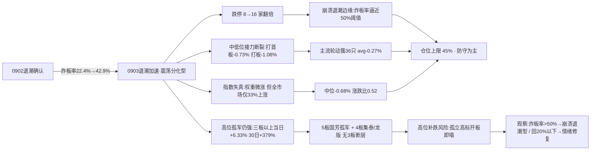

# 九月四日 · 风格研判

> **数据源新鲜度**: ok
> **降级状态**: false
> **置信度**: 75%

## 一句话结论

昨日（9月3日）市场进入**震荡分化型·退潮加速期**：炸板率从 22.4% 一夜飙升到 **42.9%**（近翻倍）、跌停从 8 家翻倍到 **16 家**、中低位接力彻底断裂，仅剩高位孤军抱团与低位防御修复两条细线。建议仓位上限 **45%**，防守为主、严禁追高、等待退潮出清后的新方向。

---

## 一、情绪的裂痕：炸板率一夜之间近翻倍

昨天的市场，用一句话概括：**指数被权重护住了，但情绪在高位裂开了**。

先看最诚实的温度计——炸板率。涨停从 52 家收缩到 44 家，跌停从 8 家翻倍到 16 家，而**炸板的家数从 15 只暴增到 33 只，炸板率从 22.4% 一口气冲到 42.9%**。这个数字意味着什么？意味着昨天每 10 只冲击涨停的股票里，有 4 只以上没能封住、冲高回落。42.9% 已经远远越过 20% 的警戒线，甚至逼近 50% 的崩溃阈值。这不是退潮的"缓慢收缩"，而是**退潮的加速**。

连板天梯更说明问题。最高板是 5 板的国芳集团（从 4 板顶上来的孤军），往下是 4 板的集泰股份、龙版传媒——然后，**没有 3 板了，直接断层到 2 板的六只**。昨天还有"4板+3板+2板"的相对完整梯队，今天的中段彻底空了。高位只剩几个孤胆英雄，中低位的接力资金已经全体收手。

最刺眼的对比在这里：指数全部翻红或走平——上证 +0.02%、深成 +0.10%、创业板 +0.01%、中证500 +0.34%——但全市场 5549 只股票里，只有 1846 只上涨、3570 只下跌，涨跌比 0.52，中位数跌了 0.68%。**权重蓝筹的护盘掩盖了 2/3 个股在跌的事实**。这是典型的"指数失真日"：大盘看起来没跌，但市场的真实体温是冷的。

## 二、六簇画像：高位的孤岛，中低位的废墟

把二十二个同花顺风格板块和二十只 ETF 放进 30 日窗口的六簇聚类，退潮加速的结构跃然纸上——**钱没有离场，而是全部缩到最高的那一座孤岛上**。

极致打板簇依然全场最刺眼：非 ST 三板以上表现 30 日累计 **+379.35%**，而且在炸板率 42.9% 的这一天，它当天还逆势大涨 **+6.33%**。高位连板簇（非 ST 二板 +105.09%）当日也基本走平（-0.95%）。打二板以上当日 +1.59%、30 日 +99.75%——**高位妖股的抱团是唯一还在赚钱的地方**。

但孤岛之外全是废墟。主流轮动簇（36 只标的，市场大本营）当日平均 -0.27%；打首板 -0.73%、打板表现 -1.08%、高贝塔 -0.35%——**中低位的接力资金彻底断裂**。更扎眼的是几个"聪明钱"proxy：昨日资金前十 30 日 -14.93%、昨日成交前十 -14.04%、深股通成交前十 -11.35%、沪股通成交前十 -8.42%——**成交额最大、资金最活跃的票，30 日在集体失血**。新高失效簇的创历史新高指数 30 日 -4.88%，趋势追高模式继续失效。

防御价值簇（银行 +4.59% / 消费 -0.74%）与资源独立簇（煤炭 +5.0%）成为仅有的两个温和正收益区域——这就是退潮期的典型避风港。

**大资金意图**：高位孤军的 +6.33% 与中低位断层的 -0.3%~-1% 形成极端分化，大资金没有离场，但只敢在最确定的几只妖股上做最后的抱团，对中低位一律回避。

**为什么走强**：国芳集团顶到 5 板、非 ST 三板以上当日 +6.33%，靠的是退潮期"缩量抱团妖股"的极致逻辑——增量资金不足时，存量资金反而更集中于最高标。

**逻辑够不够硬**：不够。这种孤立高标的抱团本质是筹码锁定而非产业逻辑，一旦 5 板高标开板补跌，孤岛会瞬间塌成废墟。

## 三、ETF 望远镜：低位修复，科技深调

三十日窗口看，结构与昨日几乎同构，只是幅度更大：中证1000 +5.88%、房地产 +5.09%、有色 +4.98%、银行 +4.59%、军工 +3.53% 领涨；芯片ETF华夏 **-11.67%**、芯片ETF -11.08%、科创50 -9.79%、半导体 -9.23%、恒生科技 -5.02% 领跌。**科技权重三十日深调 9-12%，是全场最大的失血点**，且科创50/芯片的跌幅较昨日继续扩大——科技不只没有反转，还在阴跌。

但 9 月 3 日当天出现了一丝结构变化：**低位方向开始修复**。有色 +1.43%、证券 +0.73%、房地产 +0.66%、医药 +0.53% 逆势收红，而科技 ETF 也只是小幅企稳（-0.3%~-0.7%）。这与群聊里"黄金、石油涨，大佬达成共识，资源类开启上涨之旅"的讨论互相印证——**退潮期里，资金在往低位防御和资源方向试探，而不是回到科技高位**。

## 四、外盘的风：温和，但滞后

外盘比昨日温和得多。美股 9 月 2 日收盘标普 +0.46%、纳指 +0.45%，企稳反弹；亚太 9 月 3 日止跌——韩国 +0.26%、日经 -0.17%（前一日大跌 3.99%/2.85% 后稳住），恒指 -0.39%。

美股 AI 硬件链内部继续分化：英伟达 +3.21%（5 日 +7.05%）、美光 +2.43%、Meta +2.47% 转强；但 AMD 5 日 -4.97%、迈威尔 5 日 **-15.76%**、康宁 5 日 -5.66% 深调。**算力龙头在回血，边缘硬件标的还在失血**——这与 A 股"高位孤军强、中低位弱"的格局互为镜像。

需要注意一个数据盲区：tushare 美股数据停在 9 月 2 日收盘，9 月 3 日的特斯拉 Cybercab 发布、美股大涨 7%，目前只有群聊单源信息，未经行情源确认。外盘对 A 股今天的影响，更多是情绪底色而非决定性变量——**A 股内部的退潮加速才是主要矛盾**。

## 五、KOL 的温度：大佬防御，题材脉冲

颜晓滨核心群昨夜的温度是"谨慎 + 防御"。Jason 直言"**不好做呀，慢慢来，价值投资**"，对太龙股份的判断是"明天低开再洗洗，散户该清的都清了"；zZ 明确"**科技难度很大，即使后面有第二波，现在也都在调整阶段**"；小李一句"还是银行吧，真存储"道出了防御共识；散户 Monica 则在质问"科技真的死了吗，天天只跌不涨"。唯一的方向性共识来自张清："黄金、石油涨，大佬达成共识，资源类开启上涨之旅"——**防御/资源成为大佬的集体转向**。

题材群并没有死寂，反而异常活跃，只是换了一批更"新"的脉冲：**液冷**（台积电官宣微通道散热、硅油液冷、申菱环境亚马逊订单 35-40 亿）、**OCS 光交换**（国金通信称行业 TAM 超预期上修 3-4 倍"有望奔新高"、英伟达入局）、**华为 Mate90 韬芯片**（先进封装/整机代工）、**AI 军工**（日本军备预算创新高）、**涨价链**（磷化铟停产、丙烯腈年内 +63% 碳纤维、铬盐、日酸）、**特斯拉 Cybercab**（美股大涨 7%）。

但请记住退潮期的铁律：**大佬谨慎 + 题材脉冲活跃 = 最危险的组合**。这些脉冲在退潮日的第一天往往不是机会，而是第二天炸板的种子。没有大资金共振的事件驱动，在 42.9% 炸板率的市场里，追进去就是接飞刀。

## 六、风格判定：震荡分化型（退潮加速期）

综合所有维度，今日判定为**震荡分化型**——更准确地说，是**退潮加速期的震荡分化**，已在崩溃边缘。

为什么不是连板情绪型？连板高度 5 板未达 6 板门槛，炸板率 42.9% 更是远超 20% 的硬指标——两条判据全不满足。

为什么不是主线扩散型？涨停 44 家、高度 5 板看似在区间，但"有明确梯队 + 大盘趋势健康"彻底不成立：**无 3 板断层、炸板率 42.9%、跌停 16 家翻倍、全市场仅 33% 上涨**。扩散需要健康的中段，而中段已经断了。

为什么不是崩溃退潮型？硬阈值还差一线：炸板率 42.9% 未到 50%、大盘指数未明显下跌（权重护盘微涨）。但必须诚实标注：**这是三者里最接近崩溃的一次**——炸板率已从昨日的加速线 30% 一路逼近崩溃线 50%，跌停翻倍。若今日炸板率继续上行，风格判定将立即下探崩溃退潮型。

情绪浓度我给 **35 分**（恐惧区间下沿）：涨停强度 40、连板结构 45、炸板健康度 15（42.9% 的炸板率几乎把这一维打穿）、指数表现 40，四维加权得 35。五维法校验约 33 分，差 2 分，判定一致。比起昨天的 46 分，情绪再度下探 11 分——这不是温和降温，是明显恶化。

仓位上限建议 **45%**。昨天 55% 已经是防守位，今天必须再退一步。理由：炸板率近翻倍、跌停翻倍、中低位接力断裂、高位孤立抱团随时补跌、KOL 集体转防御——**五条退潮加速信号叠加，现金比任何仓位都更值钱**。保留 45% 是为了给退潮彻底出清后的新主线留足弹药，而不是为了今天去接刀。

## 七、关键证据

- **涨停数据**: 涨停 44 / 跌停 16 / 炸板 33 / 炸板率 42.9%（前一日 52/8/15/22.4%）· 来源 tushare.limit_list_d
- **连板结构**: 最高 5 板（国芳集团），4 板 2 只（集泰/龙版），**无 3 板断层**，2 板 6 只 · 来源 tushare.limit_step
- **大盘表现**: 上证 +0.02%、创业板 +0.01%、中证500 +0.34%（权重护盘）；全市场 1846 涨/3570 跌、涨跌比 0.52、中位 -0.68% · 来源 tushare.index_daily + tushare.daily
- **风格聚类**: 极致打板簇（非ST三板以上 30日 +379.35%、当日 +6.33%）vs 主流轮动簇 36 只（当日 -0.27%）、资金/成交前十 30日 -14%~-15%、新高失效簇 -4.88% · 来源 tushare.ths_daily
- **ETF 分化**: 中证1000 +5.88%/有色 +4.98%/银行 +4.59% vs 芯片ETF华夏 -11.67%/科创50 -9.79%；当日有色 +1.43%/证券 +0.73% 领涨 · 来源 tushare.fund_daily
- **外盘**: 美股 0902 标普 +0.46%/纳指 +0.45%；英伟达 5日 +7.05% vs 迈威尔 5日 -15.76%；亚太 0903 止跌（韩 +0.26%/日 -0.17%）· 来源 tushare.index_global + us_daily
- **KOL**: Jason"慢慢来价值投资"、zZ"科技难度很大"、张清"黄金石油资源上涨之旅"；题材群炒液冷/OCS/华为Mate90/涨价链/Cybercab · 来源 wechat_cli_5groups

## 八、风险与不确定性

**最大的风险是崩溃退潮的边缘化**。炸板率 42.9% 距 50% 崩溃线一步之遥，跌停已翻倍。若今日炸板率继续上行、指数也顶不住权重护盘开始补跌，风格将直接下探崩溃退潮型，45% 的仓位上限还要再降。

**第二个风险是高位孤军的补跌**。非 ST 三板以上 30 日 +379% 的极致拥挤，5 板国芳是全场唯一的高标。退潮期孤立高标的抱团本质是筹码游戏，一旦开板就是踩踏——历史上 5 板孤军带崩全场情绪的例子不胜枚举。

**第三个风险是"指数失真"的错觉**。权重微涨掩盖了 2/3 个股下跌，若散户被指数迷惑而加仓中低位，恰好会在退潮加速期接刀。真实的广度信号（33% 上涨、中位 -0.68%）远比指数点位可信。

**第四个风险是题材脉冲的收割**。液冷/OCS/华为/涨价链在退潮日的首日脉冲，最易成为次日炸板。KOL 大佬防御 + 题材群亢奋的背离，正是退潮期追高被收割的经典场景。

**第五个风险是数据盲区**。美股 9/3 收盘（含特斯拉 Cybercab 大涨 7%）未经行情源确认，外盘对今日开盘的实际影响存在不确定性；fx/商品数据缺失，无法验证资源共识的强度。

**观察指标**：炸板率回落至 20% 以下 + 出现 6 板以上新高度 + 全市场涨跌比回到 1 以上，是退潮企稳的信号；反之炸板率破 50% + 高位补跌 + 指数补跌，则是崩溃退潮确认，需进一步降仓甚至空仓。

## 九、与其他 R/D/E 的关系

- **上游依赖**: 无（R1 是研究链路起点，仅依赖原始数据 + style_snapshot）
- **下游消费**:
  - R2（主线板块）: 消费 style / main_lines_count / position_cap_suggestion
  - R3（情绪热度）: 消费 sentiment_score 作为基准
  - R6（反证）: 与 R2 做一致性反证
  - D1（主决策）: 消费 position_cap_suggestion → 执行池总仓上限

## 数据源审计

| 源 | 日期 | 状态 | 备注 |
|---|---|:--:|---|
| tushare/ths_daily | 2026-09-03 | 🟢 | 22 风格板块 · 30日窗口 |
| tushare/fund_daily | 2026-09-03 | 🟢 | 20 ETF · 30日窗口 |
| tushare/limit_list_d | 2026-09-03 | 🟢 | 93 条 · 涨停44/跌停16/炸板33 |
| tushare/limit_step | 2026-09-03 | 🟢 | 9 条 · 连板天梯（最高5板，无3板） |
| tushare/index_daily | 2026-09-03 | 🟢 | 上证/深成/创业板/科创50/沪深300/中证500 |
| tushare/daily | 2026-09-03 | 🟢 | 5549 只 · 全市场分布 |
| tushare/index_global + us_daily | 2026-09-02/03 | 🟢 | 5 指数 + 14 美股（美股停于 0902） |
| wechat_cli_5groups | 2026-09-03 | 🟢 | 330 条 · 5 焦点群（匿名） |
| weflow_analytics | — | 🔴 | DOWN · ngrok 离线 |
| 公众号 (sanji) | — | ⚪ | disabled（用户 08-20 取消） |
| 美股 0903 收盘 | — | 🟡 | 未更新 · 特斯拉 +7% 仅群消息单源 |
| fx (USDCNH/DXY) | — | 🔴 | 缺失 · 源 down |
| SOX/HSTECH | — | 🔴 | 无数据 |

## 不确定性 / 反证

- **退潮加速定性的反向可能**：涨停 44 家并不算少、高位孤军当日还逆势 +6.33%，若今日炸板率快速回落、低位修复扩散成普涨，震荡分化型的判定会被打脸——这是最需要警惕的反证。
- **情绪浓度 35 可能低估了权重护盘的含义**：指数 5 个全红 + 中证500 +0.34%，若这是国家队/大资金主动托底的开始，市场可能比情绪分显示的更抗跌。
- **KOL 防御可能是错判**：大佬"价值投资""等风来"是长期视角，不代表对短线的判断必然正确；张清的"资源上涨之旅"若兑现，资源可能从防御变进攻，与"震荡分化"的判定冲突。
- **外盘滞后是最大数据缺口**：特斯拉 Cybercab +7% 若带动隔夜科技情绪，今日 A 股科技权重可能意外修复——这与 42.9% 炸板率的内部退潮信号形成反向拉扯。
- **风格聚类为近似代理**：板块聚类基于收益序列相关性，非 R2 的真实主线判定。

## Sub-Agent 元数据

- skill: analyze_style_v1
- artifact: data/research/20260904/R1_style.json
- 生成耗时: 约 10 分钟
- model: deepseek-v4-flash-260425
- 聚类方法: K-means/层次聚类 6簇 · 相关距离 · 特征=30日收益序列
- 覆盖: 22 同花顺风格板块 + 20 ETF + 5 外盘指数 + 14 美股
