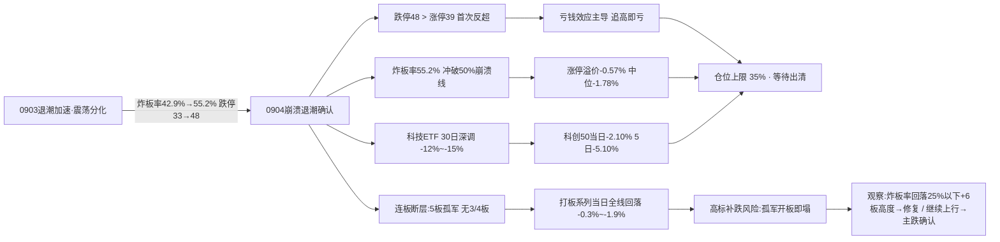

# 九月七日 · 风格研判

> **数据源新鲜度**: partial
> **降级状态**: true
> **置信度**: 70%

## 一句话结论

昨日（9月4日）市场进入**崩溃退潮型**：跌停 48 家反超涨停 39 家、炸板率 **55.2%** 冲破 50% 崩溃线（前日 42.9% 续升）、连板天梯 5 板孤军且无 3/4 板断层、科技 ETF 30 日深调 -12%~-15%。建议仓位上限 **35%**，防守为主、严禁追高、等待情绪出清。

---

## 一、崩溃的确认：跌停反超涨停的那一刻

昨天的市场，不再需要"指数失真"来掩饰——**温度计直接爆表了**。

先看最残酷的对比：涨停 39 家，跌停 **48 家**。跌停数反超涨停数，这在近一个月的行情里是第一次。再看炸板率：炸板 48 只，炸板率 **55.2%**——每两只冲击涨停的股票里，就有一只以上冲高回落封不住。这个数字已经越过 50% 的崩溃阈值，比前一日 42.9% 又抬升了 12 个百分点，比 9 月 2 日的 22.4% 更是翻了一倍半。

连板天梯的塌缩同样触目惊心：最高 5 板只剩龙版传媒一只孤军，往下**没有 4 板、没有 3 板，直接断层到 2 板的六只**。9 月 3 日还有"5板+4板×2+2板"的相对结构，昨天中段彻底空了。高位只剩一个孤胆英雄，中低位的接力资金全部收手——这就是崩溃退潮的典型形态。

**大资金意图**：跌停 48 > 涨停 39 + 炸板率 55.2%，大资金在系统性撤退，连试探性接力都停了。

**为什么走强**：唯一还在赚钱的地方是极致高标抱团——非 ST 三板以上 30 日 +341%，当日还逆势 +1.20%。退潮崩溃期存量资金只敢缩在最确定的妖股上。

**逻辑够不够硬**：不够。这是筹码锁定游戏而非产业逻辑，5 板孤军一旦开板就是踩踏，孤岛会瞬间塌成废墟。

## 二、六簇画像：孤岛仍在，废墟扩大

把二十二个同花顺风格板块和二十只 ETF 放进 30 日窗口的六簇聚类，退潮的结构比 9 月 3 日更极端——**钱不但缩到孤岛上，孤岛也在缩小**。

极致打板抱团簇依然全场最刺眼：非 ST 三板以上 30 日 **+341.03%**，当日 +1.20% 仍是逆势上涨。但请注意旁边的高位连板退潮簇：非 ST 二板 30 日 +99.0%，当日 **-1.94%**——**二板这个位置已经开始亏钱**。打二板以上当日 -1.44%、打首板 -0.31%、打板表现 -0.69%，**打板系列当日全线回落**。高标孤军抱团、中低板转弱，打板生态只剩最顶端一根独苗。

主流分化簇（36 只，市场大本营）当日平均 -1.01%，比前日的 -0.27% 进一步恶化。几个"聪明钱"proxy 继续失血：昨日成交前十 30 日 -15.71%、昨日资金前十 -11.97%、深股通成交前十 -12.89%、沪股通成交前十 -7.78%——**成交额最大、资金最活跃的票，30 日在集体失血且幅度扩大**。近端次新 -2.05%、同花顺热股 -2.1%、昨日高振幅 -5.18%，热钱方向全部熄火。

防御价值簇（银行 +5.45% / 消费 +4.73%）与资源独立簇（煤炭 +9.63%）仍是仅有的正收益避风港。值得注意的是消费 ETF 当日 **+3.31%** 领涨全场——防御方向的资金在加码，而非撤离。

## 三、ETF 望远镜：科技失血加速，防御加码

三十日窗口看，结构没有悬念：煤炭 +9.63%、房地产 +9.88%、有色 +8.57%、中证1000 +7.46%、军工 +6.57% 领涨；**芯片ETF华夏 -14.51%、芯片ETF -14.37%、半导体 -12.32%、科创50 -11.51%** 领跌——科技权重 30 日深调 12-15%，比 9 月 3 日的 9-12% 继续扩大，是全场最大的失血点。

9 月 4 日当天的结构变化是：**防御全面走强，科技继续走弱**。消费 ETF +3.31% 领涨，银行 +0.95%、军工 +0.7%、证券 +0.64%、医药 +0.26%、房地产 +1.48%、恒生科技 +1.59% 逆势收红；而芯片 -2.81%、半导体 -2.79%、芯片ETF华夏 -2.6%、科创50 -2.06%、有色 -1.52% 全线走弱。这与群聊里"财政注资大金融、保险券商重估"的事件共振——**退潮期资金明确转向低位防御与大金融政策催化，科技高位继续被抛弃**。

## 四、外盘的风：存储强攻，权重走弱

外盘 9 月 4 日收盘：标普 -0.38%、纳指 -0.29% 微跌；亚太反弹——恒指 +1.74%、韩国 +1.64%、日经 +1.26%。

美股 AI 硬件链内部出现重要分化：**存储/半导体链条强攻**——美光 +6.1%（5 日 +8.98%）、AMD +4.69%、英特尔 +4.51%（5 日 +7.08%）、康宁 +5.68%、迈威尔 +7.05%、台积电 +2.85%；而**权重走弱**——特斯拉 -5.92%、苹果 -2.51%、微软 -2.04%、谷歌 -1.17%。这与 A 股科技 30 日深调形成镜像：外盘存储强攻（美光/AMD/英特尔）可能对 A 股芯片链形成题材映射，但 A 股内部资金未进场前，难言反转。

外盘整体温和、亚太反弹，降低了外部压制——**A 股内部的崩溃退潮才是主要矛盾**，外部环境无法对冲内部情绪崩塌。

## 五、KOL 的温度：散户看跌，机构布局

颜晓滨核心群昨夜的温度是"谨慎看跌"。散户承天问"**下周股市还会继续往下嘛**"，古云直接回"**应该下**"——没有任何乐观声音。颜晓滨本人转发了东吴非银的《三大保险集团获财政部注资/定增》：财政部向人保定增 150 亿、国寿注资 350 亿、太平注资 70 亿，工行农行也发布定增公告募资 1000/1600 亿——**大金融政策催化是机构群周末最集中的方向**。

题材群依然活跃，集中在几个事件脉冲：**平陆运河**（9/7 盘后 16 时通航新闻发布会，消息密集）、**财政注资大金融**（保险/券商/互联网金融重估，mike 称"大金融系统性重估窗口正式打开"）、**GPT-6 ASTRA**（华福 AI 互联网/国金计算机密集解读，"不只是 Coding"，继续坚定 RUBIN 链）、**3D DRAM**（北方华创两步循环刻蚀突破，长鑫存储绕开 EUV，存储自主量产预期）、**染料涨价**（浙江龙盛调研：H 酸报价 15w、分散黑 33 块看 40 块，Q3 量价齐升）、**厄尔尼诺气候通胀**（鸡蛋 6.4 元/斤、联合国粮农食品价格 2022 年以来最高）。

退潮期的铁律再次应验：**散户看跌 + 机构布局政策/事件 = 情绪冰点但方向分歧**。这些事件脉冲（平陆运河/大金融/3D DRAM）在 55.2% 炸板率的市场里，首日脉冲最易次日炸板——计划外不追。

## 六、风格判定：崩溃退潮型

综合所有维度，今日判定为**崩溃退潮型**——这是五档风格里最悲观的一档，也是 9 月 3 日"震荡分化型（退潮加速期）"的必然延续。

为什么是崩溃退潮型？三条判据全部命中：**跌停 48 > 涨停 39**（跌停多）、**炸板率 55.2% > 50%**（崩溃线）、**大盘下跌**（科创50 -2.10%、深成 -0.79%、创业板 -0.78%，仅上证权重护盘 -0.30%）。加上连板断层无 3/4 板、涨停溢价 -0.57%、中位 -1.78%，追高即亏。

为什么不是其他风格？连板情绪型：涨停 39 < 50 + 炸板率 55% 远超 20%；主线扩散型：无梯队可言；震荡分化型：炸板率远超 20-30% 区间且跌停多于涨停；防御观望型：大盘在跌、跌停 48 家不是缩量走平。**五档里只有崩溃退潮型能装下昨天的数据**。

情绪浓度我给 **23 分**（恐惧区间下沿，接近极恐）：涨停强度 30、连板结构 25、炸板健康度 5（55.2% 的炸板率把这一维彻底打穿）、指数表现 30，四维加权得 22.5 ≈ 23。五维法校验约 28 分，差 5 分，判定一致。比起 9 月 4 日判定的 35 分，情绪再度下探 12 分——**这不是降温，是崩了**。

仓位上限建议 **35%**。前日 45% 已是防守位，今天必须再退。理由：跌停反超涨停、炸板率破 50% 崩溃线、连板断层、科技 30 日深调 12-15%、散户集体看跌——**五条崩溃信号叠加，现金比任何仓位都更值钱**。保留 35% 是给情绪彻底出清后的新主线留弹药，不是今天去接刀。

## 七、关键证据

- **涨停数据**: 涨停 39 / 跌停 48 / 炸板 48 / 炸板率 55.2%（前一日 44/33/33/42.9%）· 来源 tushare.limit_list_d
- **连板结构**: 最高 5 板（龙版传媒孤军），**无 3/4 板断层**，2 板 6 只 · 来源 tushare.limit_step
- **涨停溢价**: 0903 涨停 44 只在 0904 平均 -0.57%、中位 -1.78%，追高即亏 · 来源 tushare.daily 交叉
- **大盘表现**: 上证 -0.30%（权重护盘）、科创50 -2.10%、深成 -0.79%；全市场 2444 涨/2914 跌、中位 -0.17% · 来源 tushare.index_daily + tushare.daily
- **风格聚类**: 极致打板簇（非ST三板以上 30日 +341.03%、当日 +1.20%）vs 主流分化簇 36 只（当日 -1.01%）、成交/资金前十 30日 -12%~-16% · 来源 tushare.ths_daily
- **ETF 分化**: 煤炭 +9.63%/房地产 +9.88%/银行 +5.45% vs 芯片ETF华夏 -14.51%/科创50 -11.51%；当日消费 +3.31% 领涨 · 来源 tushare.fund_daily
- **外盘**: 标普 -0.38%/纳指 -0.29%；美光 +6.1%/AMD +4.69%/英特尔 +4.51% 存储强攻 vs 特斯拉 -5.92%；亚太反弹（恒指 +1.74%）· 来源 tushare.index_global + us_daily
- **KOL**: 散户"还会往下嘛""应该下"；机构周末聚焦财政注资大金融 + GPT-6 + 平陆运河 · 来源 wechat_cli_5groups

## 八、风险与不确定性

**最大的风险是崩溃的继续确认**。炸板率 55.2% 已破 50% 崩溃线，若今日继续上行、跌停继续多于涨停、指数补跌，将确认主跌段，35% 仓位上限还要再降，甚至空仓。

**第二个风险是高标孤军的补跌**。非 ST 三板以上 30 日 +341% 的极致拥挤，5 板龙版传媒是全场唯一高标。崩溃期孤立高标的抱团是筹码游戏，一旦开板就是踩踏——历史上高标带崩全场情绪的例子不胜枚举。

**第三个风险是"跌停 48 家"的失真可能**。9 月 4 日跌停数可能含 ST 股批量跌停（当前 ST 生态在退潮期批量出清），剔除 ST 后的真实跌停数可能略小。但即便打折，炸板率 55.2% + 连板断层已足以确认崩溃退潮。

**第四个风险是题材脉冲的收割**。平陆运河/大金融/3D DRAM 在崩溃日的首日脉冲，最易成为次日炸板。机构布局政策催化 ≠ 短线可追，两者是不同时间尺度。

**第五个风险是数据盲区**。fx/商品缺失无法验证资源共识强度；SOX 费半/恒生科技无数据；emotion_cycle.json 预计算因 premium 缺失降级，R1 已用真实指标重算（premium=-0.57%/ladder=5/炸板率55.2% → 高位震荡但已在崩溃边缘，置信度 0.75）。

**观察指标**：炸板率回落至 25% 以下 + 出现 6 板以上新高度 + 涨停重新 > 50 家 + 指数放量，是崩溃企稳的信号；反之炸板率继续上行 + 5 板孤军断板 + 指数补跌，则确认主跌段，需进一步降仓甚至空仓。

## 九、与其他 R/D/E 的关系

- **上游依赖**: 无（R1 是研究链路起点，仅依赖原始数据 + style_snapshot + emotion_cycle 横切）
- **下游消费**:
  - R2（主线板块）: 消费 style / main_lines_count / position_cap_suggestion
  - R3（情绪热度）: 消费 sentiment_score 作为基准
  - R6（反证）: 与 R2 做一致性反证
  - D1（主决策）: 消费 position_cap_suggestion → 执行池总仓上限

## 数据源审计

| 源 | 日期 | 状态 | 备注 |
|---|---|:--:|---|
| tushare/ths_daily | 2026-09-04 | 🟢 | 22 风格板块 · 30日窗口 |
| tushare/fund_daily | 2026-09-04 | 🟢 | 20 ETF · 30日窗口 |
| tushare/limit_list_d | 2026-09-04 | 🟢 | 96 条 · 涨停39/跌停48/炸板48 |
| tushare/limit_step | 2026-09-04 | 🟢 | 7 条 · 连板天梯（最高5板，无3/4板） |
| tushare/index_daily | 2026-09-04 | 🟢 | 上证/深成/创业板/科创50/沪深300/中证500/中证1000/上证50 |
| tushare/daily | 2026-09-04 | 🟢 | 5548 只 · 全市场分布 |
| tushare/index_global + us_daily | 2026-09-04 | 🟢 | 5 指数 + 14 美股（0904 收盘） |
| wechat_cli_5groups | 2026-09-06 | 🟢 | 71 条 · 5 焦点群（匿名） |
| emotion_cycle (横切) | 2026-09-07 | 🟡 | 预计算降级，R1 用真实指标重算 |
| weflow_analytics | — | 🔴 | DOWN · ngrok 离线 |
| 公众号 (sanji) | — | ⚪ | disabled（用户 08-20 取消） |
| fx (USDCNH/DXY) | — | 🔴 | 缺失 · 源 down |
| SOX/HSTECH | — | 🔴 | 无数据 |
| commodities | — | 🔴 | skipped（期货代码未映射） |

## 不确定性 / 反证

- **崩溃定性的反向可能**：跌停 48 家中若 ST 批量跌停占比过高，剔除后真实跌停数可能显著小于涨停数——若今日炸板率快速回落、防御扩散成普涨修复，崩溃退潮型的判定会被打脸。这是最需要警惕的反证。
- **情绪浓度 23 可能低估了防御资金的含义**：消费 +3.31%、银行 +0.95%、房地产 +1.48% 当日逆势走强 + 财政注资大金融的政策催化，若这是增量资金开始布局防御/政策的开始，市场可能比情绪分显示的更有结构韧性。
- **KOL 散户看跌可能是反向指标**：散户集体看跌往往是情绪冰点信号，历史上冰点后常现超跌反弹——但崩溃期的冰点可能还有二次探底，不宜左侧接刀。
- **外盘存储强攻是最大变量**：美光 +6.1%、AMD +4.69%、英特尔 +4.51% 若带动隔夜科技情绪，今日 A 股科技权重可能意外修复——这与 55.2% 炸板率的内部退潮信号形成反向拉扯，需盘中验证。
- **风格聚类为近似代理**：板块聚类基于收益序列相关性，非 R2 的真实主线判定。

## Sub-Agent 元数据

- skill: analyze_style_v1
- artifact: data/research/20260907/R1_style.json
- 生成耗时: 约 15 分钟
- model: deepseek-v4-flash-260425
- 聚类方法: K-means/层次聚类 6簇 · 相关距离 · 特征=30日收益序列
- 覆盖: 22 同花顺风格板块 + 20 ETF + 5 外盘指数 + 14 美股
