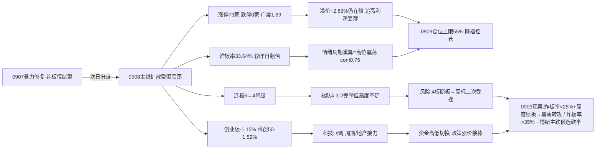

# 九月九日 · 风格研判（盘前 · 基于 0908 收盘）

> **数据源新鲜度**: ok
> **降级状态**: false
> **置信度**: 72%
> **数据归属**: 0908 收盘（T-1 · 0909 盘前预判）

## 一句话结论

9 月 9 日盘前，市场站在**修复次日分歧**的十字路口：0908 收盘涨停 73 家、跌停 0 家，但炸板率从 0907 的 16.96% 翻倍到 **33.64%**，连板高度从 6 板降到 4 板，创业板 -1.15%、科创50 -1.52% 科技回调；广度仍正（涨跌比 1.69、中位 +0.54%）、前日涨停溢价 +2.89% 还在赚。情绪周期重算为**高位震荡**，判定**主线扩散型（偏震荡）**，仓位上限 **55%**——0909 可做但控仓，只做各主线龙一/龙二与低位补涨，不追高位；若盘中炸板率再破 35%，候选数砍半、仓位再降。

---

## 一、分歧的确认：涨停还在，温度降了

0907 的暴力修复（涨停 93、炸板率 16.96%、创业板 +3.41%）在 0908 没能延续成普涨，而是走进了**修复次日最常见的高位分歧**。最直观的证据是炸板率：33.64%，比 0907 的 16.96% 直接翻倍——每三只冲击涨停的票里就有一只封不住，承接强度肉眼可见地变弱。涨停家数仍高达 73 家、跌停 0 家，说明多头没撤退，但**封板的决心在动摇**。

连板天梯从 6 板降到 4 板（4 板 3 只、3 板 3 只、2 板 12 只），梯队 4-3-2 完整但高度不足——0907 的 6 板龙头没有把高度带上去，反而在高位断档。赚钱效应也没有消失：0907 涨停的 93 只票 0908 平均溢价 **+2.89%**、中位 +2.24%，追高依然有钱赚，只是从 0907 的 +4.61% 回落——**利润变薄，容错变小**。

全市场的宽度依然站在多方一边：5549 只里涨 3417 / 跌 2026，涨跌比 1.69，中位 +0.54%，跌超 5% 的只有 58 只。但结构已经悄悄换挡：上证 +0.20%、中证1000 +0.27% 微红，创业板 -1.15%、科创50 -1.52% 回调——**科技权重在吐 0907 的涨幅，小盘和周期在接力**。

**大资金意图**：0907 是真金白银的全面进攻，0908 是**高低切换**——从 30 日深调后刚反弹的科技里兑现部分利润，转向政策（西部大开发、乡村振兴、一带一路、并购重组）与涨价链（化肥、农业、牛磺酸、燕麦）。资金没有离场，只是在换座位；0909 要盯的是换座位的方向是否持续。

**为什么走强（指数层面）**：权重上证微红 + 小盘中证1000/中证500 翻红，说明**防御性资金与小盘活跃资金都还在**，回调主要集中在前期反弹最猛的科技权重（创业板/科创50）——这是分歧而非崩溃的位置特征。

**逻辑够不够硬**：分歧的定性很硬——炸板率翻倍 + 连板降级 + 科技回调三条独立信号指向同一件事；但"分歧后转震荡还是转主跌"取决于 0909 炸板率能否回落、4 板梯队能否延续，这是最需要盘中验证的反证。

## 二、六簇画像：高标还在加速，但大本营在喘气

把二十二个同花顺风格板块和二十只 ETF 放进 30 日窗口的六簇聚类，结构比 0907 出现了一个**危险的错位**。

极致打板抱团簇依然是全场最极端：非 ST 三板以上 30 日 **+409.05%**、当日 **+9.12%**，非 ST 二板 +108.01%、当日 +5.21%——高标不但没退潮，当天还在涨。但这恰恰是问题所在：**高位越极端，与市场大本营的温差越大**。

主流进攻大本营簇（33 只，市场主体）平均 30 日 +8.14%，但**当日只有 +0.27%**——几乎原地踏步。簇内部分化剧烈：打板表现 +25.86%（当日 +2.32%）、高贝塔 +24.61%、打首板 +20.17%（当日 +1.89%）仍强；但科技 ETF 全部转绿——半导体 -1.40%、科创50 -1.41%、芯片ETF华夏 -1.25%、芯片ETF -1.32%；昨日资金前十 -0.67%、昨日成交前十 -1.54%、深股通成交前十 -0.98%、沪股通成交前十 -0.90%、昨日高振幅 -1.09%——**最活跃的资金 proxy 0907 全线转涨，0908 全线转跌**，这是分歧最锋利的证据，也是 0909 最需要盯的领先信号。

资源独立强势簇（煤炭 ETF +10.91%、当日 +2.52%）继续独立走强；防御价值簇（银行 +2.54%、当日 +0.48%）温和回暖。两个值得警惕的弱簇：弱势震荡簇（恒生科技 -5.69%、当日 -1.58%）和**新高崩塌簇——创历史新高指数 30 日 -6.17%、当日 -6.21%**。追新高模式连续多日失效，说明资金拒绝给"创新高"付溢价，更愿意在低位题材里轮动——0909 若继续，任何高位追涨的赔率都在恶化。

## 三、ETF 望远镜：科技吐涨幅，周期/地产接力

三十日窗口里领涨的换人了：**通信ETF +11.83%** 反超煤炭 +10.91%、有色 +9.49%、中证1000 +9.03%、房地产 +8.63%；领跌仍是科技深坑：芯片ETF -7.24%、芯片ETF华夏 -5.97%、科创50 -5.83%、恒生科技 -5.69%、半导体 -5.11%。

但 0908 当天的方向很清楚：**科技全面回调、周期地产走强**——房地产 +2.19%、煤炭 +2.52%、有色 +1.55%、军工 +0.96% 收红；半导体 -1.40%、科创50 -1.41%、芯片华夏 -1.25%、芯片ETF -1.32%、恒生科技 -1.58% 收绿。这与 0907"科技反弹、防御回调"完全镜像——**资金在两天之间做了个来回**。KOL 里颜晓滨"6 月底预警半导体光存储雪崩，判断仅有反弹没有反转，警惕抄底被套"的判断，正在被盘面部分验证；0909 科技能否止跌，是修复行情成色的试金石。

## 四、外盘的风：存储还在强攻，但亚洲在回调

外盘（美股 9/4 收盘、亚太 9/8）：标普 -0.38%、纳指 -0.29% 微跌；亚太 9/8 普遍回调——日经 **-1.70%**、韩国 -0.58%、恒指 -0.38%（0907 韩国 +4.61%、日经 +2.12% 后回落）。

美股 AI 硬件链延续分化但存储仍强：美光 +6.1%（5 日 +8.98%）、迈威尔 +7.05%、康宁 +5.68%、AMD +4.69%、英特尔 +4.51%、台积电 +2.85%、英伟达 +0.84%（5 日 +5.89%）、Meta +1.0%（5 日 +6.71%）；权重继续弱：特斯拉 -5.92%、苹果 -2.51%、微软 -2.04%、谷歌 -1.17%。

外盘对 A 股的含义在**减弱**：0907 存储链强攻为 A 股科技反弹提供了完美映射，0908 A 股科技却独立回调——说明科技修复已进入**内部分歧期**，外盘不再是单边助推。亚太回调也让外部从"共振"变"中性"，0909 A 股的主要矛盾回到内部：涨停 73 家 + 炸板率 33.64% 的分歧怎么演绎。

## 五、KOL 的温度：散户喊震荡，机构仍押算力

今天的 KOL 出现罕见的**同向**：散户和"机构风向标"都指向震荡。金投汇群主颜晓滨直接定性：**"今天指数一般，但个股走势走得较丝滑。当前大盘是震荡行情，3800-4200 之间都属于正常波动……关键要抓热点板块及个股并随时调整轮动"**——这是教科书式的高位震荡话术；散户盘中感叹"**果然这附近比较分歧，横盘一下午**"。

机构群仍然全力押注 AI 算力（AI 出现 97 次、算力 23 次、光模块 17 次、液冷 14 次、芯片 11 次、存储 10 次），但**主角换了**：字节世界模型/PICO XR 链（43 次）点火——视涯科技 MicroOLED 国产替代、力盛体育 VR 赛事、佳创视讯、天娱数科；华源"成熟制程价值重估"（富满微/明微电子）；电子纱/电子布涨价超预期；中信长三角液冷调研（华塑科技/维谛）；5G-A/AI-RAN 射频（武汉凡谷/通宇通讯/硕贝德）。**新增了一条更宽的涨价/政策线**：牛磺酸出口价 4→5 美金（永安药业/圣元环保）、燕麦/厄尔尼诺农业、CIPS 跨境支付 11 家外资签约、深圳国资产业大迁徙/并购重组、工信部 6G/低轨卫星、六部门乡村振兴支持涉农企业上市——农业板块（化肥 +4.26%、农化 +4.71%、农业种植 +3.12%）当日爆发，承接了从科技撤出的部分资金。

**散户喊震荡 + 机构押算力 + 政策涨价接力 = 高位震荡期的典型结构**——人心开始分歧，但还没有人系统性看空，资金在板块间做轮动而不是撤退。0909 的关键是：机构押注的 XR/存储/重估与盘面资金流向是否重新共振。

## 六、风格判定：主线扩散型（偏震荡）

综合所有维度，0909 判定为**主线扩散型**，但必须加注"偏震荡"。

三条判据命中：**涨停 73 家 ≥ 30**（超出示例区间 30-50，但连板梯队 4-3-2 成立，按同类归入）、**连板高度 4 ∈ [3,5]**、**有明确梯队**。为什么不是其他风格？连板情绪型：连板高度 4 < 6 且炸板率 33.64% > 20%，不满足；震荡分化型：涨停 73 家不分散、连板 4 板有龙头；防御观望型：涨停 73 家远非 <20；崩溃退潮型：跌停 0 家、炸板率 33.64% < 50%，离崩溃线很远。

**关键联动**：风格表只看涨停/高度，会漏掉炸板率 33.64% 的分歧——按 emotion_cycle 重算（炸板率 33.64% ≥ 25% + 溢价 +2.89% 未达 +3%），情绪周期=**高位震荡**（conf 0.75）。**以情绪周期阶段为准**，仓位上限从主线扩散型的 0.60-0.80 下修至 **55%**。注意：fetch 预计算的 emotion_cycle.json（06:48）因 premium 缺失按保守值处理误判为 low_test，R1 已用 0908 真实指标重算——这是每次盘前都要警惕的降级陷阱。

情绪浓度给 **60 分**（中性偏多/贪婪下沿）：四维法 71 分（涨停强度 40 + 连板 10 + 炸板健康 13.3 + 指数 7.6），五维法校验 58 分，差 13 < 15，取折中约 65 后按高位震荡下修至 60——涨停 73/跌停 0/溢价 +2.89% 仍支撑正收益，但炸板率翻倍 + 连板降级 + 科技回调压制情绪温度。

仓位上限 **55%**：0907 的 70% 是修复首日的主升进攻位，0908 之后是分歧确认后的**降档控仓位**——涨停还在、溢价还在，不做空头判断，但炸板率 33.64% + 连板 6→4 + 资金 proxy 转负三条信号都指向"分歧加大"，0909 保留 40% 以上机动仓应对两岔。

## 七、关键证据

- **涨停数据**: 涨停 73 / 跌停 0 / 炸板 37 / 炸板率 33.64%（0907: 93/2/19/16.96%，炸板率翻倍）· 来源 tushare.limit_list_d
- **连板结构**: 最高 4 板（3 只），3 板 3 只，2 板 12 只；较 0907 的 6 板降级 · 来源 tushare.limit_step
- **涨停溢价**: 0907 涨停 93 只在 0908 平均 +2.89%、中位 +2.24%（0907 为 +4.61%），仍正但回落 · 来源 tushare.daily 交叉
- **大盘表现**: 上证 +0.20%、创业板 -1.15%、科创50 -1.52%、中证1000 +0.27%；全市场 3417 涨/2026 跌、中位 +0.54%、跌超 5% 仅 58 只 · 来源 tushare.index_daily + tushare.daily
- **风格聚类**: 极致打板簇（非ST三板以上 30日 +409.05%、当日 +9.12%）+ 主流大本营簇 33 只（当日 +0.27% 走平）+ 新高崩塌簇（创历史新高 30日 -6.17%、当日 -6.21%）；资金/成交前十 当日转负（-0.67%~-1.54%）· 来源 tushare.ths_daily
- **ETF 分化**: 通信 +11.83%/煤炭 +10.91% vs 芯片ETF -7.24%；0908 当日房地产 +2.19%/煤炭 +2.52% 走强、科技全线回调 · 来源 tushare.fund_daily
- **主线代理**: limit_cpt_list 20 个板块 up_nums≥8——政策(西部大开发17/乡村振兴15/一带一路11) + 涨价农业(化肥10/农化8/种植8) + 科技数据(数字经济12/数据要素10/芯片9) 三类并存 · 来源 tushare.limit_cpt_list（近似代理，非 R2 判定）
- **外盘**: 标普 -0.38%/纳指 -0.29%；美光 +6.1%/迈威尔 +7.05% 存储强攻 vs 特斯拉 -5.92%；日经 -1.70%/韩国 -0.58% 亚太回调 · 来源 tushare.index_global + us_daily
- **KOL**: 颜晓滨"震荡行情 3800-4200、警惕半导体抄底被套"；散户"横盘一下午分歧"；机构 AI 97 次 + 字节世界模型/PICO 43 次 + 涨价链 30 次 + 乡村振兴/牛磺酸/燕麦/CIPS · 来源 wechat_cli_5groups（370条 覆盖 0908 全天至晚间）

## 八、风险与不确定性

**最大的风险是炸板率 33.64% 已近 35% 警戒线**。0909 若炸板率继续升至 35%+，情绪=震荡/主跌，候选数砍半、仓位上限再降——这是高位震荡向主跌滑落的第一道信号。

**第二个风险是连板降级后的高度真空**。6 板断板后，4 板梯队是全场最高。若 4 板 3 只集体断板，高标情绪二次受挫，打板系列（当日仍 +9.12%/+8.35%/+5.21%）可能补跌。

**第三个风险是科技反弹的成色**。芯片/半导体 ETF 30 日仍在 -5%~-7% 深坑，0908 当日回调说明修复遇阻；外盘存储强攻的映射在减弱，若 A 股科技二次探底，将拖累整个风险偏好。

**第四个风险是高低切换的持续性**。资金从科技切向政策/涨价（西部大开发/乡村振兴/化肥/农业/牛磺酸/燕麦/并购重组），但这类题材多为脉冲式政策或涨价事件驱动，持续性弱于产业主线——若 0909 农业/涨价兑现即走，资金无处可去，分歧将加剧。

**第五个风险是数据盲区**。fx/商品缺失无法验证涨价链（牛磺酸/燕麦/电子纱/化肥）的共识强度；SOX 费半/恒生科技无数据；weflow 离线、公众号源 disabled；emotion_cycle 预计算（06:48）仍为降级版 low_test，R1 已用 0908 真实指标重算为高位震荡（conf 0.75）。

## 九、与其他 R/D/E 的关系

- **上游依赖**: 无（R1 是研究链路起点，依赖原始数据 + style_snapshot + emotion_cycle 横切重算）
- **下游消费**:
  - R2（主线板块）: 消费 style / main_lines_count / position_cap_suggestion —— 0908 主线代理显示政策(西部大开发/乡村振兴/一带一路/并购重组)+涨价(化肥/农业/中报预增)+科技(数字经济/数据要素/芯片)并存，20 个板块 up_nums≥8
  - R3（情绪热度）: 消费 sentiment_score 60 作为基准
  - R6（反证）: 与 R2 做一致性反证
  - D1（主决策）: 消费 position_cap_suggestion 0.55 → 执行池总仓上限

## 数据源审计

| 源 | 日期 | 状态 | 备注 |
|---|---|:--:|---|
| tushare/ths_daily | 2026-09-08 | 🟢 | 22 风格板块 · 30日窗口 · 0908收盘 |
| tushare/fund_daily | 2026-09-08 | 🟢 | 20 ETF · 30日窗口 · 0908收盘 |
| tushare/limit_list_d | 2026-09-08 | 🟢 | 涨停73/跌停0/炸板37/炸板率33.64% |
| tushare/limit_step | 2026-09-08 | 🟢 | 连板天梯（最高4板，梯队4-3-2） |
| tushare/index_daily | 2026-09-08 | 🟢 | 上证/深成/创业板/科创50/沪深300/中证500/中证1000/上证50 |
| tushare/daily | 2026-09-08 | 🟢 | 5549 只 · 全市场分布 |
| tushare/limit_cpt_list | 2026-09-08 | 🟢 | 20 板块 up_nums≥8 · 主线代理 |
| tushare/index_global + us_daily | 2026-09-08 | 🟢 | 5 指数 + 14 美股（美股0904收盘 · 亚太0908收盘） |
| wechat_cli_5groups | 2026-09-08 | 🟢 | 370 条 · 5 焦点群（匿名）· 覆盖 0908 全天至晚间 |
| emotion_cycle (横切) | 2026-09-09 | 🟡 | 预计算(06:48)降级误判 low_test，R1 用真实指标重算=高位震荡 conf0.75 |
| weflow_analytics | — | 🔴 | DOWN · ngrok 离线 |
| 公众号 (sanji) | — | ⚪ | disabled（用户 08-20 取消） |
| fx (USDCNH/DXY) | — | 🔴 | 缺失 · 源 down |
| SOX/HSTECH | — | 🔴 | 无数据 |
| commodities | — | 🔴 | skipped（期货代码未映射） |

## 不确定性 / 反证

- **震荡定性的反向可能**：炸板率 33.64% 若 0909 大幅回落、4 板梯队延续，说明 0908 是"修复中继的分歧"而非"震荡确认"——主线扩散型可能重新升级回连板情绪型。这是 0909 最需要盘中验证的反证。
- **情绪浓度 60 可能低估**：涨停 73/跌停 0/溢价 +2.89% 仍是强多头数据，若 0909 科技止跌、政策涨价链走出持续性，60 分偏低，仓位上限 55% 偏保守。
- **"新高崩塌"是长期警告**：创历史新高指数 30 日 -6.17%、当日 -6.21%，追新高模式连续失效——若这代表风险偏好结构性下移，任何高位追涨（包括打板系列）的赔率都在恶化。
- **资金 proxy 转负是领先还是噪音**：昨日资金/成交前十 0907 全线转涨、0908 全线转跌，一天之内翻转——可能是高低切换的正常换手，也可能是一日游资金的离场，需要 0909 交叉验证。
- **风格聚类为近似代理**：板块聚类基于收益序列相关性，非 R2 的真实主线判定，主线具体成色由 R2 确认。
- **机构 XR/存储多头 vs 盘面科技回调的背离**：机构群 0908 全力推字节 XR/成熟制程重估，盘面科技 ETF 却全线收绿——若 0909 该背离不修复，机构的题材叙事将落后于资金流向，谨防"消息多、资金空"的陷阱。

## Sub-Agent 元数据

- skill: analyze_style_v1
- artifact: data/research/20260909/R1_style.json
- 生成耗时: 约 15 分钟（盘前）
- model: deepseek-v4-flash-260425
- 聚类方法: K-means/层次聚类 6簇 · 相关距离 · 特征=30日收益序列
- 覆盖: 22 同花顺风格板块 + 20 ETF + 5 外盘指数 + 14 美股
