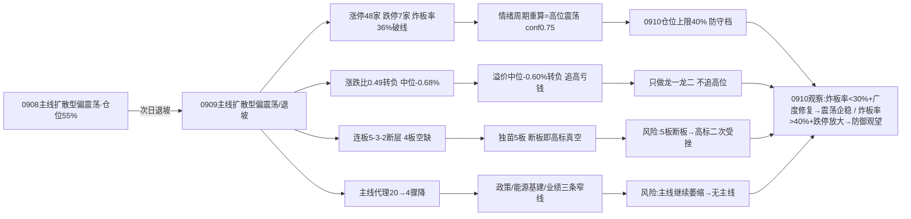

# 九月十日 · 风格研判(盘前 · 基于 0909 收盘)

> **数据源新鲜度**: partial(核心量化主源全 fresh · 颜晓滨 KOL 群缺失)
> **降级状态**: true(颜晓滨群 error · emotion_cycle 预计算降级已重算)
> **置信度**: 70%
> **数据归属**: 0909 收盘(T-1 · 0910 盘前预判)

## 一句话结论

9 月 10 日盘前,市场站在**修复行情退坡**的位置:0909 收盘涨停 48 家、跌停 7 家,炸板率升到 **36.0%**,越过了 35% 的交易纪律警戒线;全市场涨跌比 **0.49** 由正转负,中位 -0.68%;前日涨停溢价均值 +1.11% 但中位 **-0.60%** 转负;主线代理强板块从 20 个骤降到 **4 个**。情绪周期重算为**高位震荡**(conf 0.75),判定**主线扩散型(偏震荡/退坡)**,仓位上限 **40%**——0910 只做各主线龙一/龙二与低位补涨,候选数砍半,不追高位;若盘中炸板率再破 40% 或跌停继续放大,直接降级防御观望。

---

## 一、分歧的深化:涨停还在,但广度先倒了

0909 的盘面是一面照妖镜。涨停 48 家——数字不算难看,跌停也只有 7 家,连板高度还从 4 板升到了 5 板。但藏在数字下面的温度计全部指向一个方向:**退坡**。炸板率 36.0%,比 0908 的 33.64% 又高了一截,已经越过 35% 的纪律警戒线;每十只冲击涨停的票里有三只半封不住,承接强度在肉眼可见地瓦解。更关键的是广度——全市场 5550 只里涨 1794 / 跌 3642,涨跌比 **0.49** 直接从 0908 的 1.69 翻成负数,中位数 -0.68%:也就是说,昨天随便买一只票,一半以上的概率是亏的。涨停家数还能维持在 48,靠的是少数高度股硬撑门面,普涨的底座已经塌了。

连板天梯是 5 板 1 只、3 板 4 只、2 板 10 只——**4 板断层**,梯队从 0908 的 4-3-2 变成 5-3-2。高度往上走了一格,中间却断了一截,这是典型的"独苗撑高度"结构:5 板那只票一旦断板,下面没有 4 板梯队接力,高标情绪会瞬间真空。赚钱效应也在恶化:0908 涨停的票 0909 平均溢价 +1.11%,但中位数 **-0.60%**——均值靠几只大肉撑起来,一半以上的打板资金已经在亏钱。这与 0908 的"均值 +2.89%、中位 +2.24% 还在赚"形成鲜明对比:**追高的容错,两天之内从"宽"变成了"窄"**。

指数层面反而是护盘的面孔:上证 +0.28%、沪深300 +0.30% 微红,但创业板 -0.14%、科创50 -0.69%、中证1000 -0.14% 全绿。**权重在护,题材在退**——这是高位震荡末期的典型姿态,指数失真,个股才是真相。

**大资金意图**:0908 是高低切换(科技兑现利润、政策涨价接力),0909 演变成了**收缩**——不是换座位,而是有人开始离席。主线代理(涨停家数≥8 的强板块)从 0908 的 20 个骤降到 4 个,只剩区域开发政策、能源基建、业绩预增三条窄线。资金没有全面撤退(涨停 48、跌停仅 7),但**进攻半径在急剧收窄**,从"多点开花"变成"窄线防守"。

**为什么走强(指数层面)**:权重上证/沪深300 微红、银行/煤炭 ETF 收涨,说明**防御性资金还在**,但这是防守姿态,不是进攻。科创50 -0.69%、科技 ETF 全线收绿,前期反弹主力继续失血——指数走平靠权重掩护,掩盖了多数个股在跌的事实。

**逻辑够不够硬**:"退坡"的定性很硬——炸板率破线 + 广度转负 + 溢价中位转负 + 主线代理骤降,四条独立信号指向同一个方向。但"退坡后是横盘震荡还是加速退潮"取决于 0910 炸板率能否回到 30% 以下、5 板独苗能否续板、跌停是否继续放大——这是盘中必须验证的分岔。

## 二、六簇画像:高标独舞,大本营失速

把二十二个同花顺风格板块和二十只 ETF 放进 30 日窗口的六簇聚类,结构比 0908 更极端、更危险。

极致打板抱团簇依然是全场最锋利的刀:非 ST 三板以上 30 日 **+321.85%**、当日 **+3.01%**,非 ST 二板 +109.48%、当日 +1.31%——高标没有退,还在涨。但接力端已经露出疲态:**打二板以上当日 -1.66%**,从 0908 的 +8.35% 直接翻绿。高标自己还在加速,接力的资金却开始不认账,这是**情绪内部出现断层**的第一信号——三板以上的票还有人抬,二板的票开始没人接。

主流进攻大本营簇(32 只,市场主体)平均 30 日 +7.82%,**当日 -0.16%**——原地踏步甚至微跌。簇内继续分化:打板系列 30 日 +25.94%、高贝塔 +25.7%、打首板 +20.56% 仍强;但科技 ETF 全线深绿——恒生科技 -9.11%、芯片ETF -5.95%、科创50 -5.91%、芯片ETF华夏 -4.51%、半导体 -4.28%,30 日窗口全部深调,0909 当日依旧收绿。**科技这条曾经的主线,30 日维度已经在持续失血**。

资源独立强势簇(煤炭 ETF +11.75%、当日 +3.0%)继续独立走强,是全场唯一的当日大阳线;防御价值簇(银行 +2.81%、消费 +0.0%)温和,没有进攻性。两个弱势簇值得记住:弱势震荡簇(恒生科技 -9.11%、证券 -1.9%、医药 +0.27%)和**新高崩塌簇——创历史新高指数 30 日 -8.17%**。追新高模式连续第三天失效,资金明确拒绝给"创新高"付溢价,高位股的赔率在系统性恶化——这解释了为什么涨停 48 家、炸板率却 36%:资金愿意冲高,不愿意接力。

**大资金意图**:高标抱团(非ST三板以上)与市场大本营(32 只主流)的温差已经拉到 **+148% vs +7.8%** 的极端水平。资金不是不想做,是只敢在最高度、最小众的票里抱团,不敢扩散——**抱团越紧,说明市场越怕**。

**为什么走强**:煤炭/银行等资源防御类独立走强,是典型的**避险+涨价双属性**资金;打板高标独立走强,是游资在高度真空里的最后倔强。两者都不是进攻信号。

**逻辑够不够硬**:极端分化(高标 +321% vs 新高 -8%)本身就说明市场没有共识、没有合力。纪律心法里"合力来自全市场不是抱团"——0910 必须警惕:抱团越极端,瓦解越剧烈。

## 三、ETF 望远镜:防御与涨价接力,科技继续深坑

三十日窗口里领涨的依然是防御+涨价:通信ETF +12.46%、煤炭ETF +11.75%、军工ETF +7.86%、中证1000 +7.75%、房地产 +5.01%;领跌的全是科技深坑:恒生科技 -9.11%、芯片ETF -5.95%、科创50 -5.91%、芯片ETF华夏 -4.51%、半导体 -4.28%。

0909 当天的方向更清楚:煤炭 +3.0%、军工 +1.55%、通信 +0.89% 收红;有色 -2.52%、房地产 -1.75%、医药 -1.32%、科创50 -0.59% 收绿——**资金在防御(煤炭/军工)里抱团,在进攻(科技)里撤退**。这与 KOL 舆情高度同向:机构群集体聚焦涨价链(沥青期现破 5200 新高、库存五年低、炼厂单吨利润 1100 元;油运运价主升、航运指数单日 +7.45% 近周 +39.97%)——涨价是唯一有硬逻辑支撑的方向,但也是事件驱动、持续性需要验证的方向。

**大资金意图**:资金从"做多科技反弹"转向"做多实物涨价+防御",这是风险偏好下移的确认。煤炭/军工不是进攻主线,是避险的壳。

**为什么走强**:煤炭 30 日 +11.75%、当日 +3.0% 独立走强,涨价+高股息双属性;军工 +7.86% 有"十五五"装备需求释放的事件催化。两者都是"有逻辑的防守"。

**逻辑够不够硬**:涨价链(沥青/油运)逻辑硬但持续性存疑——事件驱动的钱来得快去得也快,0910 若涨价链兑现即走,资金将无处可去。科技 30 日深调 -4%~-9%,短期难有反转,反弹只有逃命波。

## 四、外盘的风:硬件链分化,韩国强、存储弱

外盘(美股 9/8 收盘、亚太 9/9):标普 -0.58%、纳指 -0.32% 微跌;亚太分化——韩国 **+1.40%**(5 日 +7.45%)强,恒指 -0.17%、日经 -0.19% 弱。

美股硬件链内部再次换主角:英特尔 **+9.05%**(5 日 +16.71%)、康宁 +7.56%、AMD +5.9%、台积电 +2.35%、迈威尔 +0.83% 强攻;但权重与存储转弱——英伟达 -2.01%、美光 -1.61%、苹果 -1.17%、微软 -1.15%、Meta -0.53%。与 0908 的"存储强攻"相比,主角从存储换成了设备/晶圆代工,**存储链(美光/英伟达)开始掉队**——这与 A 股科技 30 日深调、0909 继续回调的映射方向一致:外盘硬件链的强,已经撑不住 A 股科技的弱。

外盘对 A 股的含义继续**减弱**:韩国半导体强势(5 日 +7.45%)理论上利好 A 股科技映射,但 A 股科技 0909 独立回调——映射链条断了。0910 A 股的主要矛盾回到内部:炸板率 36% 破线后的分歧怎么演绎,而不是外盘给不给风。

## 五、KOL 的温度:颜哥缺席,涨价链独唱

今天的 KOL 有个硬伤:**颜晓滨群抓取失败**(找不到聊天对象),核心 KOL 的方向性判断不可得。仅剩 4 群 305 条消息,情绪定性只能靠量化指标和机构群主题侧写。

机构/题材群的主题高度集中于涨价链:沥青(委内瑞拉断供重质原油 → 期现破 5200 新高、库存五年低、炼厂单吨利润 1100 元创新高)、油运(航运指数翻倍、油运龙头涨停、外贸运价弹性)、成熟制程价值重估、厄尔尼诺水火电力、CIPS 跨境支付(金砖二十周年峰会 9/12)、军工"十五五"装备需求、CXMT HBM3 良率(TSV)、OCS 光通信、智能配送设备、量子计算氦气(CHIPS 法案)。

一个鲜明的特征:**主题高度分散,无单一强主线共识**。涨价链是最强的一条线,但它是事件驱动;科技细分(成熟制程/存储/光通信/智能配送设备)各有拥趸,但形不成合力。这与盘面"主线代理 20→4 骤降、广度转负"完全同向——**市场从多点进攻转向窄线防守,机构的多头叙事也追不上资金收缩的速度**。0910 要盯的是:涨价链(沥青/油运)是能走出 3 日以上持续性,还是一日游。

## 六、风格判定:主线扩散型(偏震荡/退坡)

综合所有维度,0910 判定为**主线扩散型**,但必须加注"偏震荡/退坡"。

三条判据名义命中:涨停 48 家 ∈ [30,50]、连板高度 5 ∈ [3,5]、有梯队(5 板 1 只/3 板 4 只/2 板 10 只,但 4 板断层)。为什么不是其他风格?连板情绪型:高度 5<6 且炸板率 36%>20%,不满足;震荡分化型:涨停 48 不分散、有 5 板龙头;防御观望型:涨停 48 远超 20;崩溃退潮型:跌停 7<15、炸板率 36%<50%、上证 +0.28% 未跌——**离崩溃线还有距离,但方向在往那里走**。

**关键联动**:风格表只看涨停/高度,会漏掉炸板率 36% 的分歧——按 emotion_cycle 重算(炸板率 36% ≥ 25% + 溢价 +1.11% 未达 +3%),情绪周期=**高位震荡**(conf 0.75)。**以情绪周期阶段为准**,仓位上限从主线扩散型的 0.60-0.80 下修至 **40%**。同时炸板率 36% ≥ 35% 交易纪律警戒线,触发"候选数砍半"硬规则。注意:fetch 预计算的 emotion_cycle.json(06:48)因 premium 缺失按保守值处理误判为 low_test,R1 已用 0909 真实指标重算——这是连续第三天出现的降级陷阱,每次盘前都要警惕。

情绪浓度给 **45 分**(中性偏弱/恐惧上沿):四维法 68 分(涨停强度 32 + 连板 12.5 + 炸板健康 12.8 + 指数 10.5),五维法校验 52 分,差 16 > 15 取更保守的五维方向,再叠加三重转负信号(广度 0.49、溢价中位 -0.60%、主线代理 20→4)和炸板率破线,下修至 45。0908 是 60 分,0909 直接降温 15 分,与涨停 73→48、广度 1.69→0.49、溢价中位 +2.24%→-0.60% 的全面退坡完全一致。

仓位上限 **40%**:0909 的 55% 是分歧确认后的降档,0910 是**退坡后的防守档**。涨停还在、跌停不多,不做空头判断;但炸板率 36% 破线 + 广度转负 + 主线收缩三条硬信号都在说"容错没了",0910 保留 60% 以上机动仓,只做最硬的龙一/龙二和低位补涨,计划外不出手。

## 七、关键证据

- **涨停数据**: 涨停 48 / 跌停 7 / 炸板 27 / 炸板率 36.0%(0908: 73/0/37/33.64%,涨停收缩、跌停 0→7、炸板率破 35% 警戒线)· 来源 tushare.limit_list_d
- **连板结构**: 最高 5 板(1 只),3 板 4 只,2 板 10 只;4 板断层(0908: 4-3-2)· 来源 tushare.limit_step
- **涨停溢价**: 0908 涨停 48 只在 0909 平均 +1.11%、中位 -0.60%(0908 为 +2.89%/+2.24%),均值仍正、中位转负 · 来源 tushare.daily 交叉
- **大盘表现**: 上证 +0.28%、沪深300 +0.30% 微红;创业板 -0.14%、科创50 -0.69%、中证1000 -0.14%;全市场 1794 涨/3642 跌、涨跌比 0.49、中位 -0.68% · 来源 tushare.index_daily + tushare.daily
- **风格聚类**: 极致打板簇(非ST三板以上 30日 +321.85%、当日 +3.01%;打二板以上当日 -1.66% 接力转负)+ 主流大本营簇 32 只(当日 -0.16%)+ 新高崩塌簇(创历史新高 30日 -8.17%);资金/成交前十 0909 小幅回正(+0.02%~+0.74%) · 来源 tushare.ths_daily
- **ETF 分化**: 通信 +12.46%/煤炭 +11.75% vs 恒生科技 -9.11%/芯片ETF -5.95%;0909 当日煤炭 +3.0%/军工 +1.55% 走强、科技全线收绿 · 来源 tushare.fund_daily
- **主线代理**: limit_cpt_list 仅 4 个板块 up_nums≥8(0908 为 20 个)——区域开发政策/能源基建/中报业绩预增三条窄线 · 来源 tushare.limit_cpt_list(近似代理,非 R2 判定)
- **外盘**: 标普 -0.58%/纳指 -0.32%;韩国 +1.40%(5日 +7.45%)/恒指 -0.17%/日经 -0.19%;英特尔 +9.05%/康宁 +7.56%/AMD +5.9% 强 vs 英伟达 -2.01%/美光 -1.61% 存储转弱 · 来源 tushare.index_global + us_daily
- **KOL**: 颜晓滨群 error(找不到聊天对象);4 群 305 条——涨价链主导(沥青期现破 5200/库存 5 年低/炼厂利润 1100 元、油运运价主升)、成熟制程重估、CIPS 跨境支付、军工十五五、CXMT HBM 良率、OCS、智能配送设备;主题分散无强共识 · 来源 wechat_cli_5groups

## 八、风险与不确定性

**最大的风险是炸板率 36.0% 已破 35% 警戒线**。0910 若炸板率继续升至 40%+,情绪=主跌,候选数再砍半、仓位上限降档至防御观望——这是高位震荡向主跌滑落的第一道闸门。同时跌停从 0→7 家出现,若继续放大(≥15)且大盘翻绿,风格直接降级崩溃退潮型。

**第二个风险是 5 板独苗断板后的高度真空**。4 板断层意味着 5 板那只票是全场孤军,一旦断板,下面没有 4 板梯队接力,高标情绪二次受挫,打板系列(30 日仍 +321.85%/+117.19%)可能补跌——高标补跌是退潮最惨烈的部分。

**第三个风险是广度的持续恶化**。涨跌比 0.49、中位 -0.68%,若 0910 继续普跌,赚钱效应彻底消失,涨停家数将跌破 30,风格从主线扩散型滑向震荡分化/防御观望。

**第四个风险是主线收缩的加速度**。强板块从 20→4,若 0910 继续萎缩到 ≤2 个,R2 的主线判定将面临"无主线"风险;涨价链(沥青/油运)是事件驱动,一日游概率不低,兑现即走会让资金无处可去。

**第五个风险是数据盲区**。颜晓滨群 error 使核心 KOL 方向不可得;fx/商品缺失无法验证涨价链共识强度;SOX/恒生科技无数据;weflow 离线、公众号源 disabled;emotion_cycle 预计算(06:48)仍为降级版 low_test,R1 已用 0909 真实指标重算为高位震荡(conf 0.75)。

## 九、与其他 R/D/E 的关系

- **上游依赖**: 无(R1 是研究链路起点,依赖原始数据 + style_snapshot + emotion_cycle 横切重算)
- **下游消费**:
  - R2(主线板块): 消费 style / main_lines_count / position_cap_suggestion —— 0909 主线代理只剩 4 个强板块(区域开发政策/能源基建/业绩预增),R2 需确认这三条窄线的成色
  - R3(情绪热度): 消费 sentiment_score 45 作为基准
  - R6(反证): 与 R2 做一致性反证
  - D1(主决策): 消费 position_cap_suggestion 0.40 → 执行池总仓上限;炸板率≥35% → 候选数砍半

## 数据源审计

| 源 | 日期 | 状态 | 备注 |
|---|---|:--:|---|
| tushare/ths_daily | 2026-09-09 | 🟢 | 22 风格板块 · 30日窗口 · 0909收盘 |
| tushare/fund_daily | 2026-09-09 | 🟢 | 20 ETF · 30日窗口 · 0909收盘 |
| tushare/limit_list_d | 2026-09-09 | 🟢 | 涨停48/跌停7/炸板27/炸板率36.0% |
| tushare/limit_step | 2026-09-09 | 🟢 | 连板天梯(最高5板,梯队5-3-2断层) |
| tushare/index_daily | 2026-09-09 | 🟢 | 上证/深成/创业板/科创50/沪深300/中证500/中证1000/上证50 |
| tushare/daily | 2026-09-09 | 🟢 | 5550 只 · 全市场分布(涨跌比0.49) |
| tushare/limit_cpt_list | 2026-09-09 | 🟢 | 仅 4 板块 up_nums≥8 · 主线代理(0908 为 20) |
| tushare/index_global + us_daily | 2026-09-09 | 🟢 | 5 指数 + 14 美股(美股0908收盘 · 亚太0909收盘) |
| wechat_cli_5groups | 2026-09-10 | 🟡 | 305 条 · 4/5 群 ok · 颜晓滨群 error(找不到聊天对象) |
| emotion_cycle (横切) | 2026-09-10 | 🟡 | 预计算(06:48)降级误判 low_test,R1 用真实指标重算=高位震荡 conf0.75 |
| weflow_analytics | — | 🔴 | DOWN · ngrok 离线 |
| 公众号 (sanji) | — | ⚪ | disabled(用户 08-20 取消) |
| fx (USDCNH/DXY) | — | 🔴 | 缺失 · 源 down |
| SOX/HSTECH | — | 🔴 | 无数据 |
| commodities | — | 🔴 | skipped(期货代码未映射) |

## 不确定性 / 反证

- **退坡定性的反向可能**:炸板率 36% 若 0910 大幅回落、5 板续板、广度修复,说明 0909 是"退坡途中的分歧"而非"退潮确认"——主线扩散型可能重新站稳。这是 0910 最需要盘中验证的反证。
- **情绪浓度 45 可能低估**:涨停 48/跌停 7 仍不是崩溃数据,若 0910 涨价链走出 3 日持续性、广度翻正,45 分偏低,仓位上限 40% 偏保守。
- **"新高崩塌"是长期警告**:创历史新高指数 30 日 -8.17%,追新高模式连续失效——若这代表风险偏好结构性下移,任何高位追涨(包括打板系列)的赔率都在恶化,0910 打板需格外谨慎。
- **资金 proxy 小幅回正可能是噪音**:昨日资金/成交前十 0909 从全线转负回到 +0.02%~+0.74%,但幅度微弱,可能是缩量换手而非资金回流,需要 0910 放量验证。
- **风格聚类为近似代理**:板块聚类基于收益序列相关性,非 R2 的真实主线判定,主线具体成色由 R2 确认。
- **颜晓滨群缺失的双向影响**:核心 KOL 定性不可得,情绪温度判断完全依赖量化指标;若 0910 盘前出现方向性舆情(如监管、外盘异动),本次研判缺少 KOL 侧的交叉验证。

## Sub-Agent 元数据

- skill: analyze_style_v1
- artifact: data/research/20260910/R1_style.json
- 生成耗时: 约 20 分钟(盘前)
- model: deepseek-v4-flash-260425
- 聚类方法: K-means/层次聚类 6簇 · 相关距离 · 特征=30日收益序列
- 覆盖: 22 同花顺风格板块 + 20 ETF + 5 外盘指数 + 14 美股 + 全市场 5550 只 + 4 群 KOL
