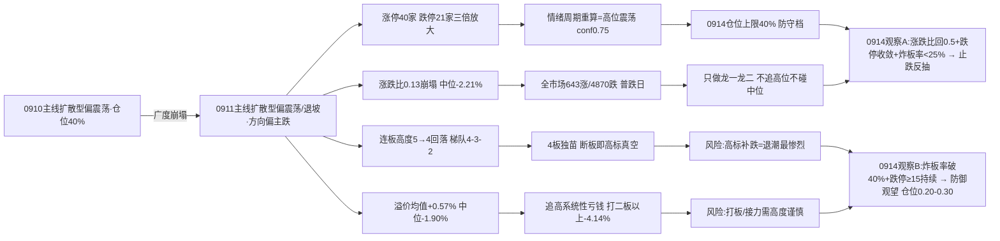

# 九月十四日 · 风格研判(盘前 · 基于 0911 收盘)

> **数据源新鲜度**: partial(核心量化主源全 fresh · 颜晓滨 KOL 群缺失)
> **降级状态**: true(颜晓滨群 error · KOL 5群仅2群 · 全局 severity=3)
> **置信度**: 55%
> **数据归属**: 0911 收盘(T-1 · 0914 盘前预判)

## 一句话结论

9 月 14 日盘前,市场站在**广度崩塌后的十字路口**:0911 收盘涨停 40 家、跌停 **21 家**(较 0910 的 7 家三倍放大),炸板率 31.0%,连板高度从 5 板回落到 4 板;全市场涨跌比 **0.13**(涨 643 / 跌 4870)、中位 **-2.21%**——比 0910 的 0.49 / -0.68% 又崩塌了一截;前日涨停溢价均值 +0.57% 但中位 **-1.90%**。情绪周期重算为**高位震荡**(conf 0.75),方向偏主跌。判定**主线扩散型(偏震荡/退坡)**,仓位上限 **40%**——0914 只做各主线龙一/龙二与低位补涨,不追高位不碰中位;若盘中炸板率破 40% 或跌停继续放大,直接降级防御观望、仓位降至 0.20-0.30。

---

## 一、0911:广度崩塌的一天

0911 的盘面,用一句话说:**指数在跌,个股在崩,高标在独舞**。涨停 40 家——数字比 0910 的 48 家缩了一截,但真正的警报是跌停:21 家,是 0910 的整整三倍。涨停与跌停的比例从"48 比 7"恶化成"40 比 21",亏钱效应不是抬头,是跳级。炸板率 31.0% 虽比 0910 的 36.0% 回落,但仍高于 25% 的分歧线——每一百只冲击涨停的票里,三只半封不住。

更刺眼的是广度。全市场 5550 只里涨 643 / 跌 4870,涨跌比 **0.13**,中位数 **-2.21%**:昨天随便买一只票,九成概率是亏的,一半以上亏超两个点。对比 0910 的 0.49、0909 的 1.69,三天之内广度从"偏多"一路滑到"崩塌"。跌超 3% 的票有 1548 只,跌超 5% 的 315 只——这不是分化,是普跌。指数层面同步转绿:上证 -1.18%、深成 -1.08%、创业板 -0.49%,连权重护盘都消失了,30 日维度上证仍 +2.06%、创业板 +0.59%,说明这是**牛市回调里的急跌**,不是熊市起点,但急跌的斜率正在加速。

连板天梯同步降温:最高 4 板(1 只)、3 板 2 只、2 板 4 只,高度从 0910 的 5 板回落,梯队 4-3-2 明显稀疏。涨停溢价是最后的实锤:0910 的涨停池在 0911 平均 +0.57%,但中位 **-1.90%**——均值靠少数大肉撑住,一半以上的打板资金在系统性亏钱,而且比 0910 的 -0.60% 更差。

- **大资金意图**:0910 还是"涨停尚在、广度先倒"的退坡,0911 变成**全面收缩**:跌停 21 家说明有人在集中离场,广度 0.13 说明普涨底座彻底塌掉,连权重都不护盘。资金不是换座位,是在降杠杆。30 日维度仍然 +13.8% 的累计涨幅,决定了这是获利盘的集中兑现,不是趋势反转——但兑现的速度,决定了 0914 是止跌反抽还是继续退潮。
- **为什么走强(指数层面)**:这次没有走强的一方,权重与题材同步下跌。唯一"强"的是高标抱团(非ST三板以上当日 +1.86%)和零星题材(通信 ETF +0.60%)——这不是进攻,是恐慌里的最后倔强。
- **逻辑够不够硬**:"广度崩塌"的定性很硬——跌停三倍放大 + 涨跌比 0.13 + 中位 -2.21% + 溢价中位 -1.90%,四条独立信号指向同一方向。但"崩塌后是反抽还是退潮"取决于 0914 的涨跌比能否回到 0.5 以上、跌停能否收敛、炸板率是否破 40%——这是盘中必须验证的分岔。

## 二、六簇画像:高标独舞,大本营失速

把二十二个同花顺风格板块和二十只 ETF 放进 30 日窗口的六簇聚类,结构比 0910 更极端:全场 42 个标的里,0911 只有 3 个收红,平均跌幅 -1.51%,而 30 日累计仍然 +13.83%——**30 日在涨,当日全崩**,这是典型的获利兑现形态。

高标抱团簇依然是最锋利的刀:非ST三板以上 30 日 **+316.61%**、当日 **+1.86%**,非ST二板 +101.63%、当日 -0.61%——高标没退,还在涨。但接力端已经崩了:**打二板以上当日 -4.14%**,打板 -1.62%、打首板 -0.50% 全线收绿。高标自己独活,接力的资金彻底不认账,这是情绪内部断层从"裂痕"变成"断裂"的信号——三板以上的票还有人抬,二板以下的票开始没人接。

主流大本营簇(35 只,占全场 83%)平均 30 日 +4.98%,**当日 -1.60%**——原地失速。簇内结构耐人寻味:打板系列 30 日仍强(打二板以上 +95.31%、打板 +20.89%、打首板 +17.80%),但当日全线转负;科技 ETF 继续深坑——恒生科技 -10.16%、科创50 -5.17%、新能源 -4.99%、芯片 -4.83%、半导体 -3.25%,30 日窗口全部深调,0911 当日依旧收绿。**科技这条曾经的进攻主线,30 日维度已经连续失血四周**。

两个单只簇和两个双只簇拼出全貌:资源独立簇(煤炭 +7.76%,但当日 -2.05% 也开始补跌)、防御温和簇(银行 +1.31%,当日 -0.70%)、权重消费弱势簇(证券 -4.44%、消费 -5.60%)、以及**新高崩塌簇——创历史新高指数 30 日 -10.73%**,追新高模式连续第五周失效,资金明确拒绝给"创新高"付溢价。

- **大资金意图**:高标抱团(+316.61%)与市场大本营(+4.98%)的温差已经拉到 **+311 个百分点**的极端水平。资金不是不想做,是只敢在最高度、最小众的票里抱团,不敢扩散——**抱团越紧,说明市场越怕**。0911 连抱团簇内部都开始分化(打二板以上 -4.14%),说明最后一块阵地也在松动。
- **为什么走强**:高标独舞是游资在高度真空里的最后倔强,银行/煤炭的"温和"是避险资金的壳。两者都不是进攻信号,是恐慌的对冲。
- **逻辑够不够硬**:极端分化本身(高标 +316% vs 新高 -11%)就说明市场没有共识、没有合力。心法里"合力来自全市场不是抱团"——0914 必须警惕:抱团越极端,瓦解越剧烈,高标补跌是退潮最惨烈的部分。

## 三、ETF 望远镜:防御缩圈,科技深坑继续

三十日窗口里领涨的只有四条线:通信 +15.98%、煤炭 +7.76%、军工 +6.76%、中证1000 +5.21%;领跌的全是科技+成长:恒生科技 -10.16%、消费 -5.60%、科创50 -5.17%、新能源 -4.99%、芯片 -4.83%。0911 当天更残酷:20 只 ETF 里只有通信 +0.60% 收红,有色 -4.05%、房地产 -3.03%、证券 -3.03% 重挫,宽基全线下跌(中证1000 -2.21% 领跌、上证50 -1.16%)。

**资金从"做多科技反弹"彻底转向"缩圈防守"**。有意思的是,煤炭 30 日 +7.76% 的独立强势在 0911 也开始补跌(-2.05%),说明连防守的钱都开始犹豫。通信是唯一 30 日与当日双红的进攻线,但它更接近事件驱动(光博会/光互联产业趋势),持续性需要验证。

- **大资金意图**:30 日窗口的进攻半径从"多点开花"缩到"通信+煤炭+军工"三条窄线,0911 连窄线都在跌——资金在**全面降杠杆**,不是切换,是收缩。这是高位震荡末期的典型姿态。
- **为什么走强**:通信 30 日 +15.98% 有光互联产业趋势的硬叙事支撑,煤炭/军工是"涨价+防御"与"事件催化"的壳。但 0911 全部回吐或转绿,说明叙事撑不住当日的系统性抛压。
- **逻辑够不够硬**:通信/光互联是唯一有产业逻辑的方向,但事件驱动的钱来得快去得也快;科技 30 日深调 -4.8%~-10.2% 短期难反转,反弹只是逃命波。0914 若通信独木难支,资金将无处可去。

## 四、外盘的风:美股夜反弹,亚太先跌

外盘给的是一个**分裂的画面**。美股周五夜(0911 收盘)反弹:标普 +0.86%、纳指 +0.96%、道指 +0.98%,但 5 日维度标普 -1.18%、纳指 -0.94%,周线仍是阴的——周五夜的红盘更像超跌反抽,不是趋势修复。亚太周五白天先跌:恒指 -0.60%(5 日 -3.30%)、韩国 -1.76%、日经 -1.93%,亚洲风险偏好先于美股走弱。

美股内部继续"弃权重/存储、抱设备/代工/连接器":AMD +2.49%(5 日 +13.15%)、英特尔 +2.61%(5 日 +12.30%)、康宁 +2.01%(5 日 +13.97%)、迈威尔 +4.03%(5 日 +13.06%)、台积电 +1.22% 强攻;英伟达 -0.03%(5 日 -4.44%)、美光 -0.22%、微软 +0.65%(5 日 -2.84%) 权重/存储掉队。这与 A 股科技 30 日深调的方向一致——**外盘设备链的强,撑不住 A 股科技的弱**,映射链条持续断裂。

对 0914 的含义:**外盘中性略偏多**(美股夜盘转红给一个高开借口),但 A 股 0911 自身广度崩塌,主要矛盾在内部——广度 0.13 之后,是止跌反抽还是继续退潮,不取决于外盘给不给风,取决于跌停家数和炸板率这两个内部温度计。

## 五、KOL 的温度:卖方还在推科技,策略开始谈回调

今天的 KOL 有个硬伤:**颜晓滨群抓取失败**,核心 KOL 方向不可得,仅剩 2 群 41 条(机构风向标群 32 条 + 盘中资讯群 9 条)。

但仅有的 41 条信息量不小。机构侧(卖方)依然全力推**AI 算力/光互联**叙事:光博会总结"供不应求、更高速率更高密度光互联"、CPO/OCS/NPO 光模块、超节点/液冷/存算一体、国产算力(昇腾/寒武纪)、AI 产业生命周期(Token 年化 12 倍增长);策略侧出现了一个值得警惕的信号——广发策略公开讨论"牛市成交萎缩到什么程度、反弹是否一定依赖放量",这是**牛市回调怀疑期**的典型议题。

机构叙事与盘面温度出现了背离:卖方还在看多科技成长,盘面广度却已崩塌到 0.13。这种背离有两种解法:要么 0914 叙事重新点燃广度(反抽),要么盘面把叙事拖下水(补跌)。0914 要盯的不是卖方说了什么,而是**资金是否重新愿意为叙事付钱**。

## 六、风格判定:主线扩散型(偏震荡/退坡),仓位 40%

综合所有维度,0914 判定为**主线扩散型**,但必须加注"偏震荡/退坡",方向偏主跌。

判据名义命中:涨停 40 家 ∈ [30,50]、连板高度 4 ∈ [3,5]、有梯队(4板 1 只/3板 2 只/2板 4 只)。为什么不是其他风格?连板情绪型:高度 4<6 且炸板率 31%>20%,不满足;震荡分化型:涨停 40 不分散、有 4 板龙头;防御观望型:涨停 40 远超 20;崩溃退潮型:跌停 21≥15、大盘 -0.91%<-0.5% 两条已命中,但**炸板率 31%<50% 未达标**——三缺一,离崩溃线只差一个炸板率。

**关键联动**:风格表只看涨停/高度,会漏掉 31% 的炸板率和 21 家跌停——按 emotion_cycle 重算(炸板率 31% ≥ 25% + 溢价 +0.57% 未达 +3%),情绪周期=**高位震荡**(conf 0.75)。**以情绪周期阶段为准**,仓位上限从主线扩散型的 0.60-0.80 下修至 **40%**。注意:fetch 预计算的 emotion_cycle.json(06:50)因指标全零误判为 low_test,R1 已用 0911 真实指标重算——这是连续出现的降级陷阱,每次盘前都要警惕。炸板率 31% 未破 35% 纪律警戒线,候选数不强制砍半,但高位震荡+广度崩塌要求候选质量优先:只做龙一/龙二和低位补涨,中位股与杂毛一律剔除。

情绪浓度给 **42 分**(恐惧区上沿):四维法 56 分(涨停强度 26.7 + 连板 10 + 炸板健康 13.8 + 指数 5.4),五维法校验 42 分(涨停 10 + 跌停压制 11.6 + 连板 10 + 炸板健康 0 + 杠杆外资 10),差 14≤15 取四维方向,再叠加广度崩塌(0.49→0.13)、跌停三倍放大(7→21)、溢价中位继续转负(-0.60%→-1.90%),下修至 **42**。0910 是 45,0911 分数只降 3 分,但广度崩塌的幅度远大于分数变化——分数被涨停/高度托底,实际赚钱效应比分数更差,仓位上限压到 40% 防守档。

## 七、关键证据

- **涨停数据**: 涨停 40 / 跌停 21 / 炸板 18 / 炸板率 31.0%(0910: 48/7/27/36.0%——跌停三倍放大、涨停收缩、炸板率回落但仍>25% 分歧线)· 来源 tushare.limit_list_d
- **连板结构**: 最高 4 板(1 只),3 板 2 只,2 板 4 只;高度 5→4 回落(0910: 5板1只/3板4只/2板10只)· 来源 tushare.limit_step
- **涨停溢价**: 0910 涨停 40 只在 0911 平均 +0.57%、中位 -1.90%(0910 为 +1.11%/-0.60%),中位继续恶化 · 来源 tushare.daily 交叉
- **大盘表现**: 上证 -1.18%、深成 -1.08%、创业板 -0.49%;全市场 643 涨/4870 跌、涨跌比 0.13、中位 -2.21%、≤-3% 1548 只 · 来源 tushare.index_daily + tushare.daily
- **风格聚类**: 高标抱团簇(非ST三板以上 30日 +316.61%、当日 +1.86%;打二板以上当日 -4.14% 接力崩)+ 主流大本营簇 35 只(当日 -1.60%)+ 新高崩塌簇(创历史新高 30日 -10.73%);42 标的中仅 3 只收红 · 来源 tushare.ths_daily
- **ETF 分化**: 通信 +15.98%/煤炭 +7.76%/军工 +6.76% vs 恒生科技 -10.16%/消费 -5.60%/科创50 -5.17%;0911 当日 20 只 ETF 仅通信收红 · 来源 tushare.fund_daily
- **主线代理**: limit_cpt_list 强板块 17 个(up_nums≥8,科技成长题材类为主,概念重叠导致计数偏高)· 来源 tushare.limit_cpt_list(近似代理,非 R2 判定)
- **外盘**: 标普 +0.86%/纳指 +0.96%/道指 +0.98%(5日 -1.18%/-0.94% 仍弱);恒指 -0.60%(5日 -3.30%)/韩国 -1.76%/日经 -1.93%;AMD +2.49%(5日 +13.15%)/英特尔 +2.61%/康宁 +2.01%/迈威尔 +4.03% 强 vs 英伟达 -0.03%(5日 -4.44%)/美光 -0.22% 存储弱 · 来源 tushare.index_global + us_daily
- **KOL**: 颜晓滨群 error;2 群 41 条——卖方全力推 AI 算力/光互联(光博会/CPO/OCS/超节点/液冷/存算一体)、Token 12x 年化;广发策略讨论"牛市成交萎缩/反弹依赖放量";网安 AI 智能体事件(9/15)· 来源 wechat_cli_5groups

## 八、风险与不确定性

**最大的风险是跌停 21 家三倍放大**。0914 若跌停继续放大(≥15 持续)且大盘翻绿,风格直接降级崩溃退潮型,仓位上限降至 0.20-0.30——崩溃线只差炸板率 50% 一条,而跌停/广度两条已达标,方向感已经不对。

**第二个风险是炸板率 31.0% 距 40% 退潮线不远**。若盘中炸板率破 40%,情绪=主跌,候选数砍半,只保留最强龙一;高标抱团(30 日仍 +316.61%/+101.63%)可能补跌——高标补跌是退潮最惨烈的部分,4 板独苗断板就是引信。

**第三个风险是广度的持续崩塌**。涨跌比 0.13、中位 -2.21%,若 0914 普跌延续,涨停家数将跌破 30,风格从主线扩散型滑向震荡分化/防御观望;若涨跌比回升到 0.5 以上、跌停收敛,则 0911 是"急跌一日"而非"退潮确认",存在反抽机会。

**第四个风险是机构叙事与盘面温度的背离**。卖方还在全力推科技成长,盘面广度却已崩塌——若 0914 叙事无法重新点燃广度,"有叙事无赚钱效应"的高位分歧会继续恶化,科技 ETF 30 日深调(-4.8%~-10.2%)可能二次探底。

**第五个风险是数据盲区**。颜晓滨群 error 使核心 KOL 方向不可得,5 群仅 2 群可用;fx/SOX/HSTECH/commodities 缺失;weflow 离线、公众号源 disabled;MCP 网关 severity=3(底层 SDK 可用);emotion_cycle 预计算(06:50)降级误判 low_test,R1 已重算为高位震荡(conf 0.75)。style_snapshot.json 今日 fetch 遗漏,R1 已重新生成。

## 九、与其他 R/D/E 的关系

- **上游依赖**: 无(R1 是研究链路起点,依赖原始数据 + style_snapshot + emotion_cycle 横切重算)
- **下游消费**:
  - R2(主线板块): 消费 style / main_lines_count / position_cap_suggestion —— 0911 强板块 17 个(科技成长题材类为主),R2 需确认题材广度背后的真实主线成色
  - R3(情绪热度): 消费 sentiment_score 42 作为基准
  - R6(反证): 与 R2 做一致性反证
  - D1(主决策): 消费 position_cap_suggestion 0.40 → 执行池总仓上限;高位震荡+广度崩塌 → 候选质量优先,只做龙一/龙二与低位补涨

## 数据源审计

| 源 | 日期 | 状态 | 备注 |
|---|---|:--:|---|
| tushare/ths_daily | 2026-09-11 | 🟢 | 22 风格板块 · 30日窗口 · 0911收盘 |
| tushare/fund_daily | 2026-09-11 | 🟢 | 20 ETF · 30日窗口 · 0911收盘 |
| tushare/limit_list_d | 2026-09-11 | 🟢 | 涨停40/跌停21/炸板18/炸板率31.0% |
| tushare/limit_step | 2026-09-11 | 🟢 | 连板天梯(最高4板,梯队4-3-2) |
| tushare/index_daily | 2026-09-11 | 🟢 | 上证/深成/创业板(全部收跌) |
| tushare/daily | 2026-09-11 | 🟢 | 5550 只 · 全市场分布(涨跌比0.13) |
| tushare/limit_cpt_list | 2026-09-11 | 🟢 | 17 板块 up_nums≥8 · 主线代理 |
| tushare/index_global + us_daily | 2026-09-11 | 🟢 | 5 指数 + 14 美股(美股0911收盘) |
| style_snapshot | 2026-09-11 | 🟡 | fetch 遗漏,R1 用 run_style_snapshot.py 重新生成(全 ok) |
| wechat_cli_5groups | 2026-09-13 | 🟡 | 41 条 · 2/5 群 ok · 颜晓滨群 error |
| emotion_cycle (横切) | 2026-09-14 | 🟡 | 预计算(06:50)降级误判 low_test,R1 用真实指标重算=高位震荡 conf0.75 |
| weflow_analytics | — | 🔴 | DOWN · ngrok 离线 |
| 公众号 (sanji) | — | ⚪ | disabled(用户 08-20 取消) |
| fx (USDCNH/DXY) | — | 🔴 | 缺失 · 源 down |
| SOX/HSTECH | — | 🔴 | 无数据 |
| commodities | — | 🔴 | skipped(期货代码未映射) |
| MCP 网关 | — | 🔴 | severity=3(底层 tushare/xtick/datapro/iwencai HTTP 可用) |

## 不确定性 / 反证

- **"崩塌后必退潮"的反向可能**:涨跌比 0.13 是极端值,若 0914 竞价高开+涨跌比快速修复(回 0.5 以上)+跌停收敛+炸板率回落至 25% 以下,说明 0911 是牛市回调中的"急跌一日"而非"退潮确认",主线扩散型可能重新站稳,仓位上限可上修至 0.50。这是 0914 最需要盘中验证的反证。
- **情绪浓度 42 可能低估**:涨停 40/炸板率 31% 仍不是崩溃数据,若 0914 科技叙事重新点燃广度、涨跌比翻正,42 分偏低,仓位上限 40% 偏保守。
- **"新高崩塌"是长期警告**:创历史新高指数 30 日 -10.73% 连续第五周失效,若这代表风险偏好结构性下移,任何高位追涨(包括打板系列)的赔率都在恶化。
- **高标抱团的脆弱性**:非ST三板以上 30 日 +316.61% 的累计涨幅意味着获利盘极重,一旦 4 板独苗断板或打板系列补跌,高标簇的回撤幅度会远超大盘——0914 高标只观察不接力。
- **主线代理 17 个可能虚高**:概念重叠导致 limit_cpt_list 计数偏高,真实主线宽度可能远小于 17,需 R2 用真实共振数据确认。
- **KOL 缺失的双向影响**:核心 KOL 定性不可得,情绪温度判断完全依赖量化指标;若 0914 盘前出现方向性舆情(监管、外盘异动),本次研判缺少 KOL 侧交叉验证。

## Sub-Agent 元数据

- skill: analyze_style_v1
- artifact: data/research/20260914/R1_style.json
- 生成耗时: 约 18 分钟(盘前)
- model: deepseek-v4-flash-ga-260731
- 聚类方法: 层次聚类(平均法) 6簇 · 相关距离 · 特征=30日收益序列
- 覆盖: 22 同花顺风格板块 + 20 ETF + 5 外盘指数 + 14 美股 + 全市场 5550 只 + 2 群 KOL(41 条)
