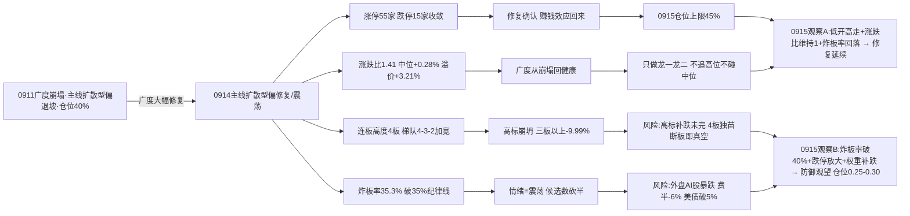

# 九月十五日 · 风格研判(盘前 · 基于 0914 收盘)

> **数据源新鲜度**: partial(核心量化主源全 fresh · KOL 5 群全灭)
> **降级状态**: true(KOL 全灭 · 全局 severity=3 · 美股 tushare 延迟)
> **置信度**: 55%
> **数据归属**: 0914 收盘(T-1 · 0915 盘前预判)

## 一句话结论

9 月 15 日盘前,市场从**广度崩塌**转身走进**修复但不稳**的分岔口:0914 收盘涨停 55 家、跌停 **15 家**(较 0911 的 21 家收敛),炸板率 **35.3%**(破 35% 纪律警戒线),连板高度维持 4 板;全市场涨跌比 **1.41**(涨 3126 / 跌 2224)、中位 **+0.28%**——较 0911 的 0.13 / -2.21% 全面回血,前日涨停溢价均值 **+3.21%**、中位 +3.12% 大幅转正。但结构分化剧烈:高标崩坍(非ST三板以上当日 **-9.99%**)、权重弱(上证 -0.07% / 创业板 -1.10%)、小票强(中证1000 +0.55%)。⚠️ **盘前重大外盘利空**:美股 0914 夜 AI 开发放缓担忧升温,费城半导体大跌近 6%,10 年美债收益率三年来首破 5%。情绪周期重算为**高位震荡**(conf 0.69)。判定**主线扩散型(偏修复/震荡)**,仓位上限 **45%**——0915 只做各主线龙一/龙二与低位补涨,不追高位不碰中位;炸板率破纪律线,候选数砍半;若盘中炸板率破 40% 或跌停放大,直接降级防御观望、仓位降至 0.25-0.30。

---

## 一、0914:广度修复的一天,高标崩塌的一天

0914 的盘面,一句话:**个股在修复,高标在崩,权重在躺平**。涨停 55 家——比 0911 的 40 家放大,跌停从 21 家收敛到 15 家,涨停与跌停的比例从"40 比 21"改善成"55 比 15"。炸板率 35.3% 是唯一的红灯:比 0911 的 31.0% 还高,已突破 35% 的纪律警戒线——修复日的分歧比崩塌日还大,每一百只冲板票里三只半封不住。

广度是真修复。全市场 5550 只里涨 3126 / 跌 2224,涨跌比 **1.41**,中位数 **+0.28%**:昨天随便买一只票,六成概率是赚的,中位转正。对比 0911 的 0.13、中位 -2.21%,一天之内广度从"崩塌"回到"健康"。跌超 3% 的只有 298 只、跌超 5% 的 89 只——抛压在收。但指数是背离的:上证 -0.07%、深成 -0.64%、创业板 -1.10%、科创50 -1.62%,唯独中证1000 +0.55% 收红——**权重在跌、小票在涨**,修复的钱全部流向中小盘题材,大票无人问津。

连板天梯:最高 4 板(1 只)、3 板 3 只、2 板 7 只——高度没抬升,但梯队比 0911(4板1/3板2/2板4)加宽了。涨停溢价是修复的实锤:0911 的涨停池在 0914 平均 **+3.21%**、中位 +3.12%——前一天打板的资金今天普遍大赚,对比 0911 自己当天的 -1.90% 中位,赚钱效应回来了。

- **大资金意图**:0911 是"全面收缩、降杠杆",0914 变成**结构再分配**:资金从小票端回补仓位,但坚决不碰权重和大票,高标抱团被主动砸掉(三板以上 -9.99%)。这是高位震荡期的典型姿态——不是全面进攻,是"低位修复 + 高标兑现"并存。
- **为什么走强**:强的是广度本身(涨跌比 1.41、溢价 +3.21%),不是任何单一方向。题材端 20 个强板块齐涨(较 0911 的 17 个更多),涨停 55 家分散在科技成长类题材——普涨靠情绪修复,不靠主线共识。
- **逻辑够不够硬**:"修复"的定性有硬证据(涨跌比 0.13→1.41、溢价中位 -1.90%→+3.12%、跌停 21→15 三条独立信号同向),但"修复能否持续"存疑——炸板率 35.3% 破纪律线说明分歧极大,且 0915 盘前外盘 AI 股暴跌,修复日次日就面临外部利空考验,这是必须盘中验证的分岔。

## 二、六簇画像:高标崩坍,低位接棒

把二十二个同花顺风格板块和二十只 ETF 放进 30 日窗口的六簇聚类,结构比 0911 更极端:42 个标的里 16 红 25 绿(当日平均 -0.24%),30 日累计仍 +13.44%——**30 日在涨,当日分化**。

最刺眼的信号是**高标崩坍簇**:非ST三板以上 30 日仍 +240.95%,但当日 **-9.99%** 崩——0911 还是当日 +1.86% 独活的最后倔强,0914 直接倒塌。这是 R1 连续多日预警的"高标补跌"正式启动:打板系列全线让位,非ST二板 +7.80%、打首板 +1.69%、打板 +1.49% 全部收红,而打二板以上 -1.75% 仍弱——**资金从最高度撤出,向二板和首板回补**,这是标准的"高标退、低位接"切换。

主流大本营簇(36 只)平均 30 日 +9.14%、当日 -0.03%,原地分化;簇内宽基与科技类 ETF 走势分裂——中证1000 +0.63% 收红、医药 +1.92% 强,通信 -2.67%、科创50 -1.59%、半导体 -1.35% 收绿。两个单只簇拼出全貌:资源独立簇(煤炭 +8.26%,当日 -1.47%)、防御温和簇(银行 +3.01%,当日 +1.06% 收红);权重消费弱势簇(消费 -4.79% / 证券 -4.81%)继续垫底;新高反抽簇(创历史新高 -6.96%,当日 **+2.37%** 反抽)——追新高模式在连续五周失效后首次转红,但 30 日仍深调。

- **大资金意图**:高标抱团(-9.99%)与市场大本营(+9.14%)的温差开始收敛,资金从"抱团最顶端"降级到"二板/首板/低位题材"——**主动降高度,不降仓位**。这与 0911 的"抱团越紧、市场越怕"相反,0914 是"散开不散仓"。
- **为什么走强**:低位端(首板/二板/次新)全线收红,说明修复资金偏好赔率而非确定性;新高反抽 +2.37% 说明最悲观的追高资金也开始试探。但高标 -9.99% 证明最高度无人接力。
- **逻辑够不够硬**:切换证据硬(高标崩 + 首板/二板红 + 新高反抽三信号同向)。但切换的持续性取决于外盘:0915 盘前美股 AI 股暴跌,若映射杀到 A 股科技成长链,低位修复可能被外盘拖下水。

## 三、ETF 望远镜:小盘强、权重弱、科技深坑

三十日窗口里领涨的是中证1000 +5.76%、军工 +4.36%、银行 +3.01%、有色 +2.08%、中证500 +2.42%;领跌的仍是科技+成长:恒生科技 -11.37%、新能源 -4.96%、证券 -4.81%、消费 -4.79%、光伏 -4.70%。0914 当天 20 只 ETF 里 5 只收红(医药 +1.92% / 银行 +1.06% / 中证1000 +0.63%),通信 -2.67% / 科创50 -1.59% / 半导体 -1.35% 继续收绿。

**资金从"科技反弹"彻底转向"小盘+防御"**。中证1000 连续两日领涨宽基,银行/医药防御属性收红,科技类 30 日深坑未填、当日继续弱。最值得注意的是:**0914 的修复没有科技参与**——修复的钱去了小盘题材和防御,科技成长链仍是 30 日维度最深的坑。

- **大资金意图**:修复行情的进攻半径从科技缩到"小盘+防御+低位题材",科技被系统性冷落。这与 0911 的"全面收缩"不同——现在是"有选择地回补",选择的不是科技。
- **为什么走强**:中证1000 领涨是小票情绪修复的直接映射,银行/医药是避险资金的标准去处。科技弱是因为 30 日深调 + 外盘映射断裂(设备链的强撑不住 A 股的弱)。
- **逻辑够不够硬**:防御方向的逻辑硬(避险+小盘情绪),但科技方向 0915 面临外盘 AI 股暴跌的直接映射——若费半 -6% 传导,A 股科技 ETF 可能二次探底,修复日的小盘强势能否扛住待验证。

## 四、外盘的风:AI 担忧之夜,美债破五

外盘给 0915 的是一个**明确的利空**。量化数据受 tushare 延迟所限停在美股 0911 收盘(标普 +0.86% / 纳指 +0.96%,5 日仍 -1.18% / -0.94%),但新闻源(800 条)确认:**美股 0914 夜大跌**——AI 开发放缓担忧升温,费城半导体指数大跌近 6%,存储/光通信普跌,英伟达/美光跌超 2%,纳指期货 -1.7%,10 年美债收益率三年来首破 5%(回落至 4.96%),布油涨破 109、现货黄金失守 4300。亚太 0914:恒指 +0.45%(5 日 -1.95%)、韩国 **-3.26%**(5 日 -4.45%,科技权重暴跌)、日经 -0.81%(5 日 -4.38%)。

对 0915 的含义:**外盘偏空**,而且是直接打在 A 股最弱环节(科技成长链)上的利空。A 股 0914 自身广度修复,但修复日次日就撞上美股 AI 链暴跌——主要矛盾从"内部修复"切换到"修复 vs 外部利空"。同时美债破 5% + 美联储本周议息(加息 25bp 预期)是全球风险资产的系统性压力,外资流出风险升温。

## 五、KOL 的温度:全灭,只剩新闻

今天的 KOL 是**最惨烈的一天:5 群全灭 0 条**。核心 KOL 群抓取失败(找不到聊天对象),其余 4 群全部 timeout;公众号源 disabled、weflow 离线——核心 KOL 定性完全不可得,情绪温度只能依赖量化指标 + 新闻 800 条。

新闻侧呈现两个方向的对撞:宏观/外盘利空(美债破 5% 三年首次、美联储本周议息、AI 开发放缓担忧发酵) vs 国内政策呵护(央行续作 5000 亿 MLF、楼市新政后房企再融资开闸)。盘前信号偏防御:海外流动性收紧 + 国内宽松对冲,与 A 股"修复但权重弱"的盘面互相印证。

## 六、风格判定:主线扩散型(偏修复/震荡),仓位 45%

综合所有维度,0915 判定为**主线扩散型**,加注"偏修复/震荡"。

判据名义命中:涨停 55 家(∈[30,50] 略超上限)、连板高度 4 ∈ [3,5]、有梯队(4板 1 只/3板 3 只/2板 7 只)。为什么不是其他风格?连板情绪型:高度 4<6 且炸板率 35.3%>20%,不满足;震荡分化型:涨停 55 不分散、有 4 板龙头+3 板梯队清晰;防御观望型:涨停 55 远超 20;崩溃退潮型:跌停 15、炸板率 35.3%<50%、大盘 -0.07% 微跌——四条全不满足。

**关键联动**:情绪周期重算(溢价 +3.21% ≥ +3% 但高度 4<5 未达主升硬规则,走综合插值)=**高位震荡**(conf 0.69),与预计算(conf 0.75)方向一致。⚠️ 炸板率 **35.3% 已破 35% 纪律警戒线**——按交易纪律,今日输出必须显式标 **情绪=震荡** 并把候选数砍半。仓位上限从主线扩散型的 0.60-0.80 下修至 **45%**:修复确认(广度 1.41 / 溢价 +3.21%)给 5 个点的回升,但炸板率破线 + 高标崩 + 外盘 AI 利空三重压制,不给 50% 以上。

情绪浓度给 **58 分**(中性偏暖):四维法 67 分(涨停强度 36.7 + 连板 10 + 炸板健康 12.9 + 指数 7.0),五维法校验 48 分(对炸板率惩罚极重:35.3%×4>100 直接归零),差 19>15 取折中。0911 是 42,0914 修复日 +16 分合理,但离贪婪区(60+)还差外盘企稳确认。

## 七、关键证据

- **涨停数据**: 涨停 55 / 跌停 15 / 炸板 30 / 炸板率 35.3%(0911: 40/21/18/31.0%——涨停放大、跌停收敛、炸板率破纪律线)· 来源 tushare.limit_list_d
- **连板结构**: 最高 4 板(1 只),3 板 3 只,2 板 7 只;高度维持 4 板,梯队加宽 · 来源 tushare.limit_step
- **涨停溢价**: 0911 涨停池在 0914 平均 +3.21%、中位 +3.12%(0911 为 +0.57%/-1.90%),大幅转正 · 来源 tushare.daily 交叉
- **大盘表现**: 上证 -0.07%、深成 -0.64%、创业板 -1.10%、科创50 -1.62%、中证1000 +0.55%;全市场 3126 涨/2224 跌、涨跌比 1.41、中位 +0.28%、≤-3% 298 只 · 来源 tushare.index_daily + tushare.daily
- **风格聚类**: 高标崩坍簇(非ST三板以上 30日 +240.95%、当日 -9.99% 崩;非ST二板 +7.80% 强)+ 主流大本营簇 36 只(当日 -0.03%)+ 新高反抽簇(创历史新高当日 +2.37% 反抽);42 标的中 16 红 25 绿 · 来源 tushare.ths_daily
- **ETF 分化**: 中证1000 +5.76%/军工 +4.36%/银行 +3.01% vs 恒生科技 -11.37%/新能源 -4.96%/证券 -4.81%;0914 当日 20 只 ETF 5 只收红 · 来源 tushare.fund_daily
- **主线代理**: limit_cpt_list 强板块 20 个(up_nums≥8,较 0911 的 17 个增加,科技成长题材类为主)· 来源 tushare.limit_cpt_list(近似代理,非 R2 判定)
- **外盘**: 美股 0911 量化(标普 +0.86%/纳指 +0.96%,5日仍弱);⚠️ 新闻确认 0914 夜大跌——AI 开发放缓担忧、费半 -6%、美债破 5%、纳指期货 -1.7%;亚太 0914——恒指 +0.45%/韩国 -3.26%/日经 -0.81% · 来源 tushare.index_global + us_daily + news_major
- **KOL**: 5 群全灭 0 条;新闻侧——美联储本周议息(加息 25bp 预期)、美债破 5%、MLF 续作 5000 亿、楼市再融资开闸 · 来源 wechat_cli_5groups(全灭) + news_major

## 八、风险与不确定性

**最大的风险是外盘 AI 股暴跌的映射杀**。美股 0914 夜费半 -6%、美债破 5%,0915 A 股科技成长链大概率低开——若高开低走,修复日的小盘强势可能一日游,科技 ETF(30 日仍深调 -4.7%~-11.4%)二次探底。

**第二个风险是炸板率 35.3% 已破纪律警戒线**。今日情绪=震荡、候选数砍半是纪律要求;若盘中炸板率破 40%,情绪=主跌,只保留最强龙一。高标崩坍(三板以上 -9.99%)可能继续扩散,4 板独苗断板就是高度真空的引信。

**第三个风险是权重与广度背离**。上证 -0.07% vs 中证1000 +0.55%,修复全在小票;若权重(尤其金融、消费)补跌拖累指数,涨跌比 1.41 的修复可能被打回原形。

**第四个风险是美债破 5% + 美联储议息的系统性压力**。10 年美债三年首破 5% 是全球风险资产的定价锚,若议息落地鹰派,外资流出压力升温,高位震荡可能滑向主跌。

**第五个风险是数据盲区**。KOL 5 群全灭(0 条)使情绪温度完全依赖量化+新闻;美股 tushare 延迟至 0911,0914 夜大跌只能靠新闻补(800 条同源,无法交叉验证);fx/SOX/HSTECH 缺失;MCP 网关 severity=3(底层 SDK 可用)。emotion_cycle 预计算(high_chop conf0.75)与 R1 重算(conf0.69)方向一致,可信。

## 九、与其他 R/D/E 的关系

- **上游依赖**: 无(R1 是研究链路起点,依赖原始数据 + style_snapshot + emotion_cycle 横切)
- **下游消费**:
  - R2(主线板块): 消费 style / main_lines_count / position_cap_suggestion —— 0914 强板块 20 个(科技成长题材类为主),R2 需确认题材广度背后的真实主线成色
  - R3(情绪热度): 消费 sentiment_score 58 作为基准(KOL 全灭,R3 须降级处理)
  - R6(反证): 与 R2 做一致性反证
  - D1(主决策): 消费 position_cap_suggestion 0.45 → 执行池总仓上限;高位震荡+炸板率破纪律线 → 候选数砍半,只做龙一/龙二与低位补涨

## 数据源审计

| 源 | 日期 | 状态 | 备注 |
|---|---|:--:|---|
| tushare/ths_daily | 2026-09-14 | 🟢 | 22 风格板块 · 30日窗口 · 0914收盘 |
| tushare/fund_daily | 2026-09-14 | 🟢 | 20 ETF · 30日窗口 · 0914收盘 |
| tushare/limit_list_d | 2026-09-14 | 🟢 | 涨停55/跌停15/炸板30/炸板率35.3% |
| tushare/limit_step | 2026-09-14 | 🟢 | 连板天梯(最高4板,梯队4-3-2) |
| tushare/index_daily | 2026-09-14 | 🟢 | 上证/深成/创业板/科创50/中证1000 |
| tushare/daily | 2026-09-14 | 🟢 | 5550 只 · 全市场分布(涨跌比1.41) |
| tushare/limit_cpt_list | 2026-09-14 | 🟢 | 20 板块 up_nums≥8 · 主线代理 |
| tushare/index_global + us_daily | 2026-09-11 | 🟡 | 5 指数 + 14 美股(美股延迟至0911) |
| news_major | 2026-09-15 | 🟢 | 800 条 · 美股0914夜大跌/AI担忧/美债破5% |
| style_snapshot | 2026-09-14 | 🟡 | fetch 遗漏,R1 用 run_style_snapshot.py 重新生成(全 ok) |
| emotion_cycle (横切) | 2026-09-15 | 🟢 | 预计算 high_chop conf0.75 · 与 R1 重算一致 |
| wechat_cli_5groups | — | 🔴 | 5 群全灭 0 条(核心 KOL 群找不到聊天对象+4群timeout) |
| weflow_analytics | — | 🔴 | DOWN · ngrok 离线 |
| 公众号 (sanji) | — | ⚪ | disabled(用户 08-20 取消) |
| fx (USDCNH/DXY) | — | 🔴 | 缺失 · 源 down |
| SOX/HSTECH | — | 🔴 | 无 kline |
| MCP 网关 | — | 🔴 | severity=3(底层 tushare/xtick/datapro/iwencai HTTP 可用) |

## 不确定性 / 反证

- **"修复日次日必跌"的反向可能**:涨跌比 1.41 是强修复信号,若 0915 低开后快速回拉(涨跌比维持 1 以上、炸板率回落至 25% 以下),说明修复有韧性,主线扩散型站稳,仓位上限可上修至 0.55——外盘利空是压力测试,不是死亡判决。
- **情绪浓度 58 可能偏高**:炸板率 35.3% 破纪律线说明分歧极大,若 0915 高开低走、跌停放大,58 分偏高,仓位上限 45% 仍嫌激进,应下修至 0.30-0.35。
- **高标崩坍的持续扩散风险**:三板以上 -9.99% 若延续,二板(+7.80%)和首板(+1.69%)的接力端可能被高标补跌拖累——"低位接棒"是切换叙事,也可能是下跌中继,0915 需盯二板溢价。
- **权重补跌风险**:修复全在小票,权重(上证 -0.07%)未参与。若 0915 权重补跌、广度与指数同跌,修复宣告失败。
- **主线代理 20 个可能虚高**:概念重叠导致 limit_cpt_list 计数偏高,真实主线宽度需 R2 用真实共振数据确认。
- **KOL 缺失的双向影响**:核心 KOL 定性不可得,情绪温度完全依赖量化+新闻;新闻侧对 AI 担忧的报道存在放大效应,0915 盘前情绪可能被外盘利空过度压制,低开幅度本身就是观察指标。

## Sub-Agent 元数据

- skill: analyze_style_v1
- artifact: data/research/20260915/R1_style.json
- 生成耗时: 约 16 分钟(盘前)
- model: deepseek-v4-flash-ga-260731
- 聚类方法: 层次聚类(平均法) 6簇 · 相关距离 · 特征=30日收益序列
- 覆盖: 22 同花顺风格板块 + 20 ETF + 5 外盘指数 + 14 美股(tushare延迟至0911) + 新闻 800 条 + 全市场 5550 只
