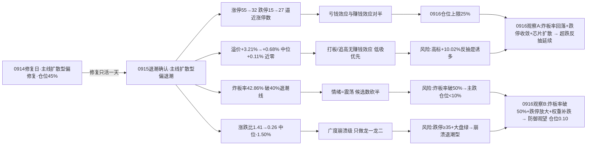

# 九月十六日 · 风格研判（盘前 · 基于 0915 收盘）

> **数据源新鲜度**: ok（核心量化主源全 fresh · KOL 3/5 群失败）
> **降级状态**: true（KOL 核心群缺失 · 全局 severity=3 · 美股延迟）
> **置信度**: 62%
> **数据归属**: 0915 收盘（T-1 · 0916 盘前预判）

## 一句话结论

9 月 16 日盘前，市场在修复日之后**一天之内跌回冰点**：0915 收盘涨停 32 家、跌停 **27 家**（几乎与涨停对半）、炸板率 **42.86%**——连续第三日破 35% 纪律警戒线，且**已破 40% 退潮线**；连板高度 5 板（5板 1 只 / 4板 1 只 / 3板 2 只 / 2板 3 只，梯队极薄）；全市场涨跌比 **0.26**（涨 1120 / 跌 4376）、中位 **-1.50%**——较 0914 的 1.41 / +0.28% 崩溃式腰斩；前日涨停溢价均值 **+0.68%**、中位仅 +0.11%，赚钱效应从大幅转正回落到近零。大盘全绿（上证 -0.54% / 创业板 -1.15%），唯科创50 +1.55% 与芯片类 ETF 逆势收红。主线代理强板块从 20 个骤降到 **6 个**（集中在新能链与科技硬件两类）。情绪周期重算为**高位震荡**（conf 0.75）且**贴主跌边缘**。判定**主线扩散型（偏退潮）**，仓位上限 **25%**——0916 只做各主线龙一/龙二与低位试错，候选数砍半；若盘中炸板率破 50% 或跌停继续放大，直接降级防御观望/崩溃退潮、仓位降至 10% 以下。

---

## 一、0915：修复日被一口吞掉的一天

0915 的盘面，一句话：**0914 的修复只活了一天**。涨停 55 家缩到 32 家，跌停从 15 家放大到 27 家——涨停与跌停的比例从"55 比 15"恶化成"32 比 27"，赚钱与亏钱几乎对半。炸板率 **42.86%** 是全场最刺眼的数字：比 0914 的 35.3% 又跳了 7 个多点，已经越过 40% 的退潮线——每一百只冲板票里四只半封不住，这是分歧到极致的信号，也是交易纪律里"情绪=震荡/主跌、候选数砍半"的硬触发。

广度是崩溃的。全市场 5548 只里涨 1120 / 跌 4376，涨跌比 **0.26**，中位数 **-1.50%**：昨天随便买一只票，七成概率是亏的，中位数亏 1.5 个点。对比 0914 的 1.41 / +0.28%，广度一天之内从"健康修复"被打回"崩溃级"——而且比 0911 的 0.21 略好一点点，但亏钱深度（中位 -1.50% vs -1.49%）不相上下。跌超 3% 的 1127 只、跌超 5% 的 235 只——抛压不仅回来，还带走了中位数的 1.5 个点。

连板天梯：最高 5 板（1 只）、4 板 1 只、3 板 2 只、2 板 3 只——高度比 0914 的 4 板抬了一级，但梯队极薄（1-1-2-3 的倒金字塔），说明高度是孤军抬上去的，不是群体接力。涨停溢价是退潮的实锤：0914 的涨停池在 0915 平均 **+0.68%**、中位 **+0.11%**——前一天打板的资金今天基本白干，对比 0914 自己当天的 +3.21% / +3.12%，赚钱效应从"大赚"滑到"归零"。

- **大资金意图**：0914 是"低位修复 + 高标兑现"，0915 变成**全面撤退**——涨停缩量、跌停翻倍、炸板率破线，资金在 0914 的修复里完成了减仓，0915 直接不玩了。唯一的逆势是科创板与芯片类，但这更像避险资金的局部回补，不是进攻。
- **为什么走强**：0915 没有走强的方向——42 个风格标的里只有 10 个收红（芯片三兄弟 + 科创50 + 非ST二板/打二板以上 + 昨日资金前十等），全部是"超跌反抽"属性，没有任何一个有持续性可言。
- **逻辑够不够硬**："退潮确认"的定性证据是硬的：炸板率破退潮线 + 涨跌比腰斩 + 跌停逼近涨停 + 溢价归零，四条独立信号同向。但"退潮之后怎么走"无法预判——0916 是继续杀（破 50% 炸板率、跌停放大）还是超跌反抽（炸板率回落、跌停收敛），只能盘中验证。

## 二、六簇画像：高标反弹，中位断层，芯片逆势

把二十二个同花顺风格板块和二十只 ETF 放进 30 日窗口的六簇聚类，结构比 0914 更极端：42 个标的里 **10 红 32 绿**（当日平均 -0.18%），30 日累计仍 +10.18%——**30 日在涨，当日普跌**。

最刺眼的信号是**高标反弹簇**：非ST三板以上 30 日仍 +245.90%，当日 **+10.02%** 大反弹——0915 高标不但没崩，反而逆势大涨。这与大盘普跌形成极端背离：市场越冷，最高标越被抱团。但看簇内结构就明白了——**中位断层**：非ST二板 +2.46%、打二板以上 +1.91% 收红，而打板 -1.29%、打首板 -1.61% 收绿。资金只认最高度和最低度，中间地带（首板/打板接力）全线失血。

主流大本营簇（34 只）平均 30 日 +5.89%、当日 -0.38%，是普跌日的分化样本：簇内**芯片类逆势收红**（半导体 +1.80% / 芯片ETF华夏 +1.99% / 芯片ETF +1.89% / 科创50 +1.55%），而百日新高 **-2.94%**、近端次新股 -0.76%、新能源 -1.08%、光伏 -0.76% 继续失血——科技硬件（芯片）与新能源链（光伏/新能源）在同一簇里走出相反方向，说明资金在科技硬件里做防守性回补。其余三个单只/小组簇拼出全景：资源独立簇（煤炭 +8.37%，当日 -0.24%）、防御独苗簇（银行 +3.94%，当日 -1.52%）、防御弱势簇（医药 -3.68% / 消费 -3.69% / 证券 -5.18% / 恒生科技 -11.82%，30 日 -6.09%）；新高崩塌簇（创历史新高 -6.80%，当日 -1.01%）继续垫底。

- **大资金意图**：高标 +10.02% 与大盘 -0.18% 的极端温差，说明资金在**退潮日把所有仓位押到最高标上**——这不是进攻，是"要么最高、要么不动"的防御性抱团；同时芯片类逆势红，是 30 日深调后的低位防守性回补。中位（首板/打板）被系统性抛弃。
- **为什么走强**：高标强是因为唯一性（全市场只有 5 板 1 只独苗，抱团成本低）；芯片强是因为 30 日深调 + 外盘映射（美股硬件链虽跌但 A 股芯片已提前跌透）；中位弱是因为退潮日接力资金消失。
- **逻辑够不够硬**：高标反弹的证据硬（+10.02%），但**单日反抽在退潮期可能是诱多**——0911 的教训是"高标最后倔强 → 0914 直接 -9.99% 崩塌"，0915 的三板以上 +10.02% 会不会重演"反抽即出货"，0916 见分晓。

## 三、ETF 望远镜：芯片逆势，其余尽墨

三十日窗口里领涨的是煤炭 +8.37%、银行 +3.94%、中证1000 +2.72%、通信 +2.51%、军工 +2.06%；领跌的仍是科技+成长：恒生科技 -11.82%、新能源 -7.32%、光伏 -6.54%、证券 -5.18%。0915 当天 20 只 ETF 里**只有芯片类收红**（半导体 +1.80% / 芯片ETF华夏 +1.99% / 芯片ETF +1.89%），宽基全线绿（沪深300 -0.64% / 上证50 -0.61% / 中证1000 -0.41% / 中证500 -0.13%）。

**资金从"小盘+防御"进一步缩到"芯片独苗"**。0914 还有银行/医药/中证1000 三个收红，0915 只剩芯片三兄弟——修复半径从"小盘+防御"缩到"科技硬件的低位防守"。煤炭/银行 30 日领涨但当日回落，说明防御资金也在兑现；恒生科技 30 日 -11.82% 是全场最深的坑，跨境端彻底失血。

- **大资金意图**：退潮日的资金没有进攻方向，只在**最深的坑里捞最确定的低位**（芯片 30 日深调 + 国产替代叙事）。这既是防守（不追高）也是试探（低位博反弹），但 0915 的广度 0.26 说明试探的资金量很小。
- **为什么走强**：芯片逆势红 = 30 日深调出空间 + 氧化锆/MLCC 国产替代消息（东曹断供）+ 机构半导体洁净室叙事共振；其余 ETF 绿 = 退潮日普跌 + 外盘硬件链回调映射。
- **逻辑够不够硬**：芯片的当日强有消息和位置支撑，但**单日逆势在退潮期不具备持续性验证**——0916 若芯片继续红且带动科技硬件扩散，才算低位承接成立；否则就是一日游。

## 四、外盘的风：AI 硬件链回调，美债破 5.4%

外盘给 0916 的底色是**偏空**。美股（0914 收盘）：标普 -0.48%（5 日 -1.28%）、纳指 -0.56%（5 日 -1.21%）——指数温和回调，但 5 日维度已经转弱。**半导体硬件链深度回调**：英伟达 -3.36%（5 日 -8.42%）、美光 -5.25%（5 日 -9.11%）、台积电 -1.02%（5 日 -5.75%）、博通 -4.77%、康宁 -0.02%（5 日 **-13.49%**）、英特尔 -5.59%、AMD -4.40%——AI 硬件链全线走弱；平台权重相对强（Meta +2.71% / 苹果 +0.24% / 微软 +1.97%，Meta 5 日 +7.92%），谷歌 0915 已更新 -1.26%。

亚太（0915）：恒指 -1.00%（5 日 -2.57%）、韩国 -0.85%（5 日 -4.71%）、日经 -0.01%（5 日 -2.74%）——亚太普跌，5 日维度全线转弱。宏观锚最扎眼：**美国 30 年期国债收益率突破 5.40%，创 2007 年以来新高**——全球风险资产的定价锚持续收紧。

对 0916 的含义：**外盘偏空，但映射关系断裂**——美股硬件链大跌 vs A 股芯片类 0915 逆势收红，说明 A 股芯片已提前跌透、走独立低位逻辑；而外盘系统性压力（美债 5.4%）对 A 股权重与外资流向是持续压制。A 股内部矛盾（退潮确认后能否止跌）才是主要矛盾：炸板率 42.86% 破退潮线 + 跌停 27 逼近涨停，情绪周期 = 高位震荡贴主跌边缘，仓位上限 25%。

## 五、KOL 的温度：机构亢奋 vs 盘面冰点

今天的 KOL 是**冰火两重天**：3/5 群抓取失败（核心KOL群找不到聊天对象、摩天轮/专注核心 timeout），可用 2 群 77 条。机构群（陆家嘴机构风向标 39 条）依然亢奋——华创"AI 产业生命周期远未结束，Token 至 2030 年 12x 年化"、国金"算力的强结构主线"、星环科技（AI 软件）深度、半导体洁净室（存储景气→Fab 扩产）、液冷/金刚石散热、氧化锆/MLCC 国产替代（东曹断供，10 月村田涨价预期）；新闻群（一手盘中 38 条）盘面侧则冰点——"指数这么走最好直接杀到收盘，投机冰点+情绪冰"（14:38），盘后更是直白："调研完 14 家私募后，发现大家都在提高现金仓位"（22:31）。

**机构叙事与盘面冰点的背离在加剧**：机构群聊的是 AI 算力十年长逻辑，盘面是炸板率破退潮线、涨跌比 0.26 的崩溃日。这个背离从 0911 延续至今，且"私募提高现金仓位"是盘后最新的同向确认——**消息多、资金空的格局没有修复，反而更极端**。新闻侧还有两条值得注意：美国 30 年期国债破 5.40%（系统性压力）+ 风电/MLCC 涨价消息发酵（与盘面强板块的题材线索一致，但 0915 盘面没有兑现成板块效应）。

## 六、风格判定：主线扩散型（偏退潮），仓位 25%

综合所有维度，0916 判定为**主线扩散型**，加注"偏退潮/高位震荡末期"。

判据名义命中：涨停 32 家（∈[30,50]）、连板高度 5 ∈ [3,5]、有梯队（5板 1 只/4板 1 只/3板 2 只/2板 3 只）。为什么不是其他风格？连板情绪型：高度 5<6 且炸板率 42.86%>20%，不满足；震荡分化型：涨停 32 不分散、有 5 板龙头；防御观望型：涨停 32>20；崩溃退潮型：跌停 27≥15 但炸板率 42.86%<50%（差 7.1 个点）——四条都差一点，只有主线扩散型命中。

**关键联动**：情绪周期重算（炸板率 42.86% ≥ 40% 但溢价均值 +0.68% 未破 -1%，不满足主跌硬规则）= **高位震荡**（conf 0.75），与预计算（conf 0.75）一致——但炸板率已破 40% 退潮线、溢价中位仅 +0.11%、跌停 27 逼近涨停，是**贴主跌边缘的高位震荡**。⚠️ 炸板率 42.86% 已破 35% 纪律警戒线——按交易纪律，今日输出必须显式标 **情绪=震荡** 并把候选数砍半。仓位上限从主线扩散型的 0.60-0.80 下修至 **25%**：退潮确认（炸板率破线 + 广度崩溃 + 跌停逼近涨停 + 溢价归零 + 主线 20→6 骤降）五重压制，不给 30% 以上；若盘中炸板率破 50% 或跌停 ≥35，降至 10% 以下。

情绪浓度给 **32 分**（恐惧区）：四维法 54 分（涨停强度 21.3 + 连板 12.5 + 炸板健康 11.4 + 指数 8.9），五维法校验 40 分（对炸板率惩罚极重：42.86%×4>100 直接归零），差 14<15 未超校验线；再叠加七重恶化信号（炸板率破退潮线/广度 0.26/跌停逼近涨停/溢价近零/主线 20→6/大盘全绿/KOL 私募提高现金仓位），下修至 32。0914 是 58，0915 崩塌日降温 26 分，与涨停 55→32、涨跌比 1.41→0.26、溢价 +3.21%→+0.68% 的全面退潮一致。

## 七、关键证据

- **涨停数据**: 涨停 32 / 跌停 27 / 炸板 24 / 炸板率 42.86%（0914: 55/15/30/35.3%——涨停收缩、跌停翻倍、炸板率破退潮线）· 来源 tushare.limit_list_d
- **连板结构**: 最高 5 板（1 只），4 板 1 只，3 板 2 只，2 板 3 只；高度抬升但梯队极薄 · 来源 tushare.limit_step
- **涨停溢价**: 0914 涨停池在 0915 平均 +0.68%、中位 +0.11%（0914 为 +3.21%/+3.12%），赚钱效应归零 · 来源 tushare.daily 交叉
- **大盘表现**: 上证 -0.54%、深成 -0.72%、创业板 -1.15%、科创50 +1.55%（唯一红）、沪深300 -0.67%、中证1000 -0.41%；全市场 1120 涨/4376 跌、涨跌比 0.26、中位 -1.50%、≤-3% 1127 只 · 来源 tushare.index_daily + tushare.daily
- **风格聚类**: 高标反弹簇（非ST三板以上 30日 +245.90%、当日 +10.02% 反抽）+ 主流大本营簇 34 只（当日 -0.38%，芯片类 +1.80~1.99% 逆势红）+ 防御弱势簇（医药/消费/证券/恒科，30日 -6.09%）+ 新高崩塌簇（创历史新高 30日 -6.80%）；42 标的中 10 红 32 绿 · 来源 tushare.ths_daily
- **ETF 分化**: 煤炭 +8.37%/银行 +3.94%/中证1000 +2.72% vs 恒生科技 -11.82%/新能源 -7.32%/光伏 -6.54%；0915 当日仅芯片三兄弟收红 · 来源 tushare.fund_daily
- **主线代理**: limit_cpt_list 强板块（up_nums≥8）仅 6 个（较 0914 的 20 个骤降），集中在新能源链类（5 个）+ 科技硬件类（1 个）· 来源 tushare.limit_cpt_list（近似代理，非 R2 判定）
- **外盘**: 美股 0914——标普 -0.48%/纳指 -0.56%，硬件链深度回调（英伟达 -3.36%/美光 -5.25%/台积电 -1.02%/康宁 5日 -13.49%）；亚太 0915——恒指 -1.00%/韩国 -0.85%/日经 -0.01%，5 日全线转弱 · 来源 tushare.index_global + us_daily
- **KOL**: 2/5 群 77 条——机构群 AI 算力链亢奋（华创 Token 12x/国金算力强结构/半导体洁净室/MLCC 国产替代）vs 盘面冰点（投机冰点+情绪冰/私募提高现金仓位）；美 30 年期国债破 5.40% 创 2007 新高 · 来源 wechat_cli_5groups（3 群失败）

## 八、风险与不确定性

**最大的风险是炸板率 42.86% 已破 40% 退潮线**。0916 若炸板率破 50% 且溢价转负，情绪周期直接判主跌（conf 0.90），候选数砍至个位、仓位上限降至 10% 以下——这是当日最需要盯的盘中信号。

**第二个风险是跌停 27 家逼近涨停 32 家**。亏钱效应与赚钱效应几乎对半，若 0916 跌停继续放大（≥35）且大盘翻绿，风格直接降级崩溃退潮型（差 7.1 个点炸板率就精确命中）。

**第三个风险是广度 0.26 崩溃级 + 溢价归零**。涨跌比 1.41→0.26 腰斩，追高赔率极差；溢价中位 +0.11% 说明打板/追高全面无利可图——0916 只认各主线龙一/龙二，低吸优先于打板，不做中位与杂毛。

**第四个风险是高标 +10.02% 反抽是诱多**。0911 的教训是"高标最后倔强 → 0914 直接 -9.99% 崩塌"，0915 的三板以上 +10.02% 可能重演"反抽即出货"——若 0916 高标再度崩塌，打板系列二次补跌。

**第五个风险是主线 20→6 骤降 + 美债 5.4% 的系统性压力**。主线宽度大幅收缩，若继续萎缩（≤3）R2 将进入"无主线"区间；美国 30 年期国债破 5.40% 创 2007 新高是全球风险资产定价锚，外资流出风险升温，高位震荡可能滑向主跌。

**第六个风险是数据盲区**。KOL 核心群缺失（3/5 群失败），情绪温度判断依赖量化指标；美股 tushare 延迟至 0914（谷歌已更新 0915），0915 夜美股（北京时间 0916 凌晨收盘）无法确认；weflow 离线、公众号 disabled、fx 缺失；MCP 网关 severity=3（底层 SDK 可用）。emotion_cycle 预计算（high_chop conf0.75）与 R1 重算（conf0.75）一致，可信。

## 九、与其他 R/D/E 的关系

- **上游依赖**: 无（R1 是研究链路起点，依赖原始数据 + style_snapshot（本次 R1 生成）+ emotion_cycle 横切）
- **下游消费**:
  - R2（主线板块）: 消费 style / main_lines_count / position_cap_suggestion —— 0915 强板块仅 6 个（新能源链 5 + 科技硬件 1），R2 需确认新能源链题材广度背后的真实主线成色
  - R3（情绪热度）: 消费 sentiment_score 32 作为基准（KOL 3/5 群失败，R3 须降级处理）
  - R6（反证）: 与 R2 做一致性反证
  - D1（主决策）: 消费 position_cap_suggestion 0.25 → 执行池总仓上限；高位震荡贴主跌边缘 + 炸板率破退潮线 → 候选数砍半，只做龙一/龙二与低位试错

## 数据源审计

| 源 | 日期 | 状态 | 备注 |
|---|---|:--:|---|
| tushare/ths_daily | 2026-09-15 | 🟢 | 22 风格板块 · 30日窗口 · 0915收盘 |
| tushare/fund_daily | 2026-09-15 | 🟢 | 20 ETF · 30日窗口 · 0915收盘 |
| tushare/limit_list_d | 2026-09-15 | 🟢 | 涨停32/跌停27/炸板24/炸板率42.86% |
| tushare/limit_step | 2026-09-15 | 🟢 | 连板天梯（最高5板，梯队1-1-2-3） |
| tushare/index_daily | 2026-09-15 | 🟢 | 上证/深成/创业板/科创50/沪深300/中证500/1000/上证50 |
| tushare/daily | 2026-09-15 | 🟢 | 5548 只 · 全市场分布（涨跌比0.26） |
| tushare/limit_cpt_list | 2026-09-15 | 🟢 | 6 板块 up_nums≥8 · 主线代理 |
| tushare/index_global + us_daily | 2026-09-14 | 🟡 | 5 指数 + 14 美股（美股延迟至0914，谷歌已更新0915） |
| style_snapshot | 2026-09-15 | 🟢 | 本次 R1 用 run_style_snapshot.py 生成（22+20+19 全 ok） |
| emotion_cycle（横切） | 2026-09-16 | 🟢 | 预计算 high_chop conf0.75 · 与 R1 重算一致 |
| wechat_cli_5groups | — | 🔴 | 3/5 群失败（核心KOL群找不到聊天对象+2群timeout），2群77条 |
| weflow_analytics | — | 🔴 | DOWN · ngrok 离线 |
| 公众号（sanji） | — | ⚪ | disabled（用户 08-20 取消） |
| fx（USDCNH/DXY） | — | 🔴 | 缺失 · style_snapshot overseas_fx_ok=0 |
| MCP 网关 | — | 🔴 | severity=3（底层 tushare/xtick/datapro/iwencai HTTP 可用） |

## 不确定性 / 反证

- **"退潮日次日超跌反抽"的反向可能**: 0915 的崩溃（广度 0.26 / 炸板率 42.86%）若 0916 低开后快速回拉（炸板率回落至 30% 以下、涨跌比回到 0.8 以上、芯片扩散带动科技硬件），说明退潮是一日性的，超跌反抽成立，仓位上限可上修至 0.35——炸板率破线是警报，不是判决。
- **情绪浓度 32 可能偏低**: 高标 +10.02% 与芯片逆势红说明极端位置仍有赚钱效应（非ST二板 +2.46%），若 0916 高标继续强且题材低位补涨，32 分偏低，可上修至 40——但仓位纪律（炸板率破线候选数砍半）不变。
- **高标 +10.02% 反抽的持续性存疑**: 单日反抽可能是退潮中的诱多（0911 高标倔强 → 0914 崩塌先例），也可能是一轮新周期的起点（低位试错期的"老龙头反抽"）——0916 需盯三板以上能否连板、二板溢价是否维持，不能把反抽当反转。
- **主线代理 6 个可能虚低**: 概念重叠导致 limit_cpt_list 计数偏低（0914 的 20 个也有重叠虚高问题），真实主线宽度需 R2 用真实共振数据确认——若 R2 确认新能源链有真实板块效应，主线扩散型可站稳，仓位上限可上修至 0.30。
- **KOL 缺失的双向影响**: 核心KOL群缺失，情绪温度完全依赖量化+新闻；机构群"AI 十年长逻辑"与盘面冰点的背离如果持续，题材叙事与资金流向的撕裂会加大追高风险——0916 的低开幅度和炸板率走向是最客观的观察指标。

## Sub-Agent 元数据

- skill: analyze_style_v1
- artifact: data/research/20260916/R1_style.json
- 生成耗时: 约 40 分钟（盘前 · 含 style_snapshot 抓取）
- model: deepseek-v4-flash-ga-260731
- 聚类方法: 层次聚类（平均法）6簇 · 相关距离 · 特征=30日收益序列
- 覆盖: 22 同花顺风格板块 + 20 ETF + 5 外盘指数 + 14 美股（tushare延迟至0914）+ 全市场 5548 只 + KOL 2群 77 条
