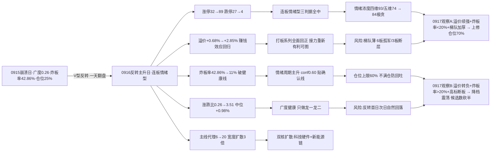

# 九月十七日 · 风格研判（盘前 · 基于 0916 收盘）

> **数据源新鲜度**: partial（核心量化主源全 fresh · KOL 全灭）
> **降级状态**: true（KOL 5/5 群失败 · 全局 severity=3 · 美股延迟）
> **置信度**: 63%
> **数据归属**: 0916 收盘（T-1 · 0917 盘前预判）

## 一句话结论

昨天还在崩溃边缘的市场，一天之内完成了 V 型反转：0916 收盘涨停 **89 家**（较 0915 的 32 家翻近三倍）、跌停只剩 **4 家**、炸板率从 **42.86% 暴降到 11%**、连板高度抬到 **6 板**、昨日涨停溢价 **+2.85%**、全市场涨跌比从崩溃级的 0.26 修复到 **3.51**。风格判定为**连板情绪型**，情绪浓度 **84（极贪区）**，情绪周期**主升**（conf 0.60，贴确认线），建议仓位上限 **60%**——只做各主线龙一/龙二与低位补涨，不满仓追高，防反转次日回吐。

---

## 一、0916：从崩溃边缘到主升的一天

如果说 0915 是把修复日一口吞掉的崩溃日，0916 就是把崩溃一口吞掉的反转日。所有的退潮指标在一天之内全部反转：涨停从 32 家拉到 89 家，跌停从 27 家压到 4 家——前一天还是"赚钱与亏钱对半"，今天亏钱效应几乎归零；炸板率 42.86% 降到 11%，每一百只冲板票里有八十九只封住，这是接近教科书级别的健康情绪日；昨日涨停溢价 +2.85%，昨天打板的人今天平均赚近三个点，赚钱效应从"近零"回到"强正"。

广度是这场反转最硬实的证据。全市场 5550 只里涨 4170 / 跌 1189，涨跌比 3.51，中位数 +0.98%——对比 0915 的 0.26 / -1.50%，一天之内从"七成概率亏钱"翻成"七成五概率赚钱"。跌超 5% 的只剩 32 只、跌超 9.9% 的只有 5 只，亏钱深度彻底消失。大盘八个宽基指数全线收红，科创50 涨 **4.14%** 领跑，上证 +0.71%、创业板 +1.96%——权重与中小盘齐涨，成长属性最强的地方涨得最多，这是典型的进攻日形态。

主线代理也同步放大：涨停最强板块（up_nums≥8）从 0915 的 6 个扩到 **20 个**，科技硬件类 7 个（居首概念簇涨停 26 家、次席 24 家）、新能源链类 5 个、区域出海类 3 个——主线宽度从"塌缩"回到"扩散"，双核（科技硬件 + 新能源链）加区域题材齐动。

- **大资金意图**：0915 的崩盘是恐慌性出清，0916 的反转是超跌回补 + 主线资金重新进场。涨停 89 家不是单一板块的孤军，而是 20 个强板块的群体效应——资金从"避险收缩"直接切回"进攻扩散"，且科创50 +4.14% 说明风险偏好最高的钱回来了。对手盘是 0915 割肉离场的恐慌盘。
- **为什么走强**：位置（0915 广度 0.26 的极端超卖 + 前一日炸板率破退潮线后物极必反）+ 催化（无新增利空，消息面中性）+ 筹码（恐慌盘出清后抛压真空，回补资金轻松推动）三维共振。涨停 89 家中相当一部分是超跌反抽，属于修复行情的第一波。
- **逻辑够不够硬**："反转成立"的证据硬：涨停翻 3 倍、跌停归零、炸板率暴降、广度极值修复、溢价转正——五个独立信号全部同向，且与情绪周期预计算（主升 conf 0.60）一致。但"反转能否延续"证据不足：这是反转首日，涨停 89 家含大量超跌普涨成分，连板梯队薄（6 板仅 1 只、3 板断层、2 板仅 9 只），证伪路径清晰——明日溢价转负或炸板率回升 >20%，主升确认即失败。

## 二、六簇画像：普涨大本营，高标独苗熄火

把二十二个同花顺风格板块和二十只 ETF 放进 30 日窗口的六簇聚类，0916 的结构和 0915 完全换了一副面孔：42 个标的里 **39 红 2 绿 1 平**（当日平均 +1.95%），只有银行（-0.47%）与消费（-0.92%）收绿——防御端成了唯一落后的地方。

最值得玩味的是**高标独苗簇**（非ST三板以上，30 日 +214.48%）当日只有 **+0.01%**——0915 它还 +10.02% 逆势狂飙，反转日反而熄火。这说明高标在崩盘日是抱团避风港，市场一旦普涨，资金立刻从最高标流向更广阔的进攻面。**二板强者簇**（非ST二板 +105.01%）当日 +4.54% 接棒领涨，**打板系列全面回正**：打二板以上 +2.85%、打首板 +2.77%、打板 +2.11%——昨天打板的资金今天全赚，赚钱效应完整回归。

**普涨大本营簇**（35 只）平均 30 日 +1.34%、当日 +2.23%，是反转日的核心样本：科技硬件领涨（半导体 +4.56%、科创50 +4.27%、芯片 +4.36~4.40%、通信 +4.90%、创历史新高 +5.7%），昨日资金前十 +3.61%、昨日成交前十 +2.87%、昨日高振幅 +1.99%——最活跃资金 proxy 全面转强。**防御弱势簇**（消费 -3.87% / 医药 -4.67% / 恒生科技 -12.49%）当日平均 -0.18% 仍弱——普涨的广度集中在进攻方向，防御与跨境端没跟上。资源独立簇（煤炭 +8.36%）、防御独苗簇（银行 +4.74% 但当日 -0.47% 唯一显著绿）继续扮演各自的独立角色。

- **大资金意图**：高标熄火 + 普涨大本营放量，说明资金从"极端位置抱团"切回"全面进攻"——反转日最怕的就是高标继续独强（那是避险不是进攻），0916 恰好相反。资金在科技硬件（30 日深调的芯片/科创）和打板梯队（赚钱效应回归）两个方向同时下注。
- **为什么走强**：科技硬件强 = 30 日深调出空间 + 美股硬件链当日止跌（AMD +2.19%）映射转正 + 国产替代叙事；打板系列强 = 溢价 +2.85% 的直接兑现；防御弱 = 进攻日资金流出防守端。
- **逻辑够不够硬**：普涨的广度硬（39/42 红），但"结构"还不够硬——高标熄火说明高度锚缺失，3 板断层、2 板仅 9 只的梯队撑不起连续主升。0917 若高标重新点火或梯队加厚，主升才真正站稳；否则就是一日普涨后的分化。

## 三、ETF 望远镜：科技硬件领涨，防御落后

三十日窗口里，20 只 ETF 领涨的是煤炭 +8.36%、通信 +6.69%、银行 +4.74%、中证1000 +1.51%、军工 +1.24%；领跌的仍是成长深坑：恒生科技 -12.49%、新能源 -8.77%、光伏 -6.67%、证券 -4.98%、医药 -4.67%。

0916 当日是科技硬件的主场：通信 +4.90%、半导体 +4.56%、芯片 ETF 华夏 +4.36%、芯片 ETF +4.40%、科创50 +4.27%——20 只 ETF 里 18 红 1 平（医药）1 绿（银行 -0.47%）。与 0915"只有芯片三兄弟逆势红"相比，修复半径从"科技硬件独苗"扩大到"科技硬件全线 + 宽基普涨"，而防御端（银行、消费）成了唯二落后的地方——进攻日资金的方向选择非常明确。

- **大资金意图**：反转日资金优先回补弹性最大的深调品种（芯片/科创 30 日 -2~-4% 但当日 +4% 以上），防御端（银行/消费 30 日仍正收益）反而被抽血——这是典型的"低位高弹性优先、高位防御兑现"的进攻切换。
- **为什么走强**：科技硬件 = 30 日深调 + 美股硬件链止跌 + 主线代理 20 个强板块中占 7 个；恒生科技 30 日 -12.49% 仍是全场最深的坑，跨境端修复滞后。
- **逻辑够不够硬**：当日强有位置和资金双重支撑，但 ETF 是结果不是原因——0917 要看科技硬件 ETF 能否连续放量（量能确认），以及新能源链 ETF 能否跟上（0916 当日新能源仅 +0.44%、光伏 +1.40%，明显落后于芯片），若新能源链持续哑火，普涨的"双核"只剩一核。

## 四、外盘的风：硬件止跌，亚太同向

外盘给 0917 的底色从"偏空"转为"中性偏稳"。美股（0915 收盘）标普 -0.45%、纳指 -0.78%，指数温和；关键是 **AI 硬件链止跌企稳**——英伟达 +0.57%（5 日 -6.0%）、AMD +2.19%、美光 +0.39%、迈威尔 +1.32%，而平台权重回吐（微软 -1.64%、亚马逊 -2.02%、谷歌 -1.26%、苹果 -0.52%），Meta +0.70%（5 日 +9.26%）仍强。这与 A 股 0916 芯片类 ETF 大涨（+4.4%）方向趋于一致——外盘映射从"背离"转回"共振"。

亚太（0916）与 A 股同向反弹：恒指 +0.19%、韩国 +1.37%、日经 +0.69%——但 5 日维度仍负（恒指 -2.22%、韩国 -4.73%、日经 -1.87%），说明修复刚起步，不是趋势反转。系统性压力仍在：美国 30 年期国债 0915 破 5.40% 创 2007 年新高，全球风险资产定价锚没有松动，外资流向与 A 股权重仍受压制。另一个盲区是**数据滞后**：美股 tushare 只到 0915，0916 夜盘（北京时间 0917 凌晨 4 点收盘）尚未确认，外盘映射存在一天的不确定性。

- **大资金意图**：美股硬件链止跌是 AI 叙事资金"停止撤退"的信号，与 A 股科技硬件共振——若 0916 夜美股硬件继续走强，0917 A 股科技硬件有隔夜溢价；若夜盘转弱，则 0916 的 +4.4% 可能被外盘压制。
- **为什么走强**：硬件止跌 = 5 日深调（英伟达 5 日 -6%、康宁 5 日 -13.49%）后的技术性企稳 + AMD/美光财报预期修复；平台回吐 = 前期避险资金的获利兑现。
- **逻辑够不够硬**：单日止跌证据弱（5 日维度硬件链仍 -6~-13%），不足以确认反转——0917 需看 0916 夜盘美股（尤其英伟达/美光）能否连续收红，以及美债收益率是否回落。外盘只能提供映射背景，A 股自身情绪周期（主升）才是主要矛盾。

## 五、情绪周期与风格判定：主升确认，极贪不满仓

情绪周期重算（用 0916 真实指标：溢价 +2.85%、连板 6 板、炸板率 11%、涨停 89 家）= **主升**（conf 0.60），与预计算 emotion_cycle.json 完全一致。溢价差 0.15 个百分点就到 +3% 硬线——贴着主升确认线，再强一点就是硬规则命中。

风格判定**精确命中连板情绪型**：连板高度 6 ≥ 6 板、涨停 89 ≥ 50 家、炸板率 11% < 20%，三条判据全中。情绪浓度四维法 93 分、五维法校验 74 分，差 19 分超校验线——反转首日情绪虚高（涨停 89 含大量超跌普涨成分 + 连板梯队薄 + 前一天刚崩过盘），从 93 下修至 **84（极贪区下沿）**。

**仓位上限 60%**：连板情绪型 band（0.60-0.80）与极贪逆向卖出窗口（0.50-0.60）的交集取上沿。主升期猛干龙头的打法不变，但 84 分极贪 + 反转首日，不满仓追高，保留 40% 机动——早盘确认（昨日涨停溢价续强、炸板率守住 20% 以下）可上修至 70%；若炸板率回升 >20% 或溢价转负，直接降档震荡、候选数砍半。

情绪浓度 **84 分（极贪区下沿）**的完整链条：四维 93（涨停强度 40 + 连板 15 + 炸板健康 17.8 + 指数 20）为主算，五维 74 校验，差 19 > 15 触发说明——反转首日涨停 89 家含大量超跌普涨、6 板孤军梯队薄、前一日刚崩盘情绪基础不稳，下修至 84。0915 是 32（恐惧），0916 一天升温 52 分，与涨停 32→89、炸板率 42.86%→11%、广度 0.26→3.51 的全面反转一致。极贪区映射为逆向卖出窗口（0.50-0.60），叠加连板情绪型 band，仓位取 **0.60**——这不是看空，是反转首日不让满仓追高。

## 六、关键证据

- **涨停数据**: 涨停 89 / 跌停 4 / 炸板 11 / 炸板率 11%（0915: 32/27/24/42.86%——全面反转）· 来源 tushare.limit_list_d
- **连板结构**: 最高 6 板（1 只），4 板 1 只，3 板 1 只，2 板 9 只——高度抬升但梯队薄 · 来源 tushare.limit_step
- **涨停溢价**: 0915 涨停池在 0916 平均 +2.85%（0915 当天 +0.68%），赚钱效应大幅转正 · 来源 tushare.daily 交叉
- **大盘表现**: 上证 +0.71%、深成 +1.25%、创业板 +1.96%、科创50 +4.14%（领涨）、沪深300 +0.68%、中证1000 +2.01%；全市场 4170 涨/1189 跌、涨跌比 3.51、中位 +0.98% · 来源 tushare.index_daily + tushare.daily
- **风格聚类**: 高标独苗簇（非ST三板以上 30日 +214.48%、当日 +0.01% 熄火）+ 二板强者簇（+105.01%、当日 +4.54%）+ 普涨大本营簇 35 只（当日 +2.23%，科技硬件领涨 +4.3~4.9%）+ 防御弱势簇（消费/医药/恒科 30日 -7.01%）；42 标的中 39 红 2 绿 1 平 · 来源 tushare.ths_daily
- **ETF 分化**: 煤炭 +8.36%/通信 +6.69%/银行 +4.74% vs 恒生科技 -12.49%/新能源 -8.77%/光伏 -6.67%；0916 当日 18 红 1 平 1 绿，科技硬件领涨 · 来源 tushare.fund_daily
- **主线代理**: limit_cpt_list 强板块（up_nums≥8）20 个（较 0915 的 6 个扩 3 倍），科技硬件类 7 + 新能源链类 5 + 区域出海类 3 · 来源 tushare.limit_cpt_list（近似代理，非 R2 判定）
- **外盘**: 美股 0915——标普 -0.45%/纳指 -0.78%，硬件链止跌（AMD +2.19%/英伟达 +0.57%/美光 +0.39%）；亚太 0916——恒指 +0.19%/韩国 +1.37%/日经 +0.69%，5 日仍负 · 来源 tushare.index_global + us_daily
- **KOL**: 5/5 群全失败，0 条消息——情绪温度纯靠量化 · 来源 wechat_cli_5groups
- **新闻**: news_major 800 条（0916 盘后）——商务部 9/17 新闻发布会前瞻、券商 IPO 承销额超去年全年、数字人民币跨境提速，消息面中性偏多 · 来源 news_major

## 七、风险与不确定性

**最大的风险是反转首日的次日回吐**。0915 广度 0.26 崩溃 → 0916 广度 3.51 是极值修复，涨停 89 家里相当一部分是超跌反抽的普涨成分——0917 自然回落概率高，高开低走防追高。观察指标：昨日涨停溢价的承接（0916 涨停池今日表现）——若大幅低开（溢价转负），主升确认失败、回落高位震荡。

**第二个风险是连板梯队太薄**。6 板仅 1 只孤军、3 板断层、2 板仅 9 只——高度是孤军抬上去的，不是群体接力。若 6 板龙头断板，情绪高度直接塌，主升降档高位震荡。0917 需要看到梯队加厚（2 板 → 3 板 5 只以上）才能确认接力健康。

**第三个风险是极贪情绪（84）的逆向压力**。情绪浓度进入 80+ 极贪区，参考映射是逆向卖出窗口——反转日第一天就把情绪打满，说明市场一致性过强，分歧随时可能来。不满仓追高，若早盘炸板率回升 >20% 或溢价转负，降档震荡、候选数砍半。

**第四个风险是高标独苗熄火的传导**。非ST三板以上当日仅 +0.01%（前日 +10.02%），高标与大盘普涨背离——若 0917 高标继续哑火，打板梯队缺乏高度锚，赚钱效应可能从"全面回正"退回"低标自嗨"。

**第五个风险是数据盲区**。KOL 5/5 群全灭（0 条消息），情绪温度纯靠量化指标，缺少市场参与者定性交叉验证；美股 tushare 延迟至 0915（0916 夜盘未确认），外盘映射存在一天不确定性；美债 30 年期 0915 破 5.40% 创 2007 新高的系统性压力未消；weflow 离线、公众号 disabled、fx 缺失。emotion_cycle 预计算（main_up conf 0.60）与 R1 重算一致，可信。

## 八、与其他 R/D/E 的关系

- **上游依赖**: 无（R1 是研究链路起点，依赖原始数据 + style_snapshot（本次 R1 生成）+ emotion_cycle 横切）
- **下游消费**:
  - R2（主线板块）: 消费 style（连板情绪型）/ main_lines_count（三主线以上）/ position_cap_suggestion（0.60）——0916 强板块 20 个（科技硬件 7 + 新能源链 5 + 区域出海 3），R2 需用真实共振数据确认双核成色
  - R3（情绪热度）: 消费 sentiment_score 84 作为基准（KOL 5/5 群失败，R3 须纯量化降级处理）
  - R6（反证）: 与 R2 做一致性反证
  - D1（主决策）: 消费 position_cap_suggestion 0.60 → 执行池总仓上限；主升期 + 连板情绪型 → 只做龙一/龙二与低位补涨，极贪 84 不满仓；早盘炸板率回升 >20% 或溢价转负 → 砍半

## 数据源审计

| 源 | 日期 | 状态 | 备注 |
|---|---|:--:|---|
| tushare/ths_daily | 2026-09-16 | 🟢 | 22 风格板块 · 30日窗口 · 0916收盘 |
| tushare/fund_daily | 2026-09-16 | 🟢 | 20 ETF · 30日窗口 · 0916收盘 |
| tushare/limit_list_d | 2026-09-16 | 🟢 | 涨停89/跌停4/炸板11/炸板率11% |
| tushare/limit_step | 2026-09-16 | 🟢 | 连板天梯（最高6板，梯队1-1-1-9） |
| tushare/index_daily | 2026-09-16 | 🟢 | 上证/深成/创业板/科创50/沪深300/中证500/1000/上证50 全红 |
| tushare/daily | 2026-09-16 | 🟢 | 5550 只 · 全市场分布（涨跌比3.51） |
| tushare/limit_cpt_list | 2026-09-16 | 🟢 | 20 板块 up_nums≥8 · 主线代理 |
| tushare/index_global + us_daily | 2026-09-15 | 🟡 | 5 指数 + 14 美股（美股延迟至0915，亚太已更新0916） |
| style_snapshot | 2026-09-16 | 🟢 | 本次 R1 用 run_style_snapshot.py 生成（22+20+19 全 ok） |
| emotion_cycle（横切） | 2026-09-17 | 🟢 | 预计算 main_up conf0.60 · 与 R1 重算一致 |
| wechat_cli_5groups | — | 🔴 | 5/5 群全失败（0 条 · 核心KOL群找不到聊天对象+4群timeout） |
| weflow_analytics | — | 🔴 | DOWN · ngrok 离线 |
| 公众号（sanji） | — | ⚪ | disabled（用户 08-20 取消） |
| fx（USDCNH/DXY） | — | 🔴 | 缺失 · style_snapshot overseas_fx_ok=0 |
| news_major | 2026-09-16 | 🟢 | 800 条 · 0916 盘后背景 |
| MCP 网关 | — | 🔴 | severity=3（底层 tushare/xtick/datapro/iwencai HTTP 可用） |

## 不确定性 / 反证

- **"反转首日"可能是"超跌反抽一日游"**：0911 → 0914 的历史模式是"高标最后倔强 → 直接崩塌"，0916 的普涨若是 0915 崩溃后的超跌反抽，0917 可能重复 0915 的"反抽即出货"。反证观察：涨跌比能否守在 1.5 以上、炸板率能否守住 20% 以下、昨日涨停溢价能否维持正——三个都破则主升证伪。
- **情绪浓度 84 可能偏高**：反转首日的 89 家涨停含大量普涨成分，梯队薄（6 板孤军）撑不起高情绪——若 0917 高标断板 + 炸板率回升，84 分是虚高，仓位应更保守。四维 93 vs 五维 74 的 19 分差距本身就是警告：五维法（对炸板率惩罚轻、对涨停饱和度线性）更保守。
- **连板高度 6 板可能是"孤军"而非"梯队"**：6 板独苗之外，4 板 1 只、3 板 1 只、2 板 9 只——若这 9 只 2 板里有 3 只以上晋级 3 板，梯队加厚，主升才真正成立；否则高度随时可塌。
- **外盘 0916 夜盘未确认**：美股 tushare 只到 0915，若 0916 夜盘（北京时间 0917 凌晨 4 点收盘）美股硬件链大跌，0916 的芯片 +4.4% 将被隔夜压制——盘前需在 P1 竞价校准阶段确认外盘最新收盘。
- **KOL 全灭的盲区**：5/5 群失败意味着没有任何市场参与者定性输入，84 分极贪完全是量化推出来的——历史上量化推极贪、但参与者实际谨慎的场景（如 0915 前夕）并不少见，0917 早盘情绪验证（竞价高开幅度、首小时炸板率）比任何静态判断都重要。

## Sub-Agent 元数据

- skill: analyze_style_v1
- artifact: data/research/20260917/R1_style.json
- 生成耗时: 约 35 分钟（盘前 · 含 style_snapshot 抓取与量化重算）
- model: deepseek-v4-flash-ga-260731
- 聚类方法: 层次聚类（平均法）6簇 · 相关距离 · 特征=30日收益序列
- 覆盖: 22 同花顺风格板块 + 20 ETF + 5 外盘指数 + 14 美股（tushare 延迟至 0915）+ 全市场 5550 只 + 主线代理 20 强板块 + KOL 0 条（5/5 群全灭）
