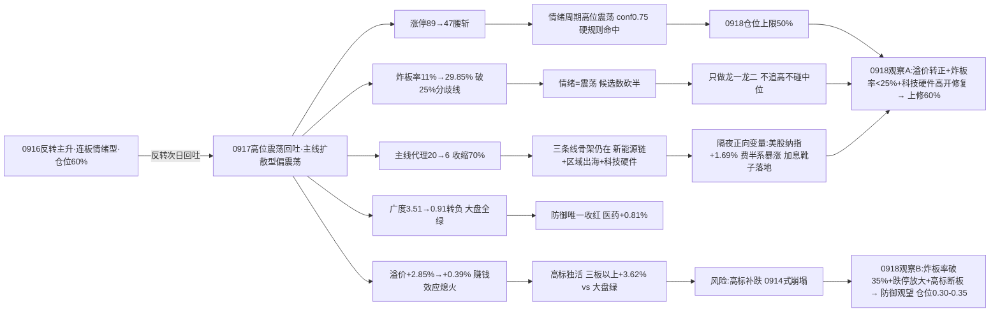

# 九月十八日 · 风格研判（盘前 · 基于 0917 收盘）

> **数据源新鲜度**: partial（核心量化主源全 fresh · KOL 5 群全灭）
> **降级状态**: true（KOL 全灭 · 全局 severity=3 · 美股 tushare 延迟）
> **置信度**: 63%
> **数据归属**: 0917 收盘（T-1 · 0918 盘前预判）

## 一句话结论

0918 盘前的底色是**反转次日的高位震荡回吐**：0917 收盘涨停 **47 家**（较 0916 的 89 家腰斩）、跌停仅 **1 家**、炸板率从 11% 回升到 **29.85%**（破 25% 分歧线、未破 35% 纪律线）、连板高度回落到 **5 板**（4 板断层）、昨日涨停溢价从 +2.85% 熄火到 **+0.39%**、全市场涨跌比从 3.51 转负到 **0.91**、八只宽基指数全线收绿。风格判定**主线扩散型（偏震荡/回吐）**，情绪浓度 **60**，情绪周期**高位震荡**（conf 0.75），建议仓位上限 **50%**——只做各主线龙一/龙二与低位补涨，不追高不碰中位；唯一的正向变量是隔夜外盘：美联储加息靴子落地后美股大涨（纳指 +1.69%、费半系暴涨），给科技硬件链一个修复窗口。

---

## 一、0917：反转次日，回吐的一天

0916 把崩溃一口吞掉，0917 又把反转吐掉了一半。涨停从 89 家收缩到 **47 家**——不到昨天的一半；炸板率从 11% 回升到 **29.85%**，每一百只冲板票里有三成封不住，分歧在放大；最伤的是赚钱效应：0916 涨停池在 0917 平均溢价只有 **+0.39%**、中位数 **0.0%**——昨天打板的人今天几乎不赚不亏，接力利润直接消失。

广度是回吐的实锤。全市场 5553 只里涨 2576 / 跌 2820，涨跌比 **0.91** 转负，中位数 **-0.08%**：昨天六成概率赚钱，今天五成半概率亏钱。不过亏钱深度不大——跌超 5% 的只有 73 只、跌超 9.9% 的只有 4 只，跌停更是只有 **1 家**，这是"回吐"而不是"崩塌"。大盘八只宽基全线收绿：上证 -0.41%、深成 -0.33%、创业板 -0.40%、科创50 -0.61%、上证50 -0.74%——权重成长同跌，但幅度都很克制（最深的 -0.74%），属于普跌回吐而非恐慌出清。

连板天梯：最高 5 板（1 只）、3 板 3 只、2 板 5 只——高度较 0916 回落 1 级，**4 板断层**，梯队从 6-4-3-2 缩成 5-3-2。主线代理同步塌缩：涨停最强板块（up_nums≥8）从 0916 的 20 个收缩到 **6 个**——新能源链类 2 个（居首概念簇涨停 13 家）、区域出海类 2 个（次席 11 家）、科技硬件类 2 个，三条线骨架还在，但宽度只剩三分之一。

- **大资金意图**：0916 是超跌回补 + 主线资金进场的全面进攻，0917 变成**获利兑现 + 高度收敛**——涨停腰斩、溢价熄火、广度转负，说明昨天的普涨里有大量超跌反抽成分，今天这批筹码在兑现；但跌停只有 1 家、高标还在（非ST三板以上 +3.62%），说明资金不是恐慌离场，是"降仓位、留龙头"。
- **为什么走弱**：位置（0916 极值修复后自然回吐）+ 筹码（反抽盘兑现）+ 结构（4 板断层、首板接力熄火）三维共振。打板系列的分化说明问题：非ST三板以上 +3.62%、非ST二板 +3.27%、打二板以上 +6.71%——高位接力还活着；但打首板 -0.53%、打板 +0.05%——首板没人接力了，资金只在最高的地方抱团。
- **逻辑够不够硬**："回吐"的定性证据硬：涨停腰斩、溢价熄火、广度转负、大盘全绿、主线收缩，五个独立信号同向。但"回吐是健康的还是转弱的起点"证据不足——高标独活（三板以上 +3.62% vs 大盘全绿）是典型的抱团避险形态，若高标明天补跌，就是 0914 那天"非ST三板以上 -9.99%"的翻版。

## 二、六簇画像：高标独活，大本营分化回吐

把二十二个同花顺风格板块和二十只 ETF 放进 30 日窗口的六簇聚类，0917 的结构是"**高标独活 + 大本营分化**"：42 个标的里 **14 红 28 绿**（当日平均 -0.08%），30 日累计仍 +7.28%——**30 日在涨，当日回吐**。

最刺眼的还是**高标独苗簇**：非ST三板以上 30 日 +203.77%、当日 **+3.62%** 继续独强；**二板强者簇**（+100.17%）当日 +3.27%，打二板以上当日 **+6.71%**——高度端还在赚钱。但**主流大本营簇**（36 只）平均 30 日 +0.04%、当日 **-0.27%**，内部剧烈分化：打板 +9.78% / 打首板 +7.40% / 通信 +5.20% 30 日仍红，而半导体 -4.41%、芯片 -5.84%、科创50 -5.49%、新能源 -8.47% 深调——**30 日维度上，钱只在打板梯队的记忆里，不在科技硬件里**。防御温和簇（医药 -1.87% 当日 +0.81%、消费 -3.01% 当日 +0.15%）是当日唯一收红的簇——回吐日资金躲回防御。银行独立簇（+3.97% 当日 -0.24%）、煤炭独立簇（+1.21% 当日 -1.10%）各自单飞。

- **大资金意图**：高标独活 + 防御收红 + 大本营分化，这是标准的**高位震荡姿态**——资金从全面进攻退到"抱团最高度 + 蹲守防御"，中间的宽基和题材被兑现。与 0916 的"高标熄火、普涨进攻"完全相反，一天的钟摆从进攻摆回防守。
- **为什么走强（高标）**：非ST三板以上 30 日 +203.77% 是全场最强动量，回吐日资金不撤龙头只撤跟风——这是存量资金的选择，也是高位震荡期"龙头不死做低位补涨"心法的量化镜像。
- **逻辑够不够硬**：高标独活的证据硬（三板以上 +3.62% vs 大盘全绿），但这是**双刃剑**——0914 的高标也是最后独活然后直接 -9.99% 崩塌。0918 关键看高标是否续强：续强则高位震荡延续，高标补跌则震荡滑向主跌。

## 三、ETF 望远镜：防御唯一收红，进攻全线绿

三十日窗口里领涨的是通信 +5.20%、银行 +3.97%、煤炭 +1.21%、军工 +0.62%、中证1000 +0.52%；领跌的仍是成长深坑：恒生科技 -11.14%、新能源 -8.47%、有色 -7.02%、光伏 -6.16%、科创50 -5.49%。

0917 当日是**防御的主场**：20 只 ETF 里只有 4 只收红——医药 +0.81%、房地产 +0.34%、消费 +0.15%、通信 +0.15%；进攻端全线绿，有色 -2.57% 领跌、证券 -1.14%、煤炭 -1.10%、芯片 -0.84~-0.89%、科创50 -0.70%。与 0916 的"18 红 1 平 1 绿、科技硬件领涨"正好反过来——回吐日的资金方向选择是明确的：**卖了进攻，买了防御**。

- **大资金意图**：回吐日资金从高弹性（芯片/科创/有色）撤到低波动（医药/消费/地产），这是避险动作不是看空——跌停 1 家说明没有系统性风险，只是把昨天的进攻仓兑现。
- **为什么走强（防御）**：医药 +0.81% 是超跌（30 日 -1.87%）+ 避险双驱动；消费/地产是低位防御标准去处。进攻端绿是因为 0916 涨太多 + 溢价熄火后没有接力资金。
- **逻辑够不够硬**：防御端的走强逻辑硬（避险 + 回吐日），但它是**结果不是方向**——0918 若科技硬件因隔夜外盘（纳指 +1.69%、费半系暴涨）高开修复，防御端的独红会被证伪为"一日避险"；ETF 只是镜子的反射面，不是决定者。

## 四、外盘的风：加息靴子落地，美股暴涨

这是 0918 盘前**最重要的外部变量**。量化数据受 tushare 延迟所限停在美股 0916 收盘（标普 -0.45%、纳指 -0.01%），但新闻源（800 + 2893 条）确认了一个大事件：**美联储时隔三年首次加息 25bp 靴子落地**，而美股 0917 夜（北京时间 0918 凌晨 4 点收盘）三大指数集体大涨——**标普 +1.14%、道指 +0.62%、纳指 +1.69%**，走出加息阴霾。

关键是结构：**半导体与 AI 硬件集体暴涨**——英特尔 +7.67%、AMD +6.36%、美光 +5.50%、英伟达 +2.54%（黄仁勋称明年芯片销量翻倍）、高通 +2.09%、阿斯麦 +1.71%；平台权重同步走强，特斯拉 +2.27%、亚马逊 +2.13%。这直接映射 A 股科技硬件链：0917 芯片类 ETF 刚跌了 -0.84~-0.89%，隔夜外盘给了它一个明确的修复窗口。产业侧催化同样密集：华为昇腾 960 提前至 2027Q1 发布、苹果接受三星 2027 内存涨价（产业链涨价信号）、英伟达 CEO 放话销量翻倍。亚太（0917）平淡：恒指 -0.44%、韩国 -0.04%、日经 +0.33%，5 日维度仍负。

- **大资金意图**：加息 25bp 是压制项，但靴子落地 + 半导体财报预期（美光/AMD 强势）让美股资金选择"利空出尽买科技"——这与 A 股 0917 内部的高标抱团形成呼应：全球资金都在往最高景气方向集中。
- **为什么走强**：美联储加息 25bp 落地（10 月概率 55.4%）后不确定性消除 + 半导体链（美光 +5.50%/AMD +6.36%）业绩与涨价叙事共振 + 英伟达销量翻倍喊话——三重催化在隔夜一次性释放。
- **逻辑够不够硬**：单日大涨的证据是新闻源（非 tushare 量化），且"加息落地反弹"可能是情绪修复而非趋势——若 0918 夜美股回落，隔夜映射消失。但方向（半导体强势）与 A 股产业催化（昇腾提前/内存涨价）一致，逻辑够硬；不确定性在持续性。

## 五、情绪周期与风格判定：高位震荡确认，隔夜外盘是唯一变量

情绪周期重算（用 0917 真实指标：溢价 +0.39%、连板 5 板、炸板率 29.85%、涨停 47 家）= **高位震荡**（conf 0.75），**硬规则命中**——炸板率 29.85% ≥ 25% 且溢价 +0.39% 未达 +3%，与预计算 emotion_cycle.json 完全一致。高位震荡期该做什么：**落袋为安/控制仓位，龙头不死可做低位补涨，不搏穿越**。

风格判定**名义命中主线扩散型**：涨停 47 家（∈[30,50]）、连板高度 5（∈[3,5]）、有梯队（5板1/3板3/2板5）。为什么不是其他风格：连板情绪型——高度 5<6 且炸板率 29.85%>20%；震荡分化型——涨停 47 不分散、有 5 板龙头+3 板梯队；防御观望型——涨停 47 远超 20；崩溃退潮型——跌停仅 1 家、炸板率 29.85%<50%、大盘 -0.41% 微跌，四条全不满足。但加注**偏震荡/回吐**：溢价熄火（+2.85%→+0.39%）、广度转负（3.51→0.91）、大盘全绿、主线收缩（20→6）——反转次日的回吐特征，风格不是健康的扩散而是震荡中的结构性行情。

**仓位上限 50%**：主线扩散型 band（0.60-0.80）∩ 高位震荡控仓 + 回吐日 → 下修到 0.50。炸板率 29.85% 已破 25% 分歧线——按纪律**情绪=震荡，候选数砍半**。情绪浓度 **60**（中性偏暖）：四维法 66、五维法 54，差 12 未超校验线取折中——0916 是 84（极贪），0917 降温 24 分，与涨停腰斩、溢价熄火、广度转负全面一致；但跌停仅 1 家无亏钱效应 + 隔夜外盘大涨，未跌破中性线。

## 六、关键证据

- **涨停数据**: 涨停 47 / 跌停 1 / 炸板 20 / 炸板率 29.85%（0916: 89/4/11/11%——涨停腰斩、炸板率回升 18.9pct）· 来源 tushare.limit_list_d
- **连板结构**: 最高 5 板（1 只），3 板 3 只，2 板 5 只——4 板断层 · 来源 tushare.limit_step
- **涨停溢价**: 0916 涨停池（89 只）在 0917 平均 +0.39%、中位 0.0%（0916 当天 +2.85%）· 来源 tushare.daily 交叉
- **大盘表现**: 上证 -0.41%、深成 -0.33%、创业板 -0.40%、沪深300 -0.45%、上证50 -0.74%、中证500 -0.37%、中证1000 -0.51%、科创50 -0.61%——八宽基全线绿；全市场 2576 涨/2820 跌、涨跌比 0.91、中位 -0.08%、≤-3% 267 只 · 来源 tushare.index_daily + tushare.daily
- **风格聚类**: 高标独苗簇（非ST三板以上 30日 +203.77%、当日 +3.62%）+ 二板强者簇（+100.17%、当日 +3.27%）+ 主流大本营簇 36 只（30日 +0.04%、当日 -0.27%）+ 防御温和簇（医药/消费 当日唯一收红）；42 标的中 14 红 28 绿 · 来源 tushare.ths_daily
- **ETF 分化**: 通信 +5.20%/银行 +3.97%/煤炭 +1.21% vs 恒生科技 -11.14%/新能源 -8.47%/有色 -7.02%；0917 当日 20 只 ETF 仅 4 红（医药/房地产/消费/通信）· 来源 tushare.fund_daily
- **主线代理**: limit_cpt_list 强板块 6 个（up_nums≥8，较 0916 的 20 个收缩 70%）：新能源链 2 + 区域出海 2 + 科技硬件 2 · 来源 tushare.limit_cpt_list（近似代理，非 R2 判定）
- **外盘**: 美股 0916 量化（标普 -0.45%/纳指 -0.01%）；⚠️ 新闻确认 0917 夜大涨——标普 +1.14%/道指 +0.62%/纳指 +1.69%，英特尔 +7.67%/AMD +6.36%/美光 +5.50%/英伟达 +2.54%；亚太 0917——恒指 -0.44%/韩国 -0.04%/日经 +0.33% · 来源 tushare.index_global + us_daily + news_cls
- **宏观**: 美联储时隔三年首次加息 25bp（10 月加息概率 55.4%）、英国央行维持利率、国际油价 17 日微跌（WTI 101.91/-0.51%）、LME 金属集体上涨（伦铜 +1.59% 报 14477）、在岸人民币 6.7060 夜盘 +41 点 · 来源 news_cls + news_major
- **KOL**: 5 群全灭 0 条；新闻侧产业催化——华为昇腾 960 提前至 2027Q1、苹果接受三星 2027 内存涨价、地瓜机器人 4 亿美元 C 轮融资 · 来源 wechat_cli_5groups（全灭）+ news_major

## 七、风险与不确定性

**最大的风险是回吐日的延续与加深**。0917 涨停腰斩、溢价熄火、广度转负是反转次日的自然回吐，但若 0918 高开（隔夜外盘刺激）后高开低走——回吐日高开是最危险的形态，主线代理可能从 6 个继续收缩，高位震荡滑向主跌。观察指标：早盘炸板率是否破 35% 纪律线、跌停是否放大。

**第二个风险是高标独活的崩塌传导**。非ST三板以上 +3.62% 是全场唯一强点，但 0914 的历史是"高标最后独活 → 直接 -9.99%"。若 0918 高标补跌、5 板龙头断板，高度真空 + 首板熄火 = 情绪直接退潮。

**第三个风险是外盘大涨的"一日游"属性**。纳指 +1.69% 是加息落地后的情绪修复，美股 tushare 数据仍延迟至 0916（0917 夜收盘仅靠新闻确认）；若 0918 夜美股回落，隔夜正向映射消失，科技硬件的修复窗口关闭。美联储加息周期开启（10 月概率 55.4%）是全球风险资产估值的长压制项。

**第四个风险是数据盲区**。KOL 5 群全灭（0 条）使情绪温度完全依赖量化+新闻；美股延迟 1 日；fx/SOX/HSTECH 缺失；MCP 网关 severity=3（底层 SDK 可用）。emotion_cycle 预计算（high_chop conf0.75）与 R1 重算一致，可信。

## 八、与其他 R/D/E 的关系

- **上游依赖**: 无（R1 是研究链路起点，依赖原始数据 + style_snapshot（本次 R1 生成）+ emotion_cycle 横切）
- **下游消费**:
  - R2（主线板块）: 消费 style（主线扩散型偏震荡）/ main_lines_count（三主线以上）/ position_cap_suggestion（0.50）——0917 强板块 6 个（新能源链 2 + 区域出海 2 + 科技硬件 2），R2 需确认三条线中哪条是真实主线
  - R3（情绪热度）: 消费 sentiment_score 60 作为基准（KOL 全灭，R3 须纯量化降级处理）
  - R6（反证）: 与 R2 做一致性反证
  - D1（主决策）: 消费 position_cap_suggestion 0.50 → 执行池总仓上限；高位震荡 + 炸板率破 25% 分歧线 → 候选数砍半，只做龙一/龙二与低位补涨；早盘炸板率破 35% 或跌停放大 → 防御观望 0.30-0.35

## 数据源审计

| 源 | 日期 | 状态 | 备注 |
|---|---|:--:|---|
| tushare/ths_daily | 2026-09-17 | 🟢 | 22 风格板块 · 30日窗口 · 0917收盘 |
| tushare/fund_daily | 2026-09-17 | 🟢 | 20 ETF · 30日窗口 · 0917收盘 |
| tushare/limit_list_d | 2026-09-17 | 🟢 | 涨停47/跌停1/炸板20/炸板率29.85% |
| tushare/limit_step | 2026-09-17 | 🟢 | 连板天梯（最高5板，4板断层） |
| tushare/index_daily | 2026-09-17 | 🟢 | 8 宽基指数全线绿 |
| tushare/daily | 2026-09-17 | 🟢 | 5553 只 · 全市场分布（涨跌比0.91） |
| tushare/limit_cpt_list | 2026-09-17 | 🟢 | 6 板块 up_nums≥8 · 主线代理 |
| tushare/index_global + us_daily | 2026-09-16 | 🟡 | 5 指数 + 14 美股（美股延迟至0916） |
| news_major + news_cls | 2026-09-18 | 🟢 | 800 + 2893 条 · 美股0917夜大涨/美联储加息落地 |
| style_snapshot | 2026-09-17 | 🟢 | R1 用 run_style_snapshot.py 生成（22+20+19 全 ok） |
| emotion_cycle（横切） | 2026-09-18 | 🟢 | 预计算 high_chop conf0.75 · 与 R1 重算一致 |
| wechat_cli_5groups | — | 🔴 | 5 群全灭 0 条（核心KOL群找不到聊天对象+4群timeout） |
| weflow_analytics | — | 🔴 | DOWN · ngrok 离线 |
| 公众号（sanji） | — | ⚪ | disabled（用户 08-20 取消） |
| fx（USDCNH/DXY） | — | 🔴 | 缺失 · style_snapshot overseas_fx_ok=0 |
| SOX/HSTECH | — | 🔴 | 无 kline |
| MCP 网关 | — | 🔴 | severity=3（底层 tushare/xtick/datapro/iwencai HTTP 可用） |

## 不确定性 / 反证

- **"回吐一日"可能被隔夜外盘打断**：0917 是反转次日回吐，但 0918 盘前美股暴涨（纳指 +1.69%）+ 产业催化（昇腾提前/内存涨价）——若 0918 A 股科技硬件因外盘高开且炸板率回落至 25% 以下、溢价转正，说明回吐被外部力量打断，主线扩散型站稳，仓位上限可上修至 0.60。隔夜外盘是压力测试，也可能是一针强心剂。
- **情绪浓度 60 可能偏高**：炸板率 29.85% 破分歧线、溢价 +0.39% 几乎归零——若 0918 高开低走、跌停放大，60 分偏高，应下修至 50 以下，仓位 0.40。
- **高标独活的崩塌风险**：三板以上 +3.62% vs 大盘全绿是抱团避险形态，0914 的历史证明高标最后独活往往紧接着崩塌——0918 需盯非ST三板以上和 5 板龙头的表现，高标补跌即高度真空。
- **主线代理 6 个可能继续收缩**：若 0918 题材端无承接（尤其科技硬件若高开低走），高位震荡可能转主跌——三条线骨架是最后的防线，R2 需用真实共振确认哪条线站得住。
- **KOL 缺失的双向影响**：核心 KOL 定性不可得，情绪温度完全依赖量化+新闻；新闻侧对"加息落地反弹"的报道存在放大效应，0918 盘前情绪可能被外盘大涨过度乐观——高开幅度本身就是观察指标，高开越多越要防回吐日高开低走。

## Sub-Agent 元数据

- skill: analyze_style_v1
- artifact: data/research/20260918/R1_style.json
- 生成耗时: 约 30 分钟（盘前 · 含 style_snapshot 抓取与量化重算）
- model: deepseek-v4-flash-ga-260731
- 聚类方法: 层次聚类（平均法）6簇 · 相关距离 · 特征=30日收益序列
- 覆盖: 22 同花顺风格板块 + 20 ETF + 5 外盘指数 + 14 美股（tushare 延迟至 0916，0917 夜大涨用新闻补）+ 新闻 800+2893 条 + 全市场 5553 只 + 主线代理 6 强板块 + KOL 0 条（5/5 群全灭）
