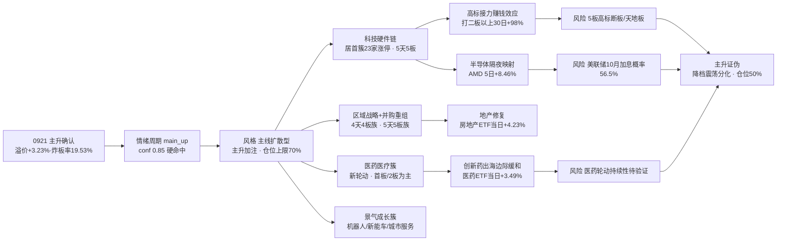

# 2026年9月22日 · **风格研判**

> **数据源新鲜度**: partial
> **降级状态**: true
> **置信度**: 0.67

## 一句话结论

0921 收盘**主升确认**：涨停 103 家、昨日涨停溢价 +3.23% 突破 +3% 强线、炸板率 19.53% 压回 20% 线下方、连板高度升到 5 板，情绪周期从上一日的"高位震荡与主升临界"正式切入**主升（conf 0.85 硬命中）**。风格定格**主线扩散型（主升加注）**，情绪浓度 82，建议仓位上限 **70%**。

## 详细分析

**一、昨日盘面：不是暴涨，是"主升确认日"。** 0921 的上涨和上一轮修复反弹最大的区别，在于它不是靠情绪亢奋冲出来的——涨停 103 家较 0921 盘前观测的 78 家扩张 32%，跌停只有 2 家，炸板率 19.53% 自 8 月以来第一次压回 20% 分歧线之下；昨日涨停溢价 +3.23%，正式突破 +3% 强线。全市场 5553 只个股涨跌比 4.85（此前 3.68），中位 +1.54%，跌超 5% 的只有 26 只，跌超 9.9% 的仅 5 只——亏钱深度极浅。八条宽基全线收涨，但涨幅温和（上证 +0.97%、中证 1000 +1.02% 领跑、科创 50 +0.29% 垫底），权重略强于成长。盘面领涨的是创新药与房地产（A 股收评原话），涨停潮里最硬的仍是科技硬件链的 5 天 5 板族。这是一轮"广度 + 高度 + 溢价"三指标同时转好的主升中段形态，不是情绪透支的加速末端。

**二、情绪周期：从临界到硬命中。** 用 0921 真实收盘指标重算情绪周期：溢价 +3.23%（≥+3% 强线）、连板高度 5 板（≥5）、涨停 103 家——三项同时满足，规则**硬命中主升，conf 0.85**，这是 9 月以来的最高置信度。与预计算（conf 0.53、盘中 fallback 口径溢价 2.13%）阶段一致，但置信度大幅上修：预计算的溢价口径偏保守，真实收盘口径下溢价破强线，主升从"插值临界"变成"规则命中"。上一日的判定还是 high_chop 0.49 对 main_up 0.48 的临界并列，一天之内完成切换——这正是"修复反弹"与"主升"的分界线：溢价站稳 +3%、炸板率压到 20% 以下，高度从 4 板升到 5 板。**大资金意图**：从 0917 回吐、0918 修复、0921 确认的节奏看，主力选择在普涨次日继续加仓而非兑现，说明这轮资金的目标是主线高度而非波段利润，对手盘是还在等回调的踏空盘与做 T 的浮动筹码；**为什么走强**：位置上是回吐后的二次确认（不是超买顶背离）、催化上有美联储利空出尽 + 中美关系缓和预期 + 创新药出海政策边际转向三线共振、筹码上炸板率 19.53% 说明抛压被充分消化；**逻辑够不够硬**：独立源共振充分——量化四指标（溢价/炸板/高度/广度）全部转好、KOL 五群全可用且仓位信号强（八成仓/满仓干）、外盘亚太 0921 续强（恒指 +1.18%、韩综 +1.65%），证伪路径也很清楚：炸板率破 25% 或 5 板高标断板/天地板，主升即证伪。

**三、30 日六簇：高位接力无分歧，防御端开始补涨。** 对 22 个同花顺风格板块 + 20 只 ETF 做 30 日窗口层次聚类（6 簇、相关距离），结构与上一日最大的变化是：高位接力簇当日**全线赚钱无分歧**——打二板以上 30 日 +98.26% 当日 +6.12%、非 ST 三板以上 30 日 +193.94% 当日 +4.36%、非 ST 二板独立成簇 30 日 +126.32% 当日 +5.41%。上一日盘前担心的"三板以上当日 -2.79% 高位分歧"完全修复，高位接力是这轮最肥的肉。主流大本营簇（34 只）30 日 +3.03%、当日 +1.18%，打板、打首板、资金前十全部正收益，普涨底色仍在。值得注意的新变化是防御修复簇（医药、房地产、消费）当日领涨——医药 ETF +3.49%、房地产 ETF +4.23%、煤炭 +2.64%，这是主升中段的典型轮动：资金从高位接力向补涨方向外溢，医药（创新药出海边际缓和）与地产（政策预期）成了新的承接池。

**四、ETF 与板块资金的指向。** 20 只 ETF 里，通信 +12.03% 继续领涨 30 日，房地产 +7.03%、军工 +6.28%、医药 +4.05%、中证 1000 +3.75% 紧随；有色 -10.90%、恒生科技 -7.46%、新能源 -5.12% 垫底。0921 当日轮动到防御修复端：房地产 +4.23%、医药 +3.49%、煤炭 +2.64% 领涨，科技 ETF 平淡（半导体 +0.29%、芯片 +0.18%）——注意，这不是科技退潮，而是主升中段的板块轮动，科技硬件链的赚钱效应仍在涨停潮里（5 天 5 板族 + 居首簇 23 家涨停）。主线代理（涨停强板块 20 个，与盘前持平）结构从普涨转向轮动：科技硬件链最硬、区域战略 + 并购重组 5 天 5 板族延续、医药医疗 5 簇合计 52 家新启动、景气成长 5 簇合计 53 家——宽度维持高位，内部在换血。

**五、隔夜外盘：偏暖但有新变量。** 美股 0918 周五收盘标普 +0.17%、纳指 +0.39%，半导体硬件链走强（AMD 5 日 +8.46%、美光 +4.16%、博通 +2.97%、英伟达 +1.34%），软件端回调（Meta -2.43%、微软 -0.80%）——"AI 硬件强、软件弱"延续，对 A 股科技硬件链有隔夜正向映射。亚太 0921 周一继续走强：恒指 +1.18%（5 日 +0.50%）、韩综 +1.65%（5 日 +4.84%）。但新变量有两个：一是美联储 10 月加息概率升至 56.5%（摩根士丹利预期 12 月和明年继续加息），紧缩周期未结束，若美债收益率/美元再上行将压制外资风险偏好；二是现货黄金失守 4340 美元跌超 1%、COMEX 黄金期货跌超 1%——避险资产回调，若持续下跌会拖累贵金属/有色链（有色 ETF 30 日已 -10.90% 最弱）。另需留意美股周一（0921）夜盘数据 tushare 尚未更新（最新仍为 0918），隔夜方向是 0922 开盘的未知数。

**六、KOL 定性：从全灭到全可用。** 上一日盘前 KOL 五群全灭（0 条），这一次 5/5 群全可用（591 条，核心 KOL 群 29 条），且信号与量化高度共振：群内短线仓位高企（八成仓/满仓干），方向集中在华为万卡/科技硬件链、中美降税预期（纺织出口）、创新药出海政策边际缓和、AI PCB/液冷/光模块产业链、上海国资 + 地产；还有"原油极有可能进入顶部区域"的讨论（若油价见顶，利好中游制造但松动资源防御端）。李迅雷"存款搬家推动牛市说法错误、建议 5 万亿房地产稳定基金"被转发——地产政策预期是当前一个隐性主线。KOL 定性（乐观 + 高仓位）与量化主升硬命中（conf 0.85）互相印证，这是 confidence 从 0.63 上修到 0.67 的主因。

### 推理深度三问（主升判定）

- **大资金意图**: 从 0917 回吐、0918 修复、0921 确认的节奏看，主力选择在普涨次日继续加仓而非兑现，目标显然是主线高度而非波段利润——这轮资金要的是科技硬件链 5 天 5 板族的延续与医药/地产补涨的承接，对手盘是等回调的踏空盘与做 T 的浮动筹码，他们会在炸板率回升时被迫离场。
- **为什么走强**: 三维交叉——位置上，这是回吐后的二次确认（非超买顶背离），连板高度刚从 4 板上到 5 板，未透支；催化上，美联储利空出尽 + 中美关系缓和预期 + 创新药出海政策边际转向三线共振；筹码上，炸板率 19.53% 压回 20% 线下方，说明抛压被充分消化，高标接力当日全线赚钱无分歧。
- **逻辑够不够硬**: 独立源共振充分——量化四指标（溢价 +3.23% 破强线 / 炸板率 19.53% 破 20% 线 / 高度 5 板 / 广度 4.85）全部转好，KOL 五群全可用且仓位信号强（八成仓/满仓干），外盘亚太 0921 续强（恒指 +1.18%、韩综 +1.65%）。硬锚至少两项：硬资金（涨停 103 家扩张 32%）+ 硬政策（创新药出海边际缓和、地产政策预期）。证伪路径清晰：炸板率破 25% 或 5 板高标断板/天地板，主升即证伪，立即降档。

## 关键证据

- 证据 1：涨停 103 / 跌停 2 / 炸板 25 / 炸板率 19.53%（较 0921 盘前 78/0/25/24.27%：涨停 +32%、炸板率 -4.7pct 破 20% 线）· 来源 tushare.limit_list_d
- 证据 2：连板天梯 5 板 1 只 / 4 板 2 只 / 3 板 5 只 / 2 板 13 只，高度升 1 级、梯队 5-4-3-2 无断层 · 来源 tushare.limit_step
- 证据 3：昨日涨停溢价 +3.23%（较 +2.78% 再升，突破 +3% 强线）· 来源 tushare.daily 重算
- 证据 4：广度 4.85（较 3.68 续强），中位 +1.54%，≤-5% 仅 26 只、≤-9.9% 仅 5 只 · 来源 tushare.daily 全市场 5553 只
- 证据 5：8 大宽基全红，中证 1000 +1.02% / 上证 +0.97% 领跑、科创 50 +0.29% 垫底 · 来源 tushare.index_daily
- 证据 6：30 日 6 簇——高标接力簇（+98~194% 当日全线赚钱无分歧）、主流大本营簇（+3.03%）、防御修复簇（医药/地产/消费 当日领涨轮动）· 来源 ths_daily + fund_daily 层次聚类
- 证据 7：ETF 通信 +12.03% 领涨 30 日，当日房地产 +4.23% / 医药 +3.49% / 煤炭 +2.64% 轮动；有色 -10.90% 最弱 · 来源 tushare.fund_daily
- 证据 8：主线代理强板块 20 个（与盘前持平·结构轮动），科技硬件 5 天 5 板族最硬 + 医药/地产新启动 · 来源 tushare.limit_cpt_list
- 证据 9：外盘美股 0918 标普 +0.17% / 纳指 +0.39%，半导体 5 日强（AMD +8.46%）；亚太 0921 恒指 +1.18% / 韩综 +1.65% · 来源 index_global + us_daily
- 证据 10：KOL 5/5 群全可用（591 条），仓位高企（八成/满仓干），方向科技硬件/医药出海/地产 · 来源 wechat_cli_5groups

## 数据源审计

| 源 | 日期 | 状态 | 备注 |
|---|---|:--:|---|
| tushare.ths_daily（22 风格板块） | 2026-09-21 | 🟢 | 22 只 · 30 日窗口 |
| tushare.fund_daily（20 ETF） | 2026-09-21 | 🟢 | 20 只 · 30 日窗口 |
| tushare.limit_list_d | 2026-09-21 | 🟢 | 涨停 103 / 跌停 2 / 炸板 25 |
| tushare.limit_step | 2026-09-21 | 🟢 | 连板 5 板 |
| tushare.index_daily | 2026-09-21 | 🟢 | 8 宽基全红 |
| tushare.daily | 2026-09-21 | 🟢 | 5553 只全市场分布 |
| tushare.limit_cpt_list | 2026-09-21 | 🟢 | 20 强板块代理 |
| tushare.index_global + us_daily | 2026-09-18/21 | 🟡 | 美股 0918 / 亚太 0921 · 美股周一夜盘未更新 |
| news_major + news_cls | 2026-09-22 | 🟢 | 800 + 2223 条 |
| wechat_cli_5groups | 2026-09-21 | 🟢 | 591 条 · 5 焦点群（匿名） |
| manifest / mcp_health | 2026-09-22 | 🟡 | global_severity=2 · weflow down |
| 商品期货 / FX kline | - | 🔴 | fut_daily 代码未映射 · fx_daily 0 条 |

## 不确定性 / 反证

必须诚实承认几处薄弱：其一，情绪浓度 82 已到贪婪上沿、逼近极贪区间（80-100）下沿——按情绪浓度表本应给 0.50-0.60 的逆向窗口，本次以情绪周期主升硬命中（conf 0.85）优先给了 0.70，但如果 0922 早盘炸板率破 25% 或出现高标天地板，主升证伪的代价会很大，须立即降档并逆向减仓；其二，连板高度 5 板仅 1 只、未破 6 板，离连板情绪型还差一口气，若 5 板高标断板，梯队 5-4-3-2 缺头，接力链上端断裂；其三，医药与地产 0921 的领涨是轮动补涨（首板/2 板为主），持续性未验证，若 0922 无承接，主线宽度可能从 20 收缩；其四，美联储紧缩未结束（10 月加息概率 56.5%），黄金大跌（失守 4340）提示避险资产在重新定价，若美债收益率/美元再上行，外资风险偏好受压；其五，美股周一（0921）夜盘数据缺失，隔夜方向未知，康宁 5 日 -9.78% 已提示光通信/玻璃链的回调风险，若美股周一回调，0922 高开低走的风险真实存在；其六，普涨幅度温和（上证 +0.97%）、权重略强于成长（科创 50 +0.29%），若 0922 成长端不接力，普涨可能转为权重搭台、题材唱戏的分化格局。

## 与其他 R/D/E 的关系

- 依赖：data/raw/20260922/manifest.json、mcp_health.json、style_snapshot.json（本次生成）、news_major/news_cls；data/research/20260922/emotion_cycle.json（预计算，已用真实指标重算校验）
- 输出被消费：R2（style / main_lines_count / position_cap_suggestion）、R3（sentiment_score 基准）、R6（一致性反证）、D1（position_cap_suggestion → 总仓上限）

## Sub-Agent 元数据

- skill: analyze_style_v1
- artifact: data/research/20260922/R1_style.json
- 生成耗时: 约 20 分钟（含数据抓取 + 聚类 + 校验）
- model: deepseek-v4-flash-ga-260731
