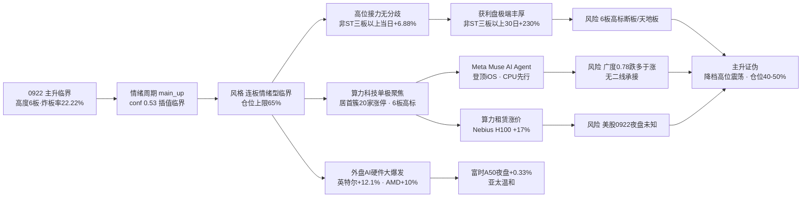

# 2026年9月23日 · **风格研判**

> **数据源新鲜度**: partial
> **降级状态**: true
> **置信度**: 0.66

## 一句话结论

0922 收盘**主升临界**：连板高度首次突破到 6 板（9 月新高），但涨停 63 家较前日收缩 39%、昨日涨停溢价 +2.60% 跌破 +3% 强线、全市场涨跌比 0.78 跌多于涨——高度抬升与广度收缩同时发生，市场从多线普涨收敛为算力科技单极聚焦。风格定格**连板情绪型（临界）**，情绪浓度 70，建议仓位上限 **65%**。

## 详细分析

**一、昨日盘面：不是普涨，是"高度抬升 + 广度收缩"的聚焦分化日。** 0922 的盘面与 0921 的普涨确认形成鲜明对照——涨停 63 家较前日的 103 家收缩 39%，跌停 3 家，炸板率 22.22% 从 20% 线上方回到 20-25% 临界带（未破 25% 分歧线）；昨日涨停溢价 +2.60%，较 +3.23% 回落并跌破 +3% 强线。最值得注意的变化在广度：全市场 5554 只个股涨跌比只有 0.78，跌 3030 家多于涨 2374 家，中位数 -0.21%——赚钱效应高度集中在主线，非主线方向（资源、新能源、消费等）亏钱效应已经显现。八条宽基横盘分化：上证 +0.06%、科创 50 +0.46% 微强、中证 500 -0.27% 最弱，指数走平、个股分化。这不是情绪的全面退潮，而是从"普涨"切换到"聚焦"——资金把火力集中到一条主线上，其他方向开始失血。

**二、情绪周期：从硬命中退回临界插值。** 用 0922 真实收盘指标重算情绪周期：溢价 +2.60%（跌破 +3% 强线）、连板高度 6 板（首次到 6）、涨停 63 家——规则未硬命中，按综合得分插值判**主升 conf 0.53**，与高位震荡 0.44 临界并列。相比 0921 的硬命中（conf 0.85），置信度明显回落：上一日溢价站稳 +3%、炸板率压到 20% 以下、高度 5 板，三项同时满足才硬命中主升；今天溢价回落、炸板率回升到临界带，只有高度一项在抬升。**大资金意图**：从 0921 普涨、0922 聚焦的节奏看，主力没有在普涨次日全面兑现，而是选择把资金集中到算力科技单极——6 板高标 1 只（8 天 6 板）是全场唯一的最高标，说明这轮资金要的是主线高度而非广度扩散；**为什么走强**：位置上是主升中段的高度突破（非末端透支）、催化上有 Meta Muse 引爆 AI Agent 叙事 + OpenAI GPT-6/Anthropic Opus 5.5 密集发布 + 算力租赁涨价（Nebius H100 租金 3.85→4.50 美元/时）三线共振、筹码上高标接力当日全线赚钱无分歧（非 ST 三板以上当日 +6.88%）；**逻辑够不够硬**：硬锚是 AI Agent 全球叙事（Meta +11.34%、CPU/推理芯片 5 日 +17~25%）+ 高位接力 30 日 +98~230% 的极端赚钱效应，但广度恶化（0.78 跌多于涨）+ 溢价跌破强线说明这条主线是"少数人的盛宴"，证伪路径非常清晰：炸板率破 25% 或 6 板高标断板/天地板，主升即证伪，且因为没有二线承接，直接转普跌。

**三、30 日六簇：高位接力无分歧，防御端分化。** 对 22 个同花顺风格板块 + 20 只 ETF 做 30 日窗口层次聚类（6 簇、相关距离），结构与上一日最大的延续是：高位接力簇仍然全场最肥——打二板以上 30 日 +97.93% 当日 +2.70%、非 ST 三板以上 30 日 +229.76% 当日 +6.88%，非 ST 二板独立成簇 30 日 +124.98% 当日 +1.98%，高位接力赚钱效应延续无分歧。主流大本营簇（34 只）30 日 +1.55%、当日 +0.39%，高贝塔 +19.55%、打板 +17.36%、打首板 +15.28%、昨日资金前十 +15.53%、创历史新高 +10.17%——普涨底色仍在但动能明显弱于高位接力。防御端开始分化：银行 ETF 独立簇（+3.23%）、煤炭 ETF 独立簇（+2.62%）30 日小幅正收益，医药 -0.94%、消费 -2.96% 走弱，房地产 +7.53% 仍是防御端里最强的——但注意，这些防御簇当日都在 0 附近徘徊，说明资金没有外溢到防御端，而是全部留在高位接力与主线。

**四、ETF 与板块资金的指向。** 20 只 ETF 里，通信 +9.89% 继续领涨 30 日，房地产 +7.53%、军工 +3.82%、银行 +3.23%、煤炭 +2.62% 紧随；有色 -13.75%、恒生科技 -7.25%、新能源 -7.01%、光伏 -4.99%、消费 -2.96% 垫底。0922 当日 20 只 ETF 涨跌参半：芯片 +0.91%、半导体 +0.67%、恒生科技 +0.72% 微涨，通信 -0.70%、军工 -0.68% 微跌——科技方向温和，没有像 0921 那样普涨。主线代理（涨停强板块 20 个，与 0921 持平）结构从多线普涨收敛到算力科技单极：居首概念簇 20 家（3 天 3 板）、次席概念簇 19 家（6 天 6 板）、第三概念簇 16 家（3 天 3 板）领跑，应用、智能体、传媒、要素、平台、算力基建簇全部上榜——宽度 20 个持平但内部高度聚焦，这是主升中段的典型特征：主线不换，只做高度。

**五、隔夜外盘：AI 硬件全链大爆发，强催化但已部分消化。** 美股 0921 周一收盘大爆发：标普 +1.49%、纳指 +2.26%，AI 硬件全链暴涨——英特尔 +12.14%（5 日 +25.30%）、AMD +9.95%（5 日 +24.75%，市值破万亿）、Meta +11.34%（Muse AI Agent 登顶 iOS）、迈威尔 +5.38%（5 日 +17.62%）、康宁 +5.89%（5 日 +10.71%）、美光 +2.77%（5 日 +12.98%）、英伟达 +2.30%（5 日 +7.78%）。CPU/推理芯片领涨的逻辑很清晰：Meta Muse 是 7×24 小时自主循环执行任务的 AI Agent，Token 消耗倍数级放大，市场优先交易 CPU 任务调度 + 推理芯片算力。但注意：A 股 0922 已部分消化这个催化（科创 50 仅 +0.46%、指数横盘走平），0923 若高开低走反而是"利好兑现"信号。亚太 0922 温和：恒指 +0.18%、韩综 +0.15%；富时 A50 夜盘 +0.33% 略偏多。另一个未知数：tushare 美股最新仅到 0921（美东周一），0922 美东周二夜盘数据缺失，隔夜方向是 0923 开盘的未知数。

**六、KOL 定性：乐观偏热，与量化广度背离。** 这次 KOL 5/5 群全可用（574 条），信号高度一致且偏热：颜晓滨群"一觉醒来崩溃式上涨，见证历史"（中东降温/伊朗可谈/油价跌破 100/中美缓和/美债破 5%/AI 刹车风险解除），早盘喊"大盘有机会冲击 4000 点"，诸葛大卫直接"这一波行情可以满仓搞了"，晚间复盘金投会调研标的 +13.4%。方向共识度极高：Meta Muse 引爆 AI 应用（CPU 先行/推理芯片第二主线/算力租赁涨价/海缆高速线缆/国产算力链）。但这里有一个必须诚实指出的背离：KOL 情绪偏热（满仓搞了）与量化广度恶化（涨跌比 0.78 跌多于涨）并不协调——喊多的人很多，但实际盘面是跌多涨少，赚钱效应只集中在少数主线票上。这可能意味着"喊多的人自己也在观望"，也可能意味着主线还在加速（高位接力 30 日 +230% 不像是观望资金能撑起来的）。这个背离让情绪浓度不宜给到 80+，confidence 相应折中。

### 推理深度三问（主升临界判定）

- **大资金意图**: 从 0921 普涨、0922 聚焦的节奏看，主力没有在普涨次日全面兑现，而是把资金集中到算力科技单极——6 板高标 1 只（8 天 6 板）是全场唯一最高标，说明这轮资金要的是主线高度而非广度扩散；对手盘是还想等回调的踏空盘，他们会在大盘突破 4000 点预期下被迫追高，而这正是高位接力获利盘最舒服的兑现环境。
- **为什么走强**: 三维交叉——位置上，这是主升中段的高度突破（连板 6 板为 9 月首次，非末端透支）；催化上，Meta Muse AI Agent 全球叙事（Meta +11.34%、CPU/推理芯片 5 日 +17~25%）+ OpenAI GPT-6/Anthropic Opus 5.5 密集发布 + 算力租赁涨价三线共振；筹码上，高标接力当日全线赚钱无分歧（非 ST 三板以上当日 +6.88%），抛压被高度聚焦的增量资金消化。
- **逻辑够不够硬**: 硬锚至少两项——硬资金（高位接力 30 日 +98~230% 极端赚钱效应）+ 硬叙事（AI Agent 全球爆火，Meta Muse 登顶 iOS、算力租赁涨价验证需求）。但软肋同样明显：广度 0.78 跌多于涨、溢价跌破 +3% 强线、涨停较前日收缩 39%——这是"少数人的盛宴"，一旦 6 板高标断板或炸板率破 25%，没有二线承接，市场可能从聚焦上涨直接转普跌。证伪路径清晰：炸板率破 25% 或高标天地板，主升即证伪，立即降档并砍仓。

## 关键证据

- 证据 1：涨停 63 / 跌停 3 / 炸板 18 / 炸板率 22.22%（较 0921 的 103/2/25/19.53%：涨停 -39%、炸板率 +2.7pct 回临界带）· 来源 tushare.limit_list_d
- 证据 2：连板天梯 6 板 1 只（8 天 6 板）/ 5 板 1 只 / 4 板 1 只 / 3 板 4 只 / 2 板 17 只，高度首次到 6、梯队无断层 · 来源 tushare.limit_step
- 证据 3：昨日涨停溢价 +2.60%（较 +3.23% 回落，跌破 +3% 强线）· 来源 tushare.daily 重算
- 证据 4：广度 0.78（较 4.85 大幅恶化，跌 3030 > 涨 2374），中位 -0.21%，≤-5% 48 只、≤-9.9% 9 只 · 来源 tushare.daily 全市场 5554 只
- 证据 5：8 大宽基横盘分化，上证 50 +0.43% / 科创 50 +0.46% 微强、中证 500 -0.27% 最弱 · 来源 tushare.index_daily
- 证据 6：30 日 6 簇——高标接力簇（+98~230% 当日全线赚钱无分歧）、非 ST 二板独立簇（+124.98%）、主流大本营簇（+1.55%）、防御端分化（银行/煤炭微正、医药/消费弱、房地产 +7.53% 最强）· 来源 ths_daily + fund_daily 层次聚类
- 证据 7：ETF 通信 +9.89% 领涨 30 日，当日芯片 +0.91% / 半导体 +0.67% 温和；有色 -13.75% 最弱 · 来源 tushare.fund_daily
- 证据 8：主线代理强板块 20 个（与 0921 持平·结构收敛到算力科技单极），6 板高标 1 只 · 来源 tushare.limit_cpt_list
- 证据 9：外盘美股 0921 大爆发（纳指 +2.26%，英特尔 +12.14% / AMD +9.95% / Meta +11.34%，AI 硬件全链 5 日 +7~25%）；亚太 0922 温和（恒指 +0.18% / 韩综 +0.15%）；富时 A50 夜盘 +0.33% · 来源 index_global + us_daily + news_cls
- 证据 10：KOL 5/5 群全可用（574 条），乐观偏热（崩溃式上涨/满仓搞了/冲击 4000 点），方向聚焦 AI Agent（Muse/CPU/推理芯片/算力租赁/海缆）· 来源 wechat_cli_5groups

## 数据源审计

| 源 | 日期 | 状态 | 备注 |
|---|---|:--:|---|
| tushare.ths_daily（22 风格板块） | 2026-09-22 | 🟢 | 22 只 · 30 日窗口 |
| tushare.fund_daily（20 ETF） | 2026-09-22 | 🟢 | 20 只 · 30 日窗口 |
| tushare.limit_list_d | 2026-09-22 | 🟢 | 涨停 63 / 跌停 3 / 炸板 18 |
| tushare.limit_step | 2026-09-22 | 🟢 | 连板 6 板（首次到 6） |
| tushare.index_daily | 2026-09-22 | 🟢 | 8 宽基横盘分化 |
| tushare.daily | 2026-09-22 | 🟢 | 5554 只全市场分布 |
| tushare.limit_cpt_list | 2026-09-22 | 🟢 | 20 强板块代理 |
| tushare.index_global + us_daily | 2026-09-21/22 | 🟡 | 美股 0921 / 亚太 0922 · 美股周一夜盘未更新 |
| news_major + news_cls | 2026-09-23 | 🟢 | 800 + 2683 条 |
| wechat_cli_5groups | 2026-09-22 | 🟢 | 574 条 · 5 焦点群（匿名） |
| manifest / mcp_health | 2026-09-23 | 🟡 | global_severity=2 · weflow/qmt down |
| 商品期货 / FX kline | - | 🔴 | fut_daily 代码未映射 · fx_daily 0 条 · 美股 0922 夜盘缺失 |

## 不确定性 / 反证

必须诚实承认几处薄弱：其一，情绪浓度 70 与情绪周期插值 0.53 的搭配本身隐含风险——高度 6 板支撑"连板情绪型"判据（高度≥6 + 涨停≥50 两项达标，仅炸板率差 2.2pct 未到 <20% 线），但广度 0.78 跌多于涨、涨停较前日收缩 39%、溢价跌破 +3% 强线，这条主线的支撑面其实很窄，若 0923 炸板率破 25% 或 6 板高标断板，从"聚焦上涨"直接转"普跌"的路径是存在的，且因为没有二线承接，跌起来会比普涨日更痛；其二，连板 6 板仅 1 只（8 天 6 板），5 板、4 板各 1 只，梯队虽无断层但上端极薄，一旦 6 板高标断板，梯队 6-5-4-3-2 缺头，接力链上端断裂；其三，KOL 乐观偏热（满仓搞了/冲击 4000 点）与量化广度恶化背离——高仓位共识本身就是拥挤信号，若 0923 开盘不及预期（高开低走），这批"喊多的人"可能成为第一波抛压；其四，美股 0921 的大爆发 A 股 0922 已部分消化（科创 50 仅 +0.46%、指数横盘），0923 若高开低走=利好兑现，且 0922 美东周二夜盘数据缺失，隔夜方向是未知数；其五，资源与防御端（有色 30 日 -13.75% 最弱、新能源/光伏 -7%）持续失血，若主线高位分歧时资金无处可去，市场可能直接进入无承接的普跌；其六，情绪周期 0.53 vs 0.44 的临界差距很小，若 0923 早盘溢价进一步回落或炸板率再升，主升判定随时会被推翻。

## 与其他 R/D/E 的关系

- 依赖：data/raw/20260923/manifest.json、mcp_health.json、style_snapshot.json（本次生成）、news_major/news_cls、wechat_cli_5groups；data/research/20260923/emotion_cycle.json（预计算，已用真实指标重算校验）
- 输出被消费：R2（style / main_lines_count / position_cap_suggestion）、R3（sentiment_score 基准）、R6（一致性反证）、D1（position_cap_suggestion → 总仓上限）

## Sub-Agent 元数据

- skill: analyze_style_v1
- artifact: data/research/20260923/R1_style.json
- 生成耗时: 约 25 分钟（含数据抓取 + 聚类 + 校验）
- model: deepseek-v4-flash-ga-260731
