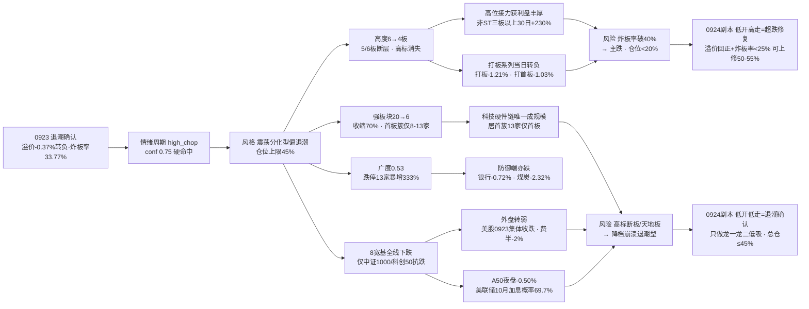

# 2026年9月24日 · **风格研判**

> **数据源新鲜度**: partial
> **降级状态**: true
> **置信度**: 0.66

## 一句话结论

0923 收盘**退潮确认**：涨停 51 家收缩、跌停 13 家暴增 333%、炸板率 33.77% 突破 25% 分歧线、昨日涨停溢价 -0.37% 转负、连板高度从 6 板回落到 4 板、强板块从 20 个收缩到 6 个、八条宽基全线下跌——情绪周期硬命中**高位震荡（conf 0.75）**，9 月首次"溢价转负 + 炸板率破线"双确认。风格定格**震荡分化型（偏退潮）**，情绪浓度 48（中性偏冷），建议仓位上限 **45%**。

## 详细分析

**一、昨日盘面：不是分化，是"退潮确认日"。** 0923 与 0922 的"高度抬升 + 广度收缩"相比，退潮信号全面落地：涨停 51 家较前日收缩 19%，跌停 13 家暴增 333%（前日仅 3 家），炸板率 33.77% 一举突破 25% 分歧线，升入高分歧区；昨日涨停溢价 -0.37% 转负——这是 9 月以来第一次"当日涨停池次日平均亏钱"，接力资金直接离场。全市场 5556 只个股涨跌比只有 0.53（前日 0.78，再恶化），中位数 -0.61%，跌超 9.9% 的 25 只、跌超 5% 的 144 只——亏钱深度扩大。八条宽基全线下跌：上证 -0.39%、深成 -0.64%、创业板 -0.60%，权重与成长同跌，仅中证 1000（-0.17%）与科创 50（-0.25%）相对抗跌。这不是主升中段的正常分歧，而是主线宽度收窄、赚钱效应转负的退潮起点。

**二、情绪周期：从插值临界到硬命中，9 月首次双确认。** 用 0923 真实收盘指标重算情绪周期：炸板率 33.77%（≥25%）、溢价 -0.37%（<+3% 且转负）——规则**硬命中高位震荡，conf 0.75**，与预计算完全一致。相比 0922 的"main_up 0.53 vs high_chop 0.44 临界并列"，0923 完成了决定性切换：高度从 6 板回落 2 级到 4 板（5/6 板断层）、溢价从 +2.60% 直接转负、炸板率从 22.22% 破 25% 线——三个维度同时恶化，高位震荡不再有争议。**大资金意图**：从 0921 普涨、0922 聚焦、0923 收窄的节奏看，主力在高位接力获利盘极端丰厚（非 ST 三板以上 30 日 +230.85%）的背景下选择了兑现而非加仓，6 板高标（8 天 6 板）消失、5 板断层，说明高度链上端主动撤退，资金没有切换到新方向，而是全线收缩；**为什么走弱**：位置上，连板高度 4 板处于 6→4 的回落通道，5/6 板断层意味着接力链上端断裂；催化上，隔夜外盘转弱（美股 0923 集体收跌、费半 -2%、A50 夜盘 -0.50%、美联储 10 月加息概率抬升至 69.7%），缺乏新催化承接；筹码上，炸板率 33.77% 说明抛压未被消化，首板簇仅 8-13 家说明新增量资金观望；**逻辑够不够硬**：退潮的证伪路径非常清晰——若 0924 早盘溢价回正且炸板率回落到 25% 以下，退潮可被推翻回高位震荡；若炸板率破 40% 或 4 板高标断板/天地板，直接确认主跌，仓位必须降到 20% 以下。

**三、30 日六簇：高位接力仍肥但动能放缓，主流大本营当日转负。** 对 22 个同花顺风格板块 + 20 只 ETF 做 30 日窗口层次聚类（6 簇、相关距离），结构与上一日最大的变化是：高标接力簇虽然 30 日收益仍然极端丰厚（打二板以上 +96.88%、非 ST 三板以上 +230.85%），但当日动能明显放缓（+1.31% / +5.09%，前日为 +2.70% / +6.88%）——赚钱效应还在，但加速度消失了。主流大本营簇（34 只）30 日 +4.49%、当日 **-0.42% 转负**，非 ST 二板 +131.86% 当日仅 +0.80%，昨日资金前十 +18.14% 当日 -0.15%，高贝塔 +17.83% 当日 +0.22%——普涨底色正在消退。创历史新高独立簇（30 日 +9.80% 当日 +2.89%）是全场唯一当日强于前日的方向，说明资金在退潮期选择"强者恒强"而非"低位扩散"。防御端全线走弱：医药 -3.14%、消费 -5.78%、煤炭 -1.99% 当日 -2.32%，银行独立簇 +1.86% 当日 -0.72%——退潮期防御端也没有接住资金，市场处于"无处可去"的状态。

**四、ETF 与板块资金的指向。** 20 只 ETF 里，通信 +11.67% 继续领涨 30 日，房地产 +5.53%、银行 +1.86%、芯片华夏 +1.01%、中证 1000 +1.00% 紧随；有色 -15.95% 垫底，恒生科技 -8.84%、新能源 -8.51%、消费 -5.78%、光伏 -4.90%。0923 当日 **20 只 ETF 全线下跌、无一只收红**——通信 -0.85%、军工 -1.54%、恒生科技 -1.08% 领跌，防御端（银行 -0.72%、煤炭 -2.32%）也在跌。这与 0922"涨跌参半"形成鲜明对比：普跌日里防御端无法提供对冲，说明这不是风格切换，而是风险偏好的整体收缩。主线代理（涨停强板块）从 20 个骤降到 6 个（收缩 70%）：居首概念簇 13 家（首板）、次席概念簇 13 家（4 天 4 板）、网络链簇 11 家（9 天 7 板）、整车链簇 9 家（9 天 7 板）、专精特新簇 8 家（4 天 2 板）、大模型簇 8 家（4 天 4 板）——宽度大幅收窄，且高度最高的方向（9 天 7 板）只剩孤军，科技硬件链仍是唯一成规模的方向但涨停家数与梯队都在萎缩。

**五、隔夜外盘：从强催化转弱，退潮的外部环境确认。** 美股 0922 周二收盘（tushare 最新）：标普 -0.08%（5 日 +2.36%）、纳指 +0.45%（5 日 +4.86%），半导体个股 5 日仍强——英特尔 +1.71%（5 日 +27.51%）、AMD +1.34%（5 日 +23.71%）、美光 +5.00%（5 日 +18.17%）、迈威尔 +1.93%（5 日 +18.34%）、台积电 +1.54%（5 日 +9.24%）；软件端回调（Meta -0.63%、微软 -0.72%）。但 0924 凌晨新闻侧已经转向：**美股三大指数集体收跌、费城半导体指数跌幅扩大至 2%、纳指 100 期货跌超 1%、富时 A50 夜盘 -0.50%、美联储 10 月加息概率抬升至 69.7%、WTI 原油涨超 2%、现货黄金失守 4280/4300 美元、比特币跌至 84000 美元**——虽然 tushare 的 0923 夜盘数据未更新，但方向信号已经非常明确：全球风险偏好收缩。对 A 股 0924 的含义是偏空的：低开概率较高，若低开高走可视为超跌修复，低开低走则确认退潮。半导体硬件链 5 日强（英特尔 +27.51%）对 A 股科技硬件链的映射已在 0923 充分消化（居首概念簇 13 家涨停但仅首板），若美股费半 -2% 传导，0924 科技硬件链高开难度进一步加大。

**六、KOL 定性：从"满仓搞了"到"轻仓观望"，情绪与量化共振向下。** 这一次 KOL 5/5 群全可用（456 条，核心 KOL 群 73 条），但仓位态度与 0922 形成鲜明对比：颜晓滨群诸葛大卫 0923 收盘后 15:47 定调——"短期看上证震荡修整、近 5 日温和上行后回踩，箱体整理特征明显，情绪理性偏稳，量能未放、无突破动能，建议保持轻仓观望、不追涨、不急跌，静待方向明确"。这是退潮期典型的谨慎表态：不再喊满仓、不再说冲击 4000 点，而是明确"等放量突破信号"。方向讨论仍在科技硬件链细分（半导体材料国产替代、功率半导体涨价、Vicor VPD 垂直供电、光通信 1.6T DSP 缺口、3D 打印），但以个股逻辑为主，缺少"主线确认/加仓"级别的方向共识。KOL 谨慎与量化退潮（溢价转负/炸板率破线/广度 0.53）高度共振——这不是背离，是互相印证的退潮信号，情绪浓度从 0922 的 70 直接降至 48（中性偏冷）。

### 推理深度三问（退潮确认判定）

- **大资金意图**: 从 0921 普涨、0922 聚焦、0923 收窄的节奏看，主力在高位接力获利盘极端丰厚（非 ST 三板以上 30 日 +230.85%、二板 +131.86%）的背景下选择兑现而非加仓——6 板高标消失、5 板断层、强板块 20→6 收缩 70%，说明高度链上端在主动撤退，且没有切换到新方向，是全线收缩而非轮动；对手盘是还相信"主升中段分歧"的抄底盘，他们会在 0924 早盘溢价继续转弱时被迫止损，这正是退潮期最后一批承接资金。
- **为什么走弱**: 三维交叉——位置上，连板高度 6→4 回落 2 级、5/6 板断层，接力链上端断裂，首板簇仅 8-13 家说明新增量资金观望；催化上，隔夜外盘转弱（美股 0923 集体收跌/费半 -2%/A50 夜盘 -0.50%/美联储 10 月加息概率 69.7%），缺乏新催化承接 0921 的普涨动能；筹码上，炸板率 33.77% 破 25% 分歧线、溢价 -0.37% 转负，抛压未被消化，高位接力获利盘开始兑现。
- **逻辑够不够硬**: 退潮信号至少三项独立确认——量化（涨停 51/跌停 13/炸板率 33.77%/溢价 -0.37%/广度 0.53/高度 6→4/强板块 20→6/8 宽基全绿）+ KOL（满仓搞了→轻仓观望，诸葛大卫明确"不追涨、静待方向"）+ 外盘（美股集体收跌/A50 夜盘 -0.50%/加息概率 69.7%）三方共振向下。但尚未到崩溃退潮型（炸板率 33.77%<50%、跌停 13<涨停 51、大盘跌幅 <1%），故定格震荡分化型（偏退潮）而非崩溃。证伪路径清晰：若 0924 早盘溢价回正且炸板率 <25%，退潮被推翻回高位震荡；若炸板率破 40% 或高标天地板，直接确认主跌。

## 关键证据

- 证据 1：涨停 51 / 跌停 13 / 炸板 26 / 炸板率 33.77%（较 0922 的 63/3/18/22.22%：涨停 -19%、跌停 +333%、炸板率 +11.5pct 破 25% 分歧线）· 来源 tushare.limit_list_d
- 证据 2：连板天梯 4 板 2 只 / 3 板 7 只 / 2 板 3 只，高度较 6 板回落 2 级、5/6 板断层 · 来源 tushare.limit_step
- 证据 3：昨日涨停溢价 -0.37%（较 +2.60% 大幅转负，9 月首次跌破 0 轴）· 来源 tushare.daily 重算
- 证据 4：广度 0.53（较 0.78 继续恶化，跌 3564 > 涨 1891），中位 -0.61%，≤-5% 144 只、≤-9.9% 25 只 · 来源 tushare.daily 全市场 5556 只
- 证据 5：8 大宽基全线下跌，上证 -0.39% / 创业板 -0.60% / 深成 -0.64%，中证 1000 -0.17% 相对抗跌 · 来源 tushare.index_daily
- 证据 6：30 日 6 簇——高标接力簇（+97~231% 当日动能放缓 +1.31%/+5.09%）、创历史新高独立簇（+9.80% 当日 +2.89% 唯一转强）、主流大本营簇（+4.49% 当日 -0.42% 转负）、防御端全线走弱 · 来源 ths_daily + fund_daily 层次聚类
- 证据 7：ETF 通信 +11.67% 领涨 30 日，0923 当日 20 只全线下跌无一只收红；有色 -15.95% 最弱 · 来源 tushare.fund_daily
- 证据 8：主线代理强板块 6 个（较 0922 的 20 个收缩 70%），居首簇 13 家仅首板，高度方向 9 天 7 板孤军 · 来源 tushare.limit_cpt_list
- 证据 9：外盘美股 0922 标普 -0.08% / 纳指 +0.45%，半导体 5 日强（英特尔 +27.51% / AMD +23.71%）但当日放缓；0924 凌晨新闻美股 0923 集体收跌 + 费半 -2% + A50 夜盘 -0.50% + 美联储 10 月加息概率 69.7% · 来源 index_global + us_daily + news_cls
- 证据 10：KOL 5/5 群全可用（456 条），从"满仓搞了"转"轻仓观望、不追涨、不急跌、静待方向明确"（诸葛大卫 0923 15:47）· 来源 wechat_cli_5groups

## 数据源审计

| 源 | 日期 | 状态 | 备注 |
|---|---|:--:|---|
| tushare.ths_daily（22 风格板块） | 2026-09-23 | 🟢 | 22 只 · 30 日窗口 |
| tushare.fund_daily（20 ETF） | 2026-09-23 | 🟢 | 20 只 · 30 日窗口 |
| tushare.limit_list_d | 2026-09-23 | 🟢 | 涨停 51 / 跌停 13 / 炸板 26 |
| tushare.limit_step | 2026-09-23 | 🟢 | 连板 4 板（较 6 板回落 2 级） |
| tushare.index_daily | 2026-09-23 | 🟢 | 8 宽基全线下跌 |
| tushare.daily | 2026-09-23 | 🟢 | 5556 只全市场分布 |
| tushare.limit_cpt_list | 2026-09-23 | 🟢 | 6 强板块代理（收缩 70%） |
| tushare.index_global + us_daily | 2026-09-22/23 | 🟡 | 美股 0922 / 亚太 0923 · 美股 0923 夜盘未更新（新闻侧已示弱） |
| news_major + news_cls | 2026-09-24 | 🟢 | 400 + 2899 条 · 美联储加息概率 69.7% / A50 -0.50% |
| wechat_cli_5groups | 2026-09-23 | 🟢 | 456 条 · 5 焦点群（匿名）· 轻仓观望 |
| manifest / mcp_health | 2026-09-24 | 🟡 | global_severity=2 · weflow/qmt down |
| 商品期货 / FX kline | - | 🔴 | fut_daily 代码未映射 · fx_daily 0 条 · 美股 0923 夜盘缺失 |

## 不确定性 / 反证

必须诚实承认几处薄弱：其一，风格定格"震荡分化型（偏退潮）"而非"崩溃退潮型"，依据是炸板率 33.77% 未破 50%、跌停 13 < 涨停 51、大盘跌幅 <1%——但 9 月 4 日（20260904）的教训是"跌停反超涨停 + 炸板率破 50% 才确认崩溃"，而今天的跌停 13 家暴增 333% 是崩溃的前置信号，若 0924 跌停继续扩大，崩溃判定随时成立；其二，高标接力 30 日 +97~231% 的获利盘是双刃剑——它们既是 9 月赚钱效应最肥的肉，也是退潮期最大的抛压来源，若 4 板高标断板/天地板，接力链上端断裂后的回撤会非常剧烈（此前非 ST 三板以上出现过 -9.99% 的单日）；其三，美股 0923 夜盘数据 tushare 尚未更新，隔夜方向依赖新闻侧（美股集体收跌/费半 -2%/A50 -0.50%）推断——若 0924 凌晨美股期货反弹，低开幅度可能小于预期；其四，KOL 谨慎（轻仓观望）与量化退潮共振是强信号，但 456 条消息里方向讨论仍聚焦科技硬件链细分（半导体材料/功率半导体/光通信），若 0924 早盘溢价回正 + 炸板率回落到 25% 以下，退潮判定可被推翻回高位震荡；其五，情绪浓度 48 是四维 65 与五维 48 的折中（差 17 > 15 超校验线），四维法的高分来自涨停 51 家未崩，但炸板率 33.77% 的惩罚在五维法里已归零——我倾向于五维法的 48，若 0924 涨停再收缩至 40 以下，情绪浓度应继续下修。

## 与其他 R/D/E 的关系

- 依赖：data/raw/20260924/manifest.json、mcp_health.json、style_snapshot.json（本次生成）、news_major/news_cls、wechat_cli_5groups；data/research/20260924/emotion_cycle.json（预计算，已用真实指标重算校验一致）
- 输出被消费：R2（style / main_lines_count / position_cap_suggestion）、R3（sentiment_score 基准）、R6（一致性反证）、D1（position_cap_suggestion → 总仓上限）

## Sub-Agent 元数据

- skill: analyze_style_v1
- artifact: data/research/20260924/R1_style.json
- 生成耗时: 约 22 分钟（含 style_snapshot 抓取 + 聚类 + 校验）
- model: deepseek-v4-flash-ga-260731
