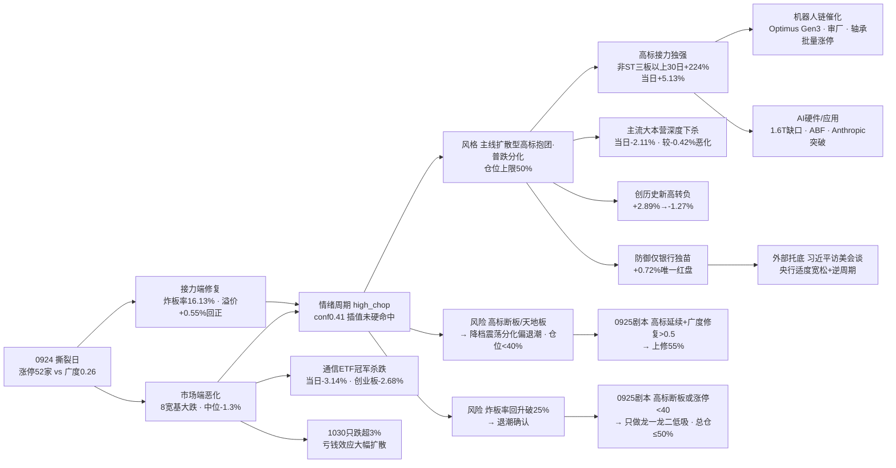

# 2026年9月25日 · **风格研判**

> **数据源新鲜度**: partial
> **降级状态**: true
> **置信度**: 0.66

## 一句话结论

0924 收盘是**极端撕裂日**：情绪接力端全面修复（涨停 52 家持平、炸板率 16.13% 重回健康区、昨日涨停溢价 +0.55% 回正、连板高度回升到 5 板、高标接力当日仍暴赚），市场端却是 9 月最差（八条宽基全线大跌、全市场涨跌比 0.26、1030 只跌超 3%）。风格定格**主线扩散型（高标抱团 · 普跌分化）**，情绪浓度 58（中性），建议仓位上限 **50%**。

## 详细分析

**一、昨日盘面：涨停活跃与指数崩塌并存的"撕裂日"。** 0924 呈现一副罕见的矛盾画面。从情绪指标看，这是一天"修复"：涨停 52 家（较前日微增 1 家）、跌停 13 家持平、炸板率 16.13%——较前日 33.77% 大幅回落 17.6 个百分点，重新回到 20% 以下的健康区；昨日涨停溢价 +0.55% 回正（前日 -0.37%），连板高度从 4 板回升到 5 板，5/6 板断层修复为 5 板有锚。但从市场指标看，这是一天"崩塌"：上证 -1.22%、深成 -2.34%、创业板 -2.68%，八条宽基全线大跌且跌幅较前日（-0.2%~-0.6%）显著加深；全市场 5557 只个股涨跌比只有 0.26——较前日 0.53 再恶化近半，是 9 月最差水平；中位数 -1.3%，4306 只下跌，1030 只跌超 3%，258 只跌超 5%。**大资金意图**：涨停家数不崩而指数大跌，说明主力没有系统性撤退，而是把资金从全市场收缩到极少数高标龙头里——非 ST 三板以上当日 +5.13%、非 ST 二板 +3.52% 的暴利与首板/打板当日微亏（-0.61%/-0.66%）形成对照，六个强板块指数当日全部收跌但内部涨停股孤军活跃，这是典型的"抱团而非扩散"；**为什么走强/走弱**：涨停端强，因为高标（5 天 5 板的人工智能方向、4 天 4 板的海峡方向）叠加机器人链（Optimus Gen3 碳纤维迭代 + 审厂传闻带动的轴承批量涨停）和北交所 30cm 次新的极致赚钱效应；指数端弱，因为权重与成长同步失血、医药消费地产资源全线下跌、通信 ETF 当日 -3.14% 领跌（30 日冠军高位杀跌），资金无处可去只认高标；**逻辑够不够硬**：这是 9 月第一次出现"涨停 50+ 与广度 0.26 并存"的极端背离，情绪指标与市场指标的脱节意味着当前的赚钱效应不具普适性——它属于少数抱团者的狂欢，对绝大多数持仓者而言是亏钱日。

**二、情绪周期：从硬命中到插值，接力修复但未脱离高位震荡。** 用 0924 真实收盘指标重算情绪周期：炸板率 16.13%（<25%）、溢价 +0.55%（<+3%），规则未硬命中任何一个阶段，按综合得分插值得 high_chop 0.41、main_up 0.34、main_down 0.24，与预计算（high_chop conf 0.4）一致。相比 0923 的"硬命中高位震荡 conf 0.75"，今天的周期判断置信度明显回落——因为接力端指标全面改善（炸板率 33.77%→16.13%、溢价 -0.37%→+0.55%、高度 4→5），市场端却在恶化（广度 0.53→0.26、中位 -0.61%→-1.3%）。这个"修复 + 撕裂"的临界态比单边退潮更难判断：情绪面支持做多高标，市场面警告普跌风险。周期仍定格高位震荡（"落袋为安/控制仓位"），但已滑向插值区，0925 的炸板率与广度走向将决定是回修主升临界还是确认退潮。

**三、30 日六簇：高标独强，主流大本营深度下杀。** 对 22 个同花顺风格板块 + 20 只 ETF 做 30 日窗口层次聚类（6 簇、相关距离），结构比 0923 更加极端。高标接力簇（3 只）30 日收益仍然惊人：非 ST 三板以上 +224.61%、非 ST 二板 +136.26%、打二板以上 +84.45%，且当日 +3.31% 是全场唯一收涨的簇——这是 9 月赚钱效应最肥、也是唯一还在赚钱的地方。创历史新高独立簇（30 日 +11.45%）当日 -1.27%，从前日的 +2.89% 独强转为回落，说明"新高模式"也开始松动。主流大本营簇（33 只）30 日 -0.77%、当日 **-2.11%**——较前日的 -0.42% 深度恶化，昨日资金前十 -3.16%、同花顺热股 -3.24%、沪深 300 -1.63%、科创 50 -2.39%，普跌底色全面覆盖。防御端同样失守：医药消费地产簇当日 -2.02%，煤炭独立簇 +0.32%，只有银行 ETF 独立簇当日 +0.72% 成为全场唯一红盘。市场的轮廓已经非常清楚：**高标接力是唯一的活口，其余一切都是下跌**。

**四、ETF 与板块资金的指向。** 20 只 ETF 里，通信 +7.83% 仍是 30 日冠军，但当日 -3.14% 领跌——30 日最强的方向开始高位杀跌，这是创业板 -2.68% 的重要注脚；房地产 +3.82%、银行 +2.97%（当日 +0.72% 唯一红盘）、军工 +0.88% 次之。垫底端与昨日一致：有色 -14.78%、新能源 -10.32%、恒生科技 -8.29%、光伏 -8.11%、消费 -5.99%。0924 当日 20 只 ETF 仅银行收红，其余全线下跌——防御端（银行除外）也没有接住资金。主线代理（涨停强板块）6 个与昨日持平，但结构变化值得注意：高度方向仅剩 2 个（5 天 5 板、4 天 4 板各一），其余 4 个全是 2 天 2 板的低位群（低空/新能源车/光伏等），且六个强板块指数当日全部收跌（-0.28%~-1.50%）——板块整体在跌、内部少数涨停股在涨，这正是"抱团"的量化证据。

**五、隔夜外盘：中性底色下的分化信号。** 美股 0923（tushare 最新）集体收跌：标普 -0.75%、纳指 -1.13%，但 5 日仍强（英特尔 +21.33%、AMD +19.92%、美光 +15.69%、迈威尔 +13.58%、Meta +10.51%）。0925 凌晨新闻侧显示 0924 夜盘三大指数涨跌不一（道指 -0.31%、标普 -0.02%、纳指 +0.01%），费城半导体盘中 -2%、存储板块普跌（美光 -1.96%、SK 海力士 -1.91%），但 Meta +4.50%、甲骨文 -3.47%（数据中心不可抗力通知），富时 A50 夜盘 +0.03%，美联储 10 月加息概率 67.5%（较前日 69.7% 略降）。外盘对 0925 是中性底色：没有系统性利空也没有强催化；半导体硬件映射偏空，AI 应用端（Meta）偏强。真正的外部正向变量在宏观与外交：**习近平同特朗普会谈**（中美关系缓和，机场热情迎接的细节意味深长）+ 央行货币政策委员会三季度例会"继续实施适度宽松的货币政策、加大逆周期调节力度"——这两条对风险偏好构成托底，也让"普跌"更可能被解读为结构性调整而非系统性风险。

**六、KOL：缩量下跌，抛压不重，继续加仓。** 这一次 KOL 5/5 群全可用（253 条，颜晓滨群 22 条），仓位态度与 0923 的"轻仓观望"形成鲜明对比：颜晓滨群 Jason 0924 收盘前 14:34 定调——"**缩量下跌 抛压不重 继续加仓**"，把普跌解读为缩量洗盘而非退潮；同群"VNA 的赚钱效应溢出，博杰股份拿住"显示高标抱团的实战心态。方向高度共识于机器人链（特斯拉 Optimus Gen3 碳纤维骨架减重 33% 迭代 + 审厂传闻带动的轴承批量涨停 + 大摩人形机器人供应链调研多家整机厂上调 2026 出货目标 + 国盛"节前积极配置机器人"）与 AI 硬件（野村光通信 1.6T DSP 缺口至 2027 下半年、ABF 膜国产替代、AI 安全的中美深圳对话），另有 AI 应用突破（Anthropic 放出 950 个智能体自主发现类 CRISPR 机制，张锋点赞）与北交所次新/玄学题材（黄酒、传媒"文字辈"、纺织"华字辈"）活跃。KOL 情绪与量化"接力修复"共振向上，但与"市场普跌"背离——他们谈论的是个股抱团机会，不是全市场贝塔，这与 0.26 的广度并不矛盾。

### 推理深度三问（撕裂日判定）

- **大资金意图**: 涨停 52 家不崩 + 指数全线大跌 + 广度 0.26 的组合，说明主力不是撤退而是**极致收缩**——资金从全市场（4306 只下跌）抽离，集中灌注到高标妖股（非 ST 三板以上 30 日 +224.61% 当日仍 +5.13%）和强板块内的少数涨停股（六板块指数全跌但内部涨停孤军）。这从"扩散做多"变成了"抱团做多"，对手盘是还相信"普涨修复"的抄底盘——他们会在 0925 早盘指数继续低开时被动止损，而高标抱团者则在等待最后一棒。
- **为什么走强 / 走弱**: 涨停端强，靠的是三条硬催化——机器人链（Optimus Gen3 碳纤维迭代减重 33% + 特斯拉供应链审厂传闻 + 大摩调研上调出货目标）、AI 硬件（1.6T DSP 缺口/ABF 膜/存储）、AI 应用突破（Anthropic 类 CRISPR/Meta Muse）；指数端弱，靠的是普跌惯性——医药消费地产资源全线失血、通信 ETF 30 日冠军当日 -3.14% 高位杀跌、权重与成长同跌无一处避险、北向/杠杆资金在加息预期升温下收缩。
- **逻辑够不够硬**: "抱团 + 普跌"的撕裂至少三项独立确认——量化（广度 0.26 为 9 月最差 vs 涨停 52/炸板率 16.13% 健康）、KOL（继续加仓 vs 只谈个股抱团）、外盘（美股走平/费半 -2% 半导体偏空 vs 中美会谈/央行宽松托底）。风格定格主线扩散型（名义命中涨停≥30 + 高度≥3）但加注"高标抱团 · 普跌分化"，仓位上限 50%（主线扩散型 band 下沿以下，因高位震荡周期 + 普跌结构）。证伪路径清晰：若 0925 早盘高标延续且广度修复（涨跌比 >0.5），可上修 55%；若高标断板/天地板或涨停回落至 40 以下，降档震荡分化型（偏退潮）、仓位降至 40% 以下。

## 关键证据

- 证据 1：涨停 52 / 跌停 13 / 炸板 10 / 炸板率 16.13%（较 0923 的 51/13/26/33.77%：涨停微增 1 家、炸板大幅减少 16 家、炸板率回落 17.6pct 重回健康区）· 来源 tushare.limit_list_d
- 证据 2：连板天梯 5 板 1 只 / 4 板 3 只 / 3 板 1 只 / 2 板 8 只，高度较 4 板回升 1 级、5/6 板断层修复 · 来源 tushare.limit_step
- 证据 3：昨日涨停溢价 +0.55%（较 0923 的 -0.37% 回正，接力资金回场但幅度温和）· 来源 tushare.daily 重算
- 证据 4：广度 0.26（较 0.53 再恶化近半，9 月最差；跌 4306 > 涨 1120），中位 -1.3%，≤-3% 1030 只、≤-5% 258 只 · 来源 tushare.daily 全市场 5557 只
- 证据 5：8 大宽基全线大跌，上证 -1.22% / 创业板 -2.68% / 深成 -2.34% / 科创 50 -2.35%，跌幅较前日显著加深 · 来源 tushare.index_daily
- 证据 6：30 日 6 簇——高标接力簇（+84~225% 当日 +3.31% 全场唯一收涨）、创历史新高独立簇（+11.45% 当日 -1.27% 转负）、主流大本营簇（-0.77% 当日 -2.11% 深度下杀）、银行独立簇（当日 +0.72% 唯一红盘）· 来源 ths_daily + fund_daily 层次聚类
- 证据 7：ETF 通信 +7.83% 领涨 30 日但当日 -3.14% 领跌（冠军高位杀跌）；0924 当日 20 只仅银行收红；有色 -14.78% 最弱 · 来源 tushare.fund_daily
- 证据 8：主线代理强板块 6 个（与 0923 持平），高度方向仅 2 个（5 天 5 板/4 天 4 板），4 个 2 板低位群，六板块指数当日全跌 · 来源 tushare.limit_cpt_list
- 证据 9：外盘美股 0923 标普 -0.75% / 纳指 -1.13%，半导体 5 日强（英特尔 +21.33% / AMD +19.92%）但当日承压；0925 凌晨新闻侧美股 0924 涨跌不一 + 费半 -2% + 存储普跌 + A50 +0.03% + 美联储 10 月加息概率 67.5% · 来源 index_global + us_daily + news_cls
- 证据 10：KOL 5/5 群全可用（253 条），从"轻仓观望"转"缩量下跌 抛压不重 继续加仓"（Jason 0924 14:34），方向共识机器人链 + AI 硬件 · 来源 wechat_cli_5groups

## 数据源审计

| 源 | 日期 | 状态 | 备注 |
|---|---|:--:|---|
| tushare.ths_daily（22 风格板块） | 2026-09-24 | 🟢 | 22 只 · 30 日窗口 |
| tushare.fund_daily（20 ETF） | 2026-09-24 | 🟢 | 20 只 · 30 日窗口 |
| tushare.limit_list_d | 2026-09-24 | 🟢 | 涨停 52 / 跌停 13 / 炸板 10 |
| tushare.limit_step | 2026-09-24 | 🟢 | 连板 5 板（较 4 板回升 1 级） |
| tushare.index_daily | 2026-09-24 | 🟢 | 8 宽基全线大跌 |
| tushare.daily | 2026-09-24 | 🟢 | 5557 只全市场分布 · 广度 0.26 |
| tushare.limit_cpt_list | 2026-09-24 | 🟢 | 6 强板块代理（高度方向 2 个） |
| tushare.index_global + us_daily | 2026-09-23/24 | 🟡 | 美股 0923 / 亚太 0924 · 美股 0924 夜盘未更新（新闻侧已示涨跌不一） |
| news_major + news_cls | 2026-09-25 | 🟢 | 400 + 2816 条 · 习近平访美会谈 / 美股 0924 涨跌不一 / A50 +0.03% |
| wechat_cli_5groups | 2026-09-24 | 🟢 | 253 条 · 5 焦点群（匿名）· 继续加仓 |
| manifest / mcp_health | 2026-09-25 | 🟡 | global_severity=2 · weflow/qmt down |
| 商品期货 / FX kline | - | 🔴 | fut_daily 代码未映射 · fx_daily 0 条 · 美股 0924 夜盘缺失 |

## 不确定性 / 反证

必须诚实承认几处薄弱：其一，风格定格"主线扩散型"是**名义命中**——涨停 52 家、高度 5 板、炸板率 16.13% 满足判据，但广度 0.26 与"扩散"二字严重背离，我选择加注"高标抱团 · 普跌分化"并压仓至 50%，这个判断依赖"抱团能延续"的假设，若 0925 高标断板，抱团瓦解与普跌共振的回撤会非常剧烈；其二，情绪周期从 0923 的硬命中（conf 0.75）回落到插值（conf 0.41），是因为接力端指标修复而市场端恶化，两个方向相反的信号让周期判断进入临界态——若 0925 炸板率回升破 25% 或溢价转负，退潮确认；若广度修复 >0.5 且高标延续，回修主升临界，两种剧本都要有预案；其三，美股 0924 夜盘数据 tushare 尚未更新，隔夜方向依赖新闻侧（涨跌不一/费半 -2%/A50 +0.03%）推断，若 0925 凌晨美股期货大幅波动（美联储加息预期仍高，美银称年内或再加息两次），低开幅度可能超预期；其四，KOL"缩量下跌继续加仓"是积极信号，但 253 条消息里讨论的几乎全是个股抱团（机器人/轴承/北交所次新），缺少全市场级别的方向共识——KOL 的乐观与 0.26 的广度可能并不冲突，反而是"抱团市"的典型特征；其五，情绪浓度 58 是四维 64 与五维 56 的折中（差 8 未超校验线），四维法给涨停端更高权重、五维法给跌停/炸板更高权重，我倾向 58 的中性定位——若 0925 涨停收缩至 40 以下，应下修至 50 以下。

## 与其他 R/D/E 的关系

- 依赖：data/raw/20260925/manifest.json、mcp_health.json、style_snapshot.json（本次生成）、news_major/news_cls、wechat_cli_5groups；data/research/20260925/emotion_cycle.json（预计算，已用真实指标重算校验一致）
- 输出被消费：R2（style / main_lines_count / position_cap_suggestion）、R3（sentiment_score 基准）、R6（一致性反证）、D1（position_cap_suggestion → 总仓上限）

## Sub-Agent 元数据

- skill: analyze_style_v1
- artifact: data/research/20260925/R1_style.json
- 生成耗时: 约 18 分钟（含 style_snapshot 抓取 + 聚类 + 校验）
- model: deepseek-v4-flash-ga-260731
