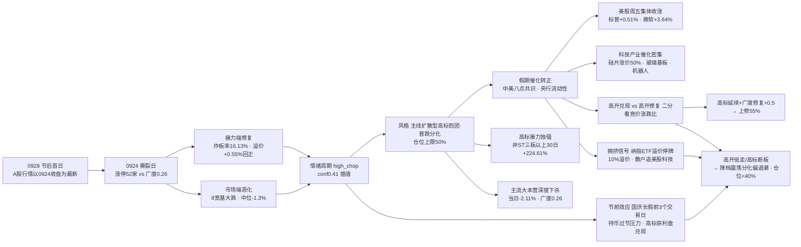

```yaml
date: 2026-09-28
agent: R1-style-analysis
skill_version: analyze_style_v1@1.0
generated_at: 2026-09-28T07:19:19+08:00
confidence: 0.62
degraded: true
data_sources:
  - name: tushare.ths_daily
    path: MCP
    status: ok
    captured_at: None
    record_count: 22
    error: None
  - name: tushare.fund_daily
    path: MCP
    status: ok
    captured_at: None
    record_count: 20
    error: None
  - name: tushare.limit_list_d
    path: MCP
    status: ok
    captured_at: None
    record_count: None
    error: None
  - name: tushare.limit_step
    path: MCP
    status: ok
    captured_at: None
    record_count: None
    error: None
  - name: tushare.index_daily
    path: MCP
    status: ok
    captured_at: None
    record_count: None
    error: None
  - name: tushare.daily
    path: MCP
    status: ok
    captured_at: None
    record_count: 5557
    error: None
  - name: tushare.limit_cpt_list
    path: MCP
    status: ok
    captured_at: None
    record_count: 6
    error: None
  - name: tushare.index_global + us_daily
    path: MCP
    status: ok
    captured_at: None
    record_count: 5
    error: None
  - name: overseas_snapshot
    path: data/raw/20260928/overseas_snapshot.json
    status: ok
    captured_at: None
    record_count: 17
    error: None
  - name: news_major + news_cls
    path: data/raw/20260928/
    status: ok
    captured_at: None
    record_count: 2617
    error: None
  - name: wechat_cli_5groups
    path: data/raw/20260928/wechat_cli_5groups.jsonl
    status: ok
    captured_at: None
    record_count: 122
    error: None
  - name: manifest.json / mcp_health.json
    path: data/raw/20260928/
    status: ok
    captured_at: None
    record_count: None
    error: None
  - name: 商品期货 / FX kline / SOX / HSTECH
    path: -
    status: error
    captured_at: None
    record_count: None
    error: fut_daily 代码未映射 · fx_daily 0 条 · SOX/HSTECH 无 kline
input_freshness: partial
input_freshness_note: 核心量化主源(ths/fund/limit/index/daily/cpt)以0924收盘为最新·中秋休市3日; 外部新闻/外盘(美股0925收盘)/KOL(0927周日)全fresh; 商品期货与FX kline缺失
```

# 2026年9月28日 · **风格研判**

> **数据源新鲜度**: partial（A股行情以 0924 收盘为最新 · 中秋休市 3 日 · 外部新闻/外盘/KOL 全 fresh）
> **降级状态**: true
> **置信度**: 0.62

## 一句话结论

0928 是中秋假期（0925-0927）后的首个交易日，A股最新收盘定格在 0924 那个"接力修复 + 市场普跌"的极端撕裂日：涨停 52 家、炸板率 16.13% 重回健康区、昨日涨停溢价 +0.55% 回正、连板高度 5 板——情绪接力端全面修复；但八条宽基全线大跌、全市场涨跌比 0.26（9 月最差）、中位 -1.3%、1030 只跌超 3%——市场端全面恶化。三天的假期里外部催化显著转正：中美达成八点成果共识、美股周五集体收涨、央行重申保持流动性充裕、科技产业催化密集。风格定格**主线扩散型（高标抱团 · 普跌分化）**，情绪浓度 58（中性），建议仓位上限 **50%**——高开大概率，但"高开兑现还是高开修复"是今天唯一的考题。

## 详细分析

**一、节后首日，先把账算清楚。** 0928 盘前最特殊的一点是：A股行情没有新增交易日——resolve_trade_date("20260928") = 20260924，0925-0927 是中秋假期。因此 R1 的量化底座与 0925 盘前完全一致：涨停 52 家（较前日微增 1 家）、跌停 13 家持平、炸板率 16.13%（较前日 33.77% 大幅回落 17.6 个百分点，重回 20% 以下健康区）、昨日涨停溢价 +0.55% 回正（前日 -0.37%）、连板高度 5 板（较 4 板回升 1 级，5/6 板断层修复为 5 板有锚）。但同一天的市场端是另一副面孔：上证 -1.22%、深成 -2.34%、创业板 -2.68%，八条宽基全线大跌且跌幅较前日显著加深；全市场 5557 只个股涨跌比 0.26——较前日 0.53 再恶化近半，是 9 月最差水平；中位数 -1.3%，4306 只下跌，1030 只跌超 3%。**大资金意图**：涨停家数不崩而指数大跌，说明主力没有系统性撤退，而是把资金从全市场收缩到极少数高标龙头里——非 ST 三板以上当日 +5.13%、非 ST 二板 +3.52% 的暴利与首板/打板当日微亏（-0.61%/-0.66%）形成对照，六个强板块指数当日全部收跌但内部涨停股孤军活跃，这是典型的"抱团而非扩散"；**为什么走强/走弱**：涨停端强，因为高标（5 天 5 板、4 天 4 板各一）叠加机器人链与北交所 30cm 次新的极致赚钱效应；指数端弱，因为权重与成长同步失血、医药消费地产资源全线下跌、通信 ETF 当日 -3.14% 领跌（30 日冠军高位杀跌），资金无处可去只认高标；**逻辑够不够硬**：这是 9 月第一次出现"涨停 50+ 与广度 0.26 并存"的极端背离，情绪指标与市场指标的脱节意味着当前的赚钱效应不具普适性——它属于少数抱团者的狂欢，对绝大多数持仓者而言是亏钱日。今天的问题是：三天的利好能不能把这条普跌的河床填平。

**二、假期三天，外部世界发生了什么。** 催化转正的密度是近期少有的：**中美关系**——习近平 9/23-25 对美进行国事访问并圆满结束，两国元首达成八点成果共识，同意构建"基于尊重、公平、对等的建设性战略稳定关系"，商务部确认"中美第八轮经贸磋商达成多项共识"，美方在介绍访问成果时甚至用"超级智能"代替"人工智能"的表述；**货币政策**——央行明确"综合运用并适时调整货币政策工具、保持流动性充裕"，并加大对扩大内需、科技创新等重点领域的金融支持；**外盘**——美股周五（0925）集体收涨：道指 +0.93%、标普 +0.51%、纳指 +0.47%，本周标普 +1.22%、纳指 +2.06%，科技硬件链走强（微软 +3.64%、苹果 +1.50%、安森美 +5.51%、微芯 +5.29%、戴尔 +5.01%），A50 期指夜盘 +0.08%；**科技产业**——12 英寸硅片涨价 50% 的半导体景气信号、英伟达加码玻璃基板并催促产业链两年内完成开发、台积电嘉义二期新增 5 座先进封装厂、格芯 SiGe 2027 年产能售罄、高塔半导体 40 亿美元扩建日本工厂、高盛把 2030 年人形机器人出货预测从 25.6 万台上调至 89 万台（德银把 2026 年上调至约 5 万台）、Anthropic 拟租赁最高 1GW 算力（投入至少 400 亿美元）、OpenAI 再次暂停最先进模型训练并联合谷歌/Anthropic 筹建 AI 安全标准机构。这些消息单独看都是结构性的，叠加在三天里一起释放，就是给 0928 的高开预埋了充足的理由。

**三、但反面同样清晰：高开兑现的弹药已经备好。** 首先，KOL 的一致性乐观已经到了需要警惕的程度——颜晓滨群周日（0927）事以密成直接喊出"**必须涨，明天必须上 4000 点**"（理由是"谈得这么好，各种利好，不涨岂不是不给老大面子"），而 zZ 的中线判断"今年上证大概率收在 3800-4200 之间"其实暗示当前 3888 点已经在区间中部偏上。其次，**节前效应**是硬约束：0928-0930 只有 3 个交易日就到国庆长假，广发策略在问"持币过节还是持股过节"、东吴在讲"国庆假期的季节效应"，历史上长假前资金天然趋于谨慎，而高标获利盘极端丰厚（非 ST 三板以上 30 日 +224.61%），兑现需求极大。第三，**拥挤信号已经出现**：多只纳指 100 ETF（易方达/嘉实/招商）因二级市场溢价过高（0924 收盘约 10% 溢价）将于 9/28 开市起临时停牌——这是散户资金对美股科技过度追逐的直接证据，若美股稍有回调，A股映射端会先杀溢价。第四，美联储 10 月加息概率仍高达 64.8%，伊朗局势反复（特朗普拒绝协议但预计本周再谈，布伦特周末一度突破 99 美元），长假期间的外盘风险不可控。所以 0928 最可能的高开，恰恰是检验"消息面脉冲还是趋势反转"的试金石。

**四、30 日六簇与 ETF 的结构没有变，变的是预期。** 对 22 个同花顺风格板块 + 20 只 ETF 做 30 日窗口层次聚类（6 簇、相关距离），结构与 0925 盘前完全一致：高标接力簇（3 只）30 日收益仍然惊人——非 ST 三板以上 +224.61%、非 ST 二板 +136.26%、打二板以上 +84.45%，且当日 +3.31% 是全场唯一收涨的簇，这是 9 月唯一还在赚钱的地方；创历史新高独立簇（30 日 +11.45%）当日 -1.27%，"新高模式"开始松动；主流大本营簇（33 只）30 日 -0.77%、当日 -2.11%，昨日资金前十 -3.16%、同花顺热股 -3.24%、沪深 300 -1.63%、科创 50 -2.39%，普跌底色全面覆盖；防御端只有银行 ETF 独立簇当日 +0.72% 收红。20 只 ETF 里，通信 +7.83% 仍是 30 日冠军但当日 -3.14% 领跌——30 日最强的方向开始高位杀跌，这是创业板 -2.68% 的重要注脚；垫底端与昨日一致：有色 -14.78%、新能源 -10.32%、恒生科技 -8.29%。结构没有变，但假期催化让"科技硬件/先进封装/具身智能/AI 应用"这些 30 日垫底或中性的方向获得了重估的理由——问题只是资金愿不愿意在节前最后三天为预期买单。

**五、情绪周期与仓位纪律。** 用 0924 真实收盘指标重算情绪周期：炸板率 16.13%（<25%）、溢价 +0.55%（<+3%），规则未硬命中任何一个阶段，按综合得分插值得 high_chop 0.41、main_up 0.34、main_down 0.24，与预计算（high_chop conf 0.4）一致。周期仍定格高位震荡（"落袋为安/控制仓位"），且叠加国庆节前效应，仓位纪律取主线扩散型 band（0.60-0.80）下沿以下 0.50。剧本二分：若早盘高标延续且广度修复（涨跌比 >0.5），说明假期催化真正转化为增量资金，可上修 55%；若高开低走、高标断板/天地板、或涨停回落至 40 以下，确认震荡分化偏退潮，仓位降至 40% 以下——空仓过节也是选项，因为长假期间美联储加息预期与中东局势的外盘风险不在任何人的控制范围内。

### 推理深度三问（节后首日判定）

- **大资金意图**: 0924 收盘涨停 52 家不崩 + 指数全线大跌 + 广度 0.26 的组合，说明主力不是撤退而是**极致收缩**——资金从全市场（4306 只下跌）抽离，集中灌注到高标妖股（非 ST 三板以上 30 日 +224.61% 当日仍 +5.13%）和强板块内的少数涨停股。假期三天外部催化（中美八点共识 + 美股周五收涨 + 半导体景气）给了资金一个重新定价的窗口：如果大资金借高开把筹码派发给追涨盘，就是"高开兑现"；如果大资金借高开重新进场做多低位科技，就是"高开修复"。0928 竞价和开盘前 30 分钟的涨跌比是唯一能区分两者的指标。
- **为什么走强 / 走弱**: 假期走强的理由全是外部变量——中美八点共识（外交面）、美股周五集体收涨（外盘面）、12 英寸硅片涨价 50% + 英伟达加码玻璃基板 + 高盛德银上调机器人出货（产业面）、央行保持流动性充裕（政策面）；0924 走弱的内因也没消失——广度 0.26 为 9 月最差、8 宽基全线大跌、通信 ETF 30 日冠军当日 -3.14% 高位杀跌、医药消费地产资源全线失血。外部变量能改变的是开盘价，内因决定的是开盘后的方向。
- **逻辑够不够硬**: "高标独强 + 外部催化转正"至少三重确认——量化（高标接力簇 30 日 +148% 唯一赚钱效应 vs 广度 0.26 普跌）、KOL（"必须涨上 4000" vs "短期还处于震荡回调中"）、外盘（美股周五收涨 + 半导体链走强 vs 纳指 ETF 溢价停牌的拥挤信号）。风格定格主线扩散型但加注"高标抱团 · 普跌分化"，仓位上限 50%（高位震荡周期 + 节前效应）。证伪路径清晰：若 0928 早盘高标延续且广度修复（涨跌比 >0.5），上修 55%；若高标断板/天地板或涨停回落至 40 以下，降档震荡分化型（偏退潮）、仓位降至 40% 以下。



## 关键证据

- 证据 1：A股行情口径——0924 收盘为最新（resolve_trade_date('20260928')=20260924，0925-0927 中秋休市），0928 为节后首个交易日 · 来源 tushare.index_daily
- 证据 2：涨停 52 / 跌停 13 / 炸板 10 / 炸板率 16.13%（较 0923 的 51/13/26/33.77%：炸板率回落 17.6pct 重回健康区）· 来源 tushare.limit_list_d
- 证据 3：连板天梯 5 板 1 只 / 4 板 3 只 / 3 板 1 只 / 2 板 8 只，高度较 4 板回升 1 级、5/6 板断层修复 · 来源 tushare.limit_step
- 证据 4：昨日涨停溢价 +0.55%（较 0923 的 -0.37% 回正）· 来源 tushare.daily 重算
- 证据 5：广度 0.26（较 0.53 再恶化近半，9 月最差；跌 4306 > 涨 1120），中位 -1.3%，≤-3% 1030 只、≤-5% 258 只 · 来源 tushare.daily 全市场 5557 只
- 证据 6：8 大宽基全线大跌，上证 -1.22% / 创业板 -2.68% / 深成 -2.34% / 科创 50 -2.35% · 来源 tushare.index_daily
- 证据 7：30 日 6 簇——高标接力簇（+84~225% 当日 +3.31% 全场唯一收涨）、创历史新高独立簇（+11.45% 当日 -1.27% 转负）、主流大本营簇（-0.77% 当日 -2.11% 深度下杀）、银行独立簇（当日 +0.72% 唯一红盘）· 来源 ths_daily + fund_daily 层次聚类
- 证据 8：ETF 通信 +7.83% 领涨 30 日但当日 -3.14% 领跌（冠军高位杀跌）；有色 -14.78% 最弱；0924 当日 20 只仅银行收红 · 来源 tushare.fund_daily
- 证据 9：外盘美股 0925 收盘——道指 +0.93% / 标普 +0.51% / 纳指 +0.47% 集体收涨；微软 +3.64%、苹果 +1.50%、安森美 +5.51%、微芯 +5.29%、戴尔 +5.01%；Meta -3.33%；恒指 -1.01%、日经 +1.30% · 来源 index_global + us_daily + overseas_snapshot
- 证据 10：假期宏观——中美八点成果共识（习近平 9/23-25 访美圆满）、央行"保持流动性充裕"、商务部"中美第八轮经贸磋商达成多项共识"、美联储 10 月加息概率 64.8%、A50 期指夜盘 +0.08%、布伦特周末破 99 美元、现货黄金周跌 2.11%、离岸人民币 6.7227（周跌 0.4%）· 来源 news_major + news_cls
- 证据 11：科技催化——12 英寸硅片涨价 50%、英伟达加码玻璃基板、台积电嘉义二期 5 座先进封装厂、格芯 SiGe 2027 售罄、高盛上调人形机器人 2030 出货至 89 万台、Anthropic 拟租 1GW 算力、OpenAI 再停最先进模型训练 · 来源 news_major + news_cls + wechat_cli_5groups
- 证据 12：拥挤信号——纳指 100 ETF（易方达/嘉实/招商）因 0924 收盘约 10% 溢价于 9/28 临时停牌；粤芯半导体创业板 IPO 中签率 0.0424%（2359 倍申购）；上证创新药科创领先指数 + 上证科创板软件服务指数 9/29 发布 · 来源 news_major + news_cls
- 证据 13：KOL 5/5 群全可用（122 条，颜晓滨群 63 条，0927 周日）——事以密成"必须涨，明天必须上 4000 点"（极度乐观），zZ"短期还处于震荡回调中"（中线谨慎）；方向共识玻璃基板+FOPLP、人形机器人、半导体景气、Meta Muse AI 应用 · 来源 wechat_cli_5groups

## 数据源审计

| 源 | 日期 | 状态 | 备注 |
|---|---|:--:|---|
| tushare.ths_daily（22 风格板块） | 2026-09-24 | 🟢 | 22 只 · 30 日窗口（中秋休市无新增交易日） |
| tushare.fund_daily（20 ETF） | 2026-09-24 | 🟢 | 20 只 · 30 日窗口 |
| tushare.limit_list_d | 2026-09-24 | 🟢 | 涨停 52 / 跌停 13 / 炸板 10 |
| tushare.limit_step | 2026-09-24 | 🟢 | 连板 5 板（较 4 板回升 1 级） |
| tushare.index_daily | 2026-09-24 | 🟢 | 8 宽基全线大跌 |
| tushare.daily | 2026-09-24 | 🟢 | 5557 只全市场分布 · 广度 0.26 |
| tushare.limit_cpt_list | 2026-09-24 | 🟢 | 6 强板块代理（高度方向 2 个） |
| tushare.index_global + us_daily | 2026-09-25 | 🟢 | 美股 0925 收盘（标普 +0.51% / 微软 +3.64%） |
| overseas_snapshot | 2026-09-25 | 🟢 | 美股 0925 / 亚太 0925 · 商品期货 skipped |
| news_major + news_cls | 2026-09-25~28 | 🟢 | 2617 条 · 中美八点共识 / A50 +0.08% / 布伦特破 99 |
| wechat_cli_5groups | 2026-09-27 | 🟢 | 122 条 · 5 焦点群（匿名）· 必须涨上 4000 |
| manifest / mcp_health | 2026-09-28 | 🟡 | global_severity=2 · weflow/qmt down · 公众号 sanji disabled |
| 商品期货 / FX kline / SOX / HSTECH | - | 🔴 | fut_daily 代码未映射 · fx_daily 0 条 · SOX/HSTECH 无 kline |

## 不确定性 / 反证

必须诚实承认几处薄弱：其一，0928 盘前最本质的不确定性是**行情口径的滞后**——A股核心量化全部定格 0924 收盘（中秋休市 3 日所致，非数据缺失），风格判定天然带有"旧结构 + 新催化"的错位，若 0928 高开直接把广度修复到 0.5 以上，名义"高标抱团·普跌分化"会被迅速证伪为"主线扩散健康态"，这需要竞价后由 P1 校准；其二，KOL 的一致性乐观（"必须涨，明天必须上 4000 点"）本身可能是反向指标——历史上节前一致性看多后高开低走的案例并不少，尤其当纳指 ETF 溢价停牌已经暴露散户拥挤交易时；其三，美联储 10 月加息概率仍高达 64.8%，伊朗局势反复（特朗普拒协议但预计本周再谈，布伦特周末破 99 美元），国庆长假 8 天（若 10/1-10/8）的外盘风险无法用任何 A股盘前分析对冲，持股过节是押注长假期间外盘平稳；其四，高标接力 30 日 +224.61% 的获利盘极端丰厚，节前最后 3 个交易日的兑现压力远大于平时，若高标断板与普跌共振，回撤会非常剧烈；其五，情绪浓度 58 是四维 64 与五维 56 的折中（差 8 未超校验线），假期催化为正向前置信但未计入 0924 指标——若 0928 广度修复，情绪浓度应上修至 65+，反之若涨停收缩至 40 以下，应下修至 50 以下。

## 与其他 R/D/E 的关系

- 依赖：data/raw/20260928/manifest.json、mcp_health.json、style_snapshot.json（本次生成）、news_major/news_cls、wechat_cli_5groups、overseas_snapshot；data/research/20260928/emotion_cycle.json（预计算，已用真实指标重算校验一致）
- 输出被消费：R2（style / main_lines_count / position_cap_suggestion）、R3（sentiment_score 基准）、R6（一致性反证）、D1（position_cap_suggestion → 总仓上限）

## Sub-Agent 元数据

- skill: analyze_style_v1
- artifact: data/research/20260928/R1_style.json
- 生成耗时: 约 16 分钟（含 style_snapshot 抓取 + 聚类 + 校验）
- model: deepseek-v4-flash-ga-260731
