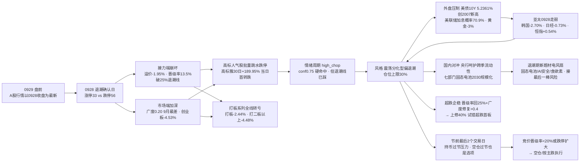

```yaml
date: 2026-09-29
agent: R1-style-analysis
skill_version: analyze_style_v1@1.0
generated_at: 2026-09-29T07:18:10+08:00
confidence: 0.67
degraded: true
data_sources:
  - name: tushare.ths_daily
    path: MCP
    status: ok
    captured_at: None
    record_count: 22
    error: None
  - name: tushare.fund_daily
    path: MCP
    status: ok
    captured_at: None
    record_count: 20
    error: None
  - name: tushare.limit_list_d
    path: MCP
    status: ok
    captured_at: None
    record_count: None
    error: None
  - name: tushare.limit_step
    path: MCP
    status: ok
    captured_at: None
    record_count: None
    error: None
  - name: tushare.index_daily
    path: MCP
    status: ok
    captured_at: None
    record_count: None
    error: None
  - name: tushare.daily
    path: MCP
    status: ok
    captured_at: None
    record_count: 5557
    error: None
  - name: tushare.limit_cpt_list
    path: MCP
    status: ok
    captured_at: None
    record_count: 1
    error: None
  - name: tushare.index_global + us_daily
    path: MCP
    status: ok
    captured_at: None
    record_count: 19
    error: None
  - name: overseas_snapshot
    path: data/raw/20260929/overseas_snapshot.json
    status: ok
    captured_at: None
    record_count: None
    error: None
  - name: news_major + news_cls
    path: data/raw/20260929/
    status: ok
    captured_at: None
    record_count: 3045
    error: None
  - name: wechat_cli_5groups
    path: data/raw/20260929/wechat_cli_5groups.jsonl
    status: ok
    captured_at: None
    record_count: 392
    error: None
  - name: manifest.json / mcp_health.json
    path: data/raw/20260929/
    status: ok
    captured_at: None
    record_count: None
    error: None
  - name: 商品期货 / FX kline / SOX / HSTECH
    path: -
    status: error
    captured_at: None
    record_count: None
    error: fut_daily 代码未映射 · fx_daily 0 条 · SOX/HSTECH 无 kline
input_freshness: partial
input_freshness_note: 核心量化主源(ths/fund/limit/index/daily/cpt)以0928收盘为最新·非节假日滞后; 美股滞后1日(0925收盘·0928隔夜由news_cls补充); 外部新闻/KOL全fresh; 商品期货与FX kline缺失
```

# 2026年9月29日 · **风格研判**

> **数据源新鲜度**: partial（A股行情以 0928 收盘为最新 · 美股滞后 1 日 · 外部新闻/KOL 全 fresh）
> **降级状态**: true
> **置信度**: 0.67

## 一句话结论

0928 是中秋假期后的第一个交易日，也是 0928 盘前那份"高开兑现还是高开修复"考卷的交卷日——答案是后者：上证 -1.67%、创业板 -4.53%（9 月最深）、涨停 33 家、跌停 56 家反超涨停、昨日涨停溢价 -1.95% 转负、晋级率 13.5% 跌破 25% 退潮线、全市场涨跌比 0.20（9 月最差）、高位人气股批量跳水跌停。风格定格**震荡分化型（偏退潮）**，情绪浓度 35（恐惧），建议仓位上限 **30%**——节前最后 2 个交易日，退潮期纪律优先，空仓过节也是选项。

## 详细分析

**一、节后首日把账算完，结果是退潮。** 昨天盘前我们预设的降档条件——涨停回落至 40 以下、高标断板或跳水、高开低走——在今天全部命中。先看接力端：涨停 33 家（较节前最后收盘 52 家减 19 家）、跌停 56 家（较 13 家暴增 43 家，**跌停反超涨停**，这是 9 月第一次）、炸板率 25.0%（破 25% 分歧线）、昨日涨停溢价 -1.95%（节前涨停池高开仅 +0.20%，随后一路杀到收盘平均亏 1.95%，接力资金被彻底闷杀）、晋级率 13.5%（节前 52 只涨停里只有 7 只晋级，跌破 25% 退潮线）。再看连板天梯：最高 5 板只剩 1 只独苗，4 板整个断层，3 板 3 只、2 板 3 只，全市场连板股仅 7 只——对比节前收盘的 5-4-3-2 完整梯队（13 只），梯队收缩近半，高度悬空、宽度全无。**大资金意图**：这不是普通的回调，而是资金从高标抱团中系统性撤退——跌停反超涨停、溢价转负、晋级率破线、高标人气股批量跳水，四个信号同向共振，指向"抱团瓦解"的开始；**为什么走弱**：节前最后一批涨停票在高开后无人接力，获利盘借高开出货（高开 +0.20% 就是派发窗口），配合创业板 -4.53% 的成长重灾，赚钱效应全面转负；**逻辑够不够硬**：退潮线三条件（晋级率 <25%、跌停反超、广度 0.20）全部触发，这是可量化的硬信号，不是情绪化猜测——0928 盘前"高开兑现"的剧本被完整走完。

**二、30 日六簇看结构：高标开始补跌，主流大本营加速失血。** 对 22 个同花顺风格板块 + 20 只 ETF 做 30 日窗口层次聚类（6 簇、相关距离），退潮的痕迹在簇结构里看得非常清楚：高标接力簇（2 只）30 日收益仍是全场最高（打二板以上 +61.18%、非 ST 三板以上 +189.95%），但当日已经转跌（-4.48% / -1.73%，簇均值 -3.10%）——对比节前收盘的当日 +3.31%、30 日 +148.44%，高标簇从"唯一赚钱的地方"变成"开始回吐的地方"，这是 9 月最肥的肉第一次出现裂缝；主流大本营簇（34 只）30 日 -5.02%、当日 -3.39%，较节前的 -0.77% 大幅恶化——通信 ETF 当日 -7.66% 领跌（30 日冠军彻底熄火）、昨日成交前十 -6.84%、百元股 -5.48%、深股通成交前十 -5.34%、创历史新高 -4.35%，普跌底色全面覆盖，连防御性的银行 ETF 当日也转跌（-0.48%），20 只 ETF 当日无一红盘。打板系列全线转亏（打板 -2.44%、打首板 -2.61%、打二板以上 -4.48%、非 ST 三板以上 -1.73%），只有非 ST 二板当日 +1.00% 还撑着——但这是 30 日 +124.72% 获利盘里的最后一口汤。结构上没有任何一个方向提供赚钱效应，这是典型的退潮日特征。

**三、外盘与隔夜宏观：美债风暴是压舱石，不是背景音。** 美股数据 tushare 滞后 1 日（最新为 0925 周五收盘：标普 +0.51%、纳指 +0.48%，微软 +3.66%、苹果 +1.53%、康宁 +1.68% 半导体链强），但 0928 周一的隔夜动态由新闻流补全：美股三大指数集体低开、中概股多数上涨（网易 +5%）、英伟达盘前涨近 2%（Firmus×Meta 亚太 AI 基础设施协议 + Anthropic×英伟达智能体安全合作）——科技结构性利好仍在，但被更大的宏观压力盖过：**10 年期美债收益率 5.2361% 创 2007 年以来新高**（单日 +7.56bp）、两年期 4.9305% 涨向 5% 关口、美联储 10 月加息概率升至 70.9%、黄金重挫 3% 至 7 周低点、WTI 93.55（+1%）、日债风暴再起（日本 10 月加息预期升温）。亚太 0928 周一同步走弱：韩国 -2.70%、日经 -0.73%，恒指 +0.54% 是唯一红盘但恒生科技 -0.37%、光通信龙头重挫近 17%。A50 期指夜盘收跌 0.01% 报 13923 点，基本持平。美债收益率创 2007 新高 + 加息概率 70.9% 的组合，对成长股估值是持续的压制——创业板 -4.53% 不是一次性的，它对应的是"利率上行期成长杀估值"的大背景。国内政策面提供局部对冲：央行三季度例会延续"适度宽松"、加大逆周期调节、重点支持"六张网"，上证报确认央行超量续作 MLF、提高隔夜逆回购上限，资金面有望平稳跨季；七部门发文"2030 年全固态电池初步规模化应用"给退潮期资金一个低位新方向。

**四、情绪周期与仓位纪律：高位震荡硬命中，但退潮线已踩。** 用 0928 真实指标重算：炸板率 25.0%（≥25%）+ 溢价 -1.95%（<+3%）→ 硬命中高位震荡，conf 0.75，与预计算一致（预计算的 +0.20% 是开盘溢价口径，0924 池高开仅 +0.20% 后杀到收盘 -1.95%，两个口径都指向接力极差，阶段结论稳健）。但必须清醒：高位震荡是"名"，退潮线是"实"——晋级率 13.5% <25%、跌停 56 >涨停 33、广度 0.20 三项全触发，溢价 -1.95% 也跌破了 -1% 的亏钱效应阈值。按退潮期纪律（总仓 ≤20-30%，不做接力），仓位上限取 30%；若 0929 竞价晋级率继续 <20% 或跌停扩大，直接按主跌执行，空仓过节最优。KOL 的转变也印证了这点：0927 还在喊"必须涨，明天必须上 4000 点"，0928 盘中 zZ 直击"高位人气股大面积跳水跌停"，机构周末交流明确"资金主动降风险敞口、杠铃型配置"（银行红利 + AI 应用/半导体设备/国产替代）——从一致性乐观到防守共识的反转，本身就是情绪周期转向的标志。

### 推理深度三问（0929 风格判定）

- **大资金意图**: 0928 跌停反超涨停 + 溢价 -1.95% + 晋级率 13.5% + 高标人气股批量跳水，四个信号同向，指向资金从高标抱团中系统性撤退、节前最后 2 个交易日主动降风险敞口。30 日高标簇（非 ST 三板以上 +189.95%）当日首次转跌是"抱团瓦解"的第一块多米诺——这不是正常换手，是获利盘借高开派发的典型走法。
- **为什么走强 / 走弱**: 0928 走弱的直接原因是节前涨停池高开后无人接力（高开 +0.20% 即派发窗口），深层原因是美债收益率 5.2361% 创 2007 新高 + 美联储加息概率 70.9% 压制成长估值（创业板 -4.53%），叠加节前持币过节压力；唯一的结构性亮点（英伟达链/固态电池/AI 安全等产业催化）在利率压力面前只够支撑局部高开，撑不起全面修复。
- **逻辑够不够硬**: "退潮确认"至少三重确认——量化（退潮线三条件全触发 + 高标簇转跌 + 打板全线转亏）、KOL（高位人气股批量跳水跌停 + 机构降风险敞口）、外盘（亚太 0928 走弱 + 美债风暴）。风格定格震荡分化型（偏退潮）但加注"退潮线已踩"，仓位上限 30%；证伪路径清晰：若 0929 超跌企稳（晋级率回 25% 以上、广度修复 >0.4），可上修至 40% 试错超跌首板；若晋级率继续 <20% 或跌停扩大，空仓过节最优。



## 关键证据

- 证据 1：A股行情口径——0928 收盘为最新（resolve_trade_date('20260929')=20260928，非节假日滞后），0928 为中秋（0925-0927）后首个交易日，全线兑现"高开兑现"剧本 · 来源 tushare.index_daily
- 证据 2：涨停 33 / 跌停 56 / 炸板 11 / 炸板率 25.0%（较 0924 的 52/13/10/16.13%：跌停暴增 43 家、跌停反超涨停、炸板率破 25% 分歧线）· 来源 tushare.limit_list_d
- 证据 3：晋级率 13.5%（0924 涨停池 52 只 → 0928 仅 7 只晋级，破 25% 退潮线）；连板股仅 7 只：5 板 1 / 3 板 3 / 2 板 3，4 板断层 · 来源 limit_list_d + limit_step 交叉
- 证据 4：昨日涨停溢价 -1.95%（收盘口径，0924 池 0928 平均 -1.95%；开盘溢价口径 +0.20% 后杀至收盘）· 来源 tushare.daily 重算
- 证据 5：广度 0.20（较 0924 的 0.26 再恶化，9 月最差；跌 4554 > 涨 898），中位 -1.85%，≤-3% 1825 只、≤-5% 859 只、≤-9.9% 123 只 · 来源 tushare.daily 全市场 5557 只
- 证据 6：8 大宽基全线大跌，上证 -1.67% / 创业板 -4.53%（9 月最深）/ 科创 50 -4.06% / 上证 50 -1.26%（唯一抗跌）· 来源 tushare.index_daily
- 证据 7：30 日 6 簇——高标接力簇（+61~190% 但当日 -3.10% 首转跌）、非 ST 二板独立簇（当日 +1.00% 唯一收红）、银行独立簇（当日 -0.48% 转跌）、主流大本营簇（-5.02% 当日 -3.39% 加速下杀）· 来源 ths_daily + fund_daily 层次聚类
- 证据 8：ETF 30 日银行 +2.48% 唯一正收益、通信 30 日冠军当日 -7.66% 领跌彻底熄火；0928 当日 20 只 ETF 无一红盘；有色 -18.88% 最弱 · 来源 tushare.fund_daily
- 证据 9：主线代理——强板块（up_nums≥8）仅 1 个（较 0924 收盘 6 个急剧收缩），高度方向仅 5 板 1 只独苗 · 来源 tushare.limit_cpt_list
- 证据 10：外盘 0928 周一——恒指 +0.54%（恒生科技 -0.37%，光通信龙头重挫近 17%）/ 韩国 -2.70% / 日经 -0.73%；美股 0925 周五（最新）标普 +0.51% / 纳指 +0.48%，微软 +3.66% / 苹果 +1.53% · 来源 index_global + us_daily + overseas_snapshot
- 证据 11：隔夜美股 0928——三大指数低开、中概股多数上涨（网易 +5%）、英伟达盘前 +2%（Firmus×Meta / Anthropic×英伟达）· 来源 news_cls
- 证据 12：隔夜宏观——美债 10Y 5.2361% 创 2007 以来新高（+7.56bp）、两年期 4.9305%、美联储 10 月加息概率 70.9%、黄金重挫 3% 至 7 周低点、WTI 93.55（+1%）、A50 夜盘 -0.01% 报 13923、OpenAI 取消发布 GPT-6.1 · 来源 news_major + news_cls
- 证据 13：国内政策——央行三季度例会"适度宽松"+加大逆周期调节+支持"六张网"；央行超量续作 MLF/提高隔夜逆回购上限（资金面平稳跨季）；七部门"2030 年全固态电池初步规模化应用" · 来源 news_major + news_cls
- 证据 14：KOL 5/5 群全可用（392 条，颜晓滨群 39 条，0928 盘后）——机构周末交流"资金主动降风险敞口/杠铃型配置"；zZ 盘中"高位人气股大面积跳水跌停"；退潮期新方向固态电池/AI 安全/食欲素/MLCC/BBU/VNA · 来源 wechat_cli_5groups

## 数据源审计

| 源 | 日期 | 状态 | 备注 |
|---|---|:--:|---|
| tushare.ths_daily（22 风格板块） | 2026-09-28 | 🟢 | 22 只 · 30 日窗口（0928 收盘全 fresh） |
| tushare.fund_daily（20 ETF） | 2026-09-28 | 🟢 | 20 只 · 30 日窗口 |
| tushare.limit_list_d | 2026-09-28 | 🟢 | 涨停 33 / 跌停 56 / 炸板 11 · 晋级率 13.5% |
| tushare.limit_step | 2026-09-28 | 🟢 | 连板 5 板 · 4 板断层 · 梯队仅 7 只 |
| tushare.index_daily | 2026-09-28 | 🟢 | 8 宽基全线大跌 · 创业板 -4.53% |
| tushare.daily | 2026-09-28 | 🟢 | 5557 只全市场分布 · 广度 0.20 |
| tushare.limit_cpt_list | 2026-09-28 | 🟢 | 强板块仅 1 个代理 |
| tushare.index_global + us_daily | 2026-09-25 | 🟡 | 美股滞后 1 日（0925 收盘）· 港股/韩/日 0928 收盘 |
| overseas_snapshot | 2026-09-29 | 🟢 | 美股 0925 / 亚太 0928 · 商品期货 skipped |
| news_major + news_cls | 2026-09-28~29 | 🟢 | 3045 条 · 美债 10Y 创 2007 新高 / 美联储 70.9% / 七部门固态电池 |
| wechat_cli_5groups | 2026-09-28 | 🟢 | 392 条 · 5 焦点群（匿名）· 防守共识 |
| manifest / mcp_health | 2026-09-29 | 🟡 | global_severity=2 · weflow/qmt down · 公众号 sanji disabled |
| 商品期货 / FX kline / SOX / HSTECH | - | 🔴 | fut_daily 代码未映射 · fx_daily 0 条 · SOX/HSTECH 无 kline |

## 不确定性 / 反证

必须诚实承认几处薄弱。其一，**美股数据滞后 1 日**：tushare 最新为 0925 周五收盘，0928 周一收盘数据未更新，隔夜美股的最终走向（低开是否收窄/是否转跌）只能由新闻流近似，若 0928 美股实际收盘强于预期（英伟达盘前 +2% 的科技结构性利好有翻盘可能），0929 A股低开幅度可能小于悲观预期；其二，**情绪周期是"名"退潮线是"实"**：炸板率 25% 未破 40% 硬线，系统未判主跌，但溢价 -1.95% + 晋级率 13.5% 已呈主跌特征——这是周期判定的灰色地带，我用退潮期纪律（≤30% 仓）覆盖而非纠结标签；其三，**退潮期的一致性悲观同样可能是反向指标**：0928 KOL 从"必须涨上 4000"急转防守，历史上情绪极值处常孕育超跌反弹，节前最后 2 个交易日若出现恐慌性低开杀跌后的承接（晋级率回 25% 以上），反而可能是轻仓试错窗口；其四，**隔夜政策催化（七部门固态电池）可能引发局部高开**，退潮期追新题材=接最后一棒，若无量能承接则高开低走，这是今天最大的盘中陷阱；其五，情绪浓度 35 是四维 50 与五维 31 的折中（差 19 超校验线，因四维法对跌停压制与溢价转负反映不足而向五维方向修正），若 0929 出现超跌修复，情绪浓度应上修至 45+，反之若晋级率继续恶化则应下修至 25 以下。

## 与其他 R/D/E 的关系

- 依赖：data/raw/20260929/manifest.json、mcp_health.json、style_snapshot.json（本次生成）、news_major/news_cls、wechat_cli_5groups、overseas_snapshot；data/research/20260929/emotion_cycle.json（预计算 high_chop conf0.75，已用真实指标重算校验一致）
- 输出被消费：R2（style / main_lines_count / position_cap_suggestion）、R3（sentiment_score 基准）、R6（一致性反证）、D1（position_cap_suggestion → 总仓上限）

## Sub-Agent 元数据

- skill: analyze_style_v1
- artifact: data/research/20260929/R1_style.json
- 生成耗时: 约 18 分钟（含 style_snapshot 抓取 + 外盘 index_global 修复 + 聚类 + 校验）
- model: deepseek-v4-flash-ga-260731
