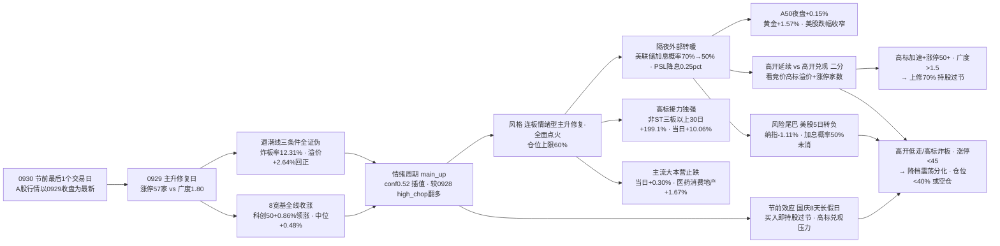

```yaml
date: 2026-09-30
agent: R1-style-analysis
skill_version: analyze_style_v1@1.0
generated_at: 2026-09-30T07:13:49+08:00
confidence: 0.66
degraded: true
data_sources:
  - name: tushare.ths_daily
    path: MCP
    status: ok
    captured_at: None
    record_count: 22
    error: None
  - name: tushare.fund_daily
    path: MCP
    status: ok
    captured_at: None
    record_count: 20
    error: None
  - name: tushare.limit_list_d
    path: MCP
    status: ok
    captured_at: None
    record_count: None
    error: None
  - name: tushare.limit_step
    path: MCP
    status: ok
    captured_at: None
    record_count: None
    error: None
  - name: tushare.index_daily
    path: MCP
    status: ok
    captured_at: None
    record_count: None
    error: None
  - name: tushare.daily
    path: MCP
    status: ok
    captured_at: None
    record_count: 5559
    error: None
  - name: tushare.limit_cpt_list
    path: MCP
    status: ok
    captured_at: None
    record_count: 17
    error: None
  - name: tushare.index_global + us_daily
    path: MCP
    status: ok
    captured_at: None
    record_count: 5
    error: None
  - name: overseas_snapshot
    path: data/raw/20260930/overseas_snapshot.json
    status: ok
    captured_at: None
    record_count: 19
    error: None
  - name: news_major + news_cls
    path: data/raw/20260930/
    status: ok
    captured_at: None
    record_count: 3463
    error: None
  - name: wechat_cli_5groups
    path: data/raw/20260930/wechat_cli_5groups.jsonl
    status: ok
    captured_at: None
    record_count: 401
    error: None
  - name: manifest.json / mcp_health.json
    path: data/raw/20260930/
    status: ok
    captured_at: None
    record_count: None
    error: None
  - name: 商品期货 / FX kline / SOX / HSTECH
    path: -
    status: error
    captured_at: None
    record_count: None
    error: fut_daily 代码未映射 · fx_daily 0 条 · SOX/HSTECH 无 kline
input_freshness: partial
input_freshness_note: 核心量化主源(ths/fund/limit/index/daily/cpt)以0929收盘为最新·非节假日滞后; 美股0929隔夜滞后1日由news_cls补齐(美联储转鸽/加息概率降至50%/A50+0.15%); 商品期货与FX kline缺失; SOX/HSTECH无kline
```

# 2026年9月30日 · **风格研判**

> **数据源新鲜度**: partial（A股行情以 0929 收盘为最新 · 美股隔夜滞后 1 日由新闻侧补齐 · FX/SOX/HSTECH 缺失）
> **降级状态**: true
> **置信度**: 0.66

## 一句话结论

0930 是国庆长假前的最后 1 个交易日，A股最新收盘定格在 0929 那个"退潮全面证伪、主升修复点火"的日子：涨停 57 家、跌停 10 家、炸板率 12.31% 重回健康区、昨日涨停溢价 +2.64% 回正、连板高度 6 板、全市场涨跌比 1.80、8 条宽基全线收涨、强板块从 1 个扩张到 17 个——0928 那场退潮的账被一天还清。隔夜外部又添两把火：美联储 10 月加息概率从约 70% 骤降至约 50%（威廉姆斯称"政策行动并无紧迫性"），央行下调 PSL 利率 0.25 个百分点。风格定格**连板情绪型（主升修复·全面点火）**，情绪浓度 70（贪婪），建议仓位上限 **60%**——今天的考题只有一个：节前最后一天，是持股过节博节后，还是落袋为安躲长假。

## 详细分析

**一、0929 把退潮的账全部还清了。** 三天前（0928，中秋后首日）我们还在按退潮纪律防守：涨停 33 家、跌停 56 家反超涨停、炸板率 25%、昨日涨停溢价 -1.95%、广度 0.20、创业板 -4.53%——退潮线三条件（晋级率 13.5%<25% / 跌停反超涨停 / 广度 0.20）全触发。0929 用一根大阳线把所有条件全部证伪：涨停 57 家（+24）、跌停 10 家（-46）、炸板率 12.31%（重回 <20% 健康区）、昨日涨停溢价 +2.64%（由亏转盈）、连板高度回升到 6 板（4 板断层修复）、晋级率约 30.3%（重回 25% 健康线上方）、广度 1.80（3471 涨 vs 1933 跌，中位 +0.48%）、8 条宽基全线收涨（科创 50 +0.86% 领涨）。**大资金意图**：0928 是缩量洗盘而非系统性撤退——主力没有离场，只是在退潮日把筹码从全市场抽回到高标，0929 又借着反弹把资金放回科技硬件/算力/AI/固态电池的多条主线；**为什么走强**：涨停端强是因为高标（6 板、12 天 8 板梯队）与低位新题材（固态电池 10 家首板、锂电池 11 家、新能源汽车 10 家）同步点火，17 个强板块同日放量，赚钱效应从高标孤岛扩散到全市场；**逻辑够不够硬**：修复日的成色要看承接——炸板率 12.31% 说明封板质量高，溢价 +2.64% 说明接力有肉，广度 1.80 说明不是只有少数人赚钱，这三个数字同时健康，修复是真实的，不是一根假阳线。

**二、30 日六簇：高标还是那座金山，但河床已经填平。** 对 22 个同花顺风格板块 + 20 只 ETF 做 30 日窗口层次聚类（6 簇、相关距离），高标接力簇依旧是最亮的那颗星：非 ST 三板以上 30 日 +199.1%、当日 +10.06%，非 ST 二板独立簇 30 日 +120.44%、当日 +3.11%——9 月赚钱的尽头还是高标接力。但真正重要的变化在底部：主流大本营簇（34 只）当日从 -3.39% 修复到 +0.30%，医药消费地产簇当日 +1.67%（房地产 ETF 当日 +4.43% 领涨，30 日 +5.4% 登顶 ETF 榜），20 只 ETF 里房地产、银行、军工、煤炭领涨，有色、新能源、光伏、恒生科技、证券垫底但跌幅收敛。打板系列全线转正（非 ST 三板以上 +10.06% / 打首板 +1.27%）。**为什么走强/走弱**：高标强是因为主升期资金只认龙头（"涨停就是龙头，涨停散户就蜂拥而至"），房地产/银行/军工强是因为央行 PSL 降息 + 节前防守资金配置，科技 ETF 弱是因为 30 日高位回撤后仍在修复路上；**逻辑够不够硬**：修复日的结构比 0925 那次"高标独强、其余全杀"健康得多——现在是高标继续 + 全市场止跌的双轮，若 0930 能维持广度 >1.5，主升修复就有第二天的命。

**三、隔夜外部送来了高开的理由，也保留了风险的尾巴。** 最重磅的转向在美联储：威廉姆斯"政策行动并无紧迫性"后，交易员把 10 月加息概率从约 70% 下调至约 50%（年底前或仅加息一次），美股 0929 也把跌幅收窄到道指 -0.25%、标普 -0.16%、纳指 -0.09%（对比 0928 的 -0.77%/-0.92%）；A50 期指夜盘 +0.15% 报 13900 点；现货黄金 +1.57% 报 4179.95 美元、COMEX 铜 +0.43%——贵金属与铜同涨，风险偏好回升。国内侧央行下调 PSL 利率 0.25 个百分点至一年期 1.5%，是明牌的政策呵护。产业催化更是密集到有点拥挤：长鑫 108 亿新建测试工厂（存储测试设备）、AMD 82 亿美元收购李飞飞 World Labs（世界模型）、OpenAI 周活破 12 亿 + 年化收入逼近 700 亿美元、英伟达 Open Agent Safety Platform（AI 安全）、华为 Mate90 全系 eSIM、豆包对标 Muse 新产品国庆上线、可灵 Kling4.0 内测。**但风险尾巴同样清晰**：美股 5 日已转负（纳指 5 日 -1.11%），0928 特斯拉 -3.94%、英特尔 -5.67%、Meta -4.79% 的集体回调意味着美股科技高位并不稳，国庆 8 天长假里加息概率 50%、美债收益率高位、伊朗局势、日债风暴没有一样在我们的控制范围内——这正是"高开兑现还是高开延续"的赌注所在。

**四、今天是节前最后 1 个交易日，买入即持股过节。** 这是 0930 与普通交易日最大的不同：今天买的每一手，赌的不是明天，而是国庆 8 天长假后的开盘。因此两股力量会正面交锋——持股过节派（风中追风 08:17"决定持股过节这个方向了"）vs 落袋兑现派（Jason 18:11"明天不涨停就出货"，高标获利盘 30 日 +199% 兑现压力极大）。长假前资金天然谨慎（0925 我们就提示过节效应），加上高标极端获利盘，0930 最可能的高开恰恰是检验"主升延续还是脉冲兑现"的试金石。KOL 的乐观里混着清醒：诸葛大卫 09:55"昨天大跌以后果然今天是修复的一天"确认修复，D"外资离场去美债啦"提醒外资，张清 22:05"只有吹个超级泡泡，科技大佬们投的钱才能收回"给 AI 估值泼冷水。

**五、情绪周期与仓位纪律：主升，但带着节前的刹车。** 用 0929 真实指标重算情绪周期：溢价 +2.64%、炸板率 12.31%、高度 6 板、涨停 57 家，规则未硬命中（溢价 <+3%），按综合得分插值 main_up 0.52、high_chop 0.29，与预计算（main_up 0.47）方向一致且置信度上升——0928 的高位震荡（conf 0.75）已经翻多为主升修复。情绪浓度四维 82（极贪）vs 五维 63（贪婪）差 19 超校验线，取贪婪 70：修复热度真实，但节前最后一日 + 外盘 5 日转负不值得给到极贪的满配。仓位上限取连板情绪型 band（0.60-0.80）下沿 0.60，只做各主线龙一/龙二，不做追高。剧本二分写死：若早盘高标加速且涨停维持 50+、广度 >1.5，说明节前资金愿意持股过节，可上修 70% 博节后；若高开兑现、高标炸板、涨停回落至 40 以下，降至 40% 以下甚至空仓过节——长假外盘风险不在任何人控制范围内，空仓也是一种仓位。

### 推理深度三问（节前收官日判定）

- **大资金意图**: 0929 涨停 57 家 + 广度 1.80 + 17 个强板块同步放量的组合，说明主力在退潮日（0928）不是撤退而是收缩筹码，修复日又把资金放回科技硬件/算力/AI/固态电池多条主线。节前最后一天，大资金面临持股过节 vs 落袋的分叉：如果高标竞价继续加速且涨停维持 50+，说明主力愿意扛长假风险做多节后；如果高标低开/炸板，说明主力在利用高开派发。竞价前 30 分钟的高标溢价率与涨停家数是唯一能区分两者的指标。
- **为什么走强 / 走弱**: 走强的理由全是"修复 + 催化"——退潮证伪（炸板率 12.31%/溢价 +2.64%/广度 1.80）、美联储转鸽（加息概率 70%→50%）、央行 PSL 降息 0.25pct、产业催化密集（长鑫/AMD 收购/OpenAI/AI 安全/固态电池）；走弱的风险也没消失——外盘美股 5 日转负、高标获利盘 +199% 兑现压力、节前最后 1 日资金天然谨慎。外部变量决定开盘价，兑现压力决定开盘后的方向。
- **逻辑够不够硬**: "主升修复 + 节前收官"至少三重确认——量化（退潮线三条件全证伪/高标当日 +10.06%/广度 1.80 vs 五维贪婪 63）、KOL（"今天是修复的一天"/"持股过节" vs "明天不涨停就出货"/"超级泡泡"）、外盘政策（美联储转鸽 + PSL 降息 + A50 +0.15% vs 美股 5 日转负）。风格定格连板情绪型但压仓 60%（节前 + 高标获利盘 + 外盘不可控）。证伪路径清晰：高标加速 + 涨停 50+ → 上修 70%；高标断板 / 涨停 <45 → 40% 以下 / 空仓。



## 关键证据

- 证据 1：A股行情口径——0929 收盘为最新（resolve_trade_date('20260930')=20260929），0930 为国庆长假前最后 1 个交易日 · 来源 tushare.index_daily
- 证据 2：涨停 57 / 跌停 10 / 炸板 8 / 炸板率 12.31%（较 0928 的 33/56/11/25.0%：涨停 +24、跌停 -46、炸板率 -12.7pct 重回健康区，退潮线三条件全面证伪）· 来源 tushare.limit_list_d
- 证据 3：连板天梯 6 板 1 只 / 4 板 1 只 / 3 板 1 只 / 2 板 7 只，高度较 5 板回升 1 级、4 板断层修复；晋级率约 30.3%（0928 池 33 只→连板 10 只，较 13.5% 翻倍重回 25% 健康线）· 来源 tushare.limit_step
- 证据 4：昨日涨停溢价 +2.64%（0928 池 33 只 0929 平均 +2.64%，较 -1.95% 大幅转正）· 来源 tushare.daily 重算
- 证据 5：广度 1.80（涨 3471 > 跌 1933），中位 +0.48%，≥9.9% 涨停 80 只、≥5% 214 只、≤-5% 仅 68 只、≤-9.9% 16 只——普跌全面收敛 · 来源 tushare.daily 全市场 5559 只
- 证据 6：8 大宽基全线收涨，上证 +0.18% / 创业板 +0.09% / 科创 50 +0.86% 领涨（较 0928 全线大跌完全反转）· 来源 tushare.index_daily
- 证据 7：30 日 6 簇——高标接力簇（非ST三板以上 +199.1% 当日 +10.06%）、非ST二板独立簇（+120.44% 当日 +3.11%）、医药消费地产簇（当日 +1.67%）、银行 ETF 独立簇（+0.72%）、煤炭 ETF 独立簇（-1.50%）、主流大本营簇 34 只（当日 +0.30% 止跌）· 来源 ths_daily + fund_daily 层次聚类
- 证据 8：ETF 房地产 30 日 +5.4% 登顶（当日 +4.43%）；有色 -14.43% 最弱；0929 当日 20 只涨跌互现，恒生科技 -1.11%/煤炭 -1.50% 仍弱 · 来源 tushare.fund_daily
- 证据 9：主线代理 17 个强板块（较 0928 的 1 个急剧扩张）：12 天 8 板梯队 + 7 天 6 板梯队 + 首板点火方向（固态电池 10/锂电池 11/新能源汽车 10）· 来源 tushare.limit_cpt_list
- 证据 10：外盘美股 0928 收盘——标普 -0.77% / 纳指 -0.92%（5 日转负）；亚太 0929：恒指 -0.48% / 韩国 -0.27% / 日经 -0.60%——A股与亚太脱钩独立反弹 · 来源 index_global + us_daily + overseas_snapshot
- 证据 11：隔夜美股 0929——道指 -0.25% / 标普 -0.16% / 纳指 -0.09% 跌幅收窄；美联储 10 月加息概率从 ~70% 降至 ~50%（威廉姆斯鸽派）；A50 夜盘 +0.15% 报 13900 点；黄金 +1.57% / 铜 +0.43% · 来源 news_major + news_cls
- 证据 12：国内政策——央行下调 PSL 利率 0.25pct 至一年期 1.5%；产业催化——长鑫 108 亿测试工厂 / AMD 82 亿美元收购 World Labs / OpenAI 周活 12 亿 / 英伟达 AI 安全平台 / 华为 Mate90 eSIM / 豆包对标 Muse 国庆上线 / 可灵 Kling4.0 内测 · 来源 news_major + news_cls
- 证据 13：KOL 5/5 群全可用（401 条，颜晓滨群 40 条，0929 盘后）——诸葛大卫"今天是修复的一天"、风中追风"决定持股过节"、Jason"明天不涨停就出货"（高标兑现）、张清"超级泡泡"警惕 · 来源 wechat_cli_5groups

## 数据源审计

| 源 | 日期 | 状态 | 备注 |
|---|---|:--:|---|
| tushare.ths_daily（22 风格板块） | 2026-09-29 | 🟢 | 22 只 · 30 日窗口 |
| tushare.fund_daily（20 ETF） | 2026-09-29 | 🟢 | 20 只 · 30 日窗口 |
| tushare.limit_list_d | 2026-09-29 | 🟢 | 涨停 57 / 跌停 10 / 炸板 8 |
| tushare.limit_step | 2026-09-29 | 🟢 | 连板 6 板（4 板断层修复 · 晋级率约 30%） |
| tushare.index_daily | 2026-09-29 | 🟢 | 8 宽基全线收涨 |
| tushare.daily | 2026-09-29 | 🟢 | 5559 只全市场分布 · 广度 1.80 |
| tushare.limit_cpt_list | 2026-09-29 | 🟢 | 17 强板块代理（12 天 8 板 + 7 天 6 板 + 首板点火） |
| tushare.index_global + us_daily | 2026-09-28 | 🟡 | 美股 0928 收盘（标普 -0.77% / 纳指 -0.92%）· 0929 隔夜滞后 1 日 |
| overseas_snapshot | 2026-09-28~29 | 🟢 | 美股 0928 / 亚太 0929 · 商品期货 skipped |
| news_major + news_cls | 2026-09-29~30 | 🟢 | 3463 条 · 美联储转鸽 / PSL 降息 / A50 +0.15% |
| wechat_cli_5groups | 2026-09-29 | 🟢 | 401 条 · 5 焦点群（匿名）· 修复共识 + 持股过节 |
| manifest / mcp_health | 2026-09-30 | 🟡 | global_severity=2 · weflow/qmt down · 公众号 sanji disabled |
| 商品期货 / FX kline / SOX / HSTECH | - | 🔴 | fut_daily 代码未映射 · fx_daily 0 条 · SOX/HSTECH 无 kline |

## 不确定性 / 反证

必须诚实承认几处薄弱：其一，**节前最后 1 个交易日的本质不确定性是"主升延续 vs 高开兑现"的二分**——0929 修复日的全部指标（涨停 57/炸板率 12.31%/溢价 +2.64%/广度 1.80）都是单日事实，情绪周期 main_up 0.52 是插值而非硬命中（溢价 <+3%），若 0930 高开低走、高标断板，名义"连板情绪型"会被迅速证伪为"节前脉冲"，这需要竞价后由 P1 校准；其二，**情绪浓度四维 82（极贪）与五维 63（贪婪）差 19 超校验线**，我取贪婪 70 并压仓 60%，但如果 0930 竞价高标加速、涨停维持 50+，说明节前资金真的敢持股过节，70 反而低估了市场热度——这是一个主动的折让，不是数据自信；其三，**高标获利盘极端丰厚**（非 ST 三板以上 30 日 +199.1%），Jason"明天不涨停就出货"已是高标兑现的实况，节前最后一日若高标与普跌共振，回撤会比平时更剧烈；其四，**外盘美股 5 日转负**（纳指 -1.11%）与国庆 8 天长假（加息概率 50% 未消、美债收益率高位、伊朗局势、日债风暴）意味着持股过节是押注长假期间外盘平稳——这是任何 A股盘前分析都无法对冲的风险，空仓过节同样是最优解之一；其五，**17 个强板块集中在同一科技大方向内**，修复日多点开花固然健康，但同涨意味着同跌——若长假期间美股科技继续回调，节后 A股科技板块的映射补跌会非常集中。

## 与其他 R/D/E 的关系

- 依赖：data/raw/20260930/manifest.json、mcp_health.json、style_snapshot.json（本次生成：22 风格板块 + 20 ETF + 外盘）、news_major/news_cls、wechat_cli_5groups、overseas_snapshot；data/research/20260930/emotion_cycle.json（预计算 main_up conf0.47，已用真实指标重算 main_up conf0.52 校验方向一致）
- 输出被消费：R2（style / main_lines_count / position_cap_suggestion）、R3（sentiment_score 基准）、R6（一致性反证）、D1（position_cap_suggestion → 总仓上限；0930 仓位上限 0.60，剧本二分：高标加速上修 0.70 / 高标断板降至 0.40 以下或空仓）

## Sub-Agent 元数据

- skill: analyze_style_v1
- artifact: data/research/20260930/R1_style.json
- 生成耗时: 约 12 分钟（含 style_snapshot 抓取 + 聚类 + 校验 + 散文渲染）
- model: deepseek-v4-flash-ga-260731
