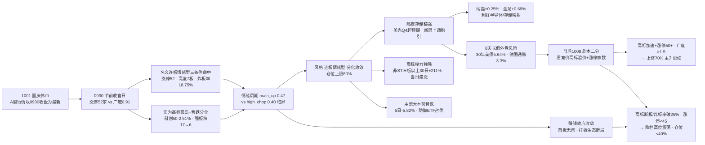

```yaml
date: 2026-10-01
agent: R1-style-analysis
skill_version: analyze_style_v1@1.0
generated_at: 2026-10-01T07:25:00+08:00
confidence: 0.66
degraded: true
data_sources:
  - name: tushare.ths_daily
    path: data/raw/20261001/style_snapshot.json
    status: ok
    captured_at: 2026-10-01T06:14:32
    record_count: 22
    error: null
  - name: tushare.fund_daily
    path: data/raw/20261001/style_snapshot.json
    status: ok
    captured_at: 2026-10-01T06:14:32
    record_count: 20
    error: null
  - name: tushare.limit_list_d
    path: MCP
    status: ok
    captured_at: null
    record_count: 73
    error: null
  - name: tushare.limit_step
    path: MCP
    status: ok
    captured_at: null
    record_count: 12
    error: null
  - name: tushare.index_daily
    path: MCP
    status: ok
    captured_at: null
    record_count: 8
    error: null
  - name: tushare.daily
    path: MCP
    status: ok
    captured_at: null
    record_count: 5561
    error: null
  - name: tushare.limit_cpt_list
    path: MCP
    status: ok
    captured_at: null
    record_count: 6
    error: null
  - name: tushare.index_global + us_daily
    path: data/raw/20261001/style_snapshot.json
    status: degraded
    captured_at: 2026-10-01T06:14:32
    record_count: 5
    error: "美股0929收盘·0930隔夜由news_cls补齐"
  - name: overseas_snapshot
    path: data/raw/20261001/overseas_snapshot.json
    status: degraded
    captured_at: 2026-10-01T06:02:14
    record_count: 19
    error: "FX缺失·商品skipped"
  - name: news_major + news_cls
    path: data/raw/20261001/
    status: ok
    captured_at: null
    record_count: 3673
    error: null
  - name: wechat_cli_5groups
    path: data/raw/20261001/wechat_cli_5groups.jsonl
    status: ok
    captured_at: 2026-10-01T06:01:00
    record_count: 334
    error: null
  - name: manifest.json / mcp_health.json
    path: data/raw/20261001/
    status: ok
    captured_at: 2026-10-01T06:00:59
    record_count: null
    error: null
  - name: 商品期货 / FX kline / SOX / HSTECH
    path: -
    status: error
    captured_at: null
    record_count: null
    error: fut_daily 代码未映射 · fx_daily 0 条 · SOX/HSTECH 无 kline
input_freshness: partial
input_freshness_note: 核心量化主源(ths/fund/limit/index/daily/cpt)以0930收盘为最新·非节假日滞后; 美股0930隔夜滞后1日由news_cls补齐(美光超预期/新思上调指引/金龙+0.69%); 商品期货与FX kline缺失; SOX/HSTECH无kline; 20261001为国庆节休市, A股行情以0930收盘为最新
```

# 2026年10月1日 · **风格研判**

> **数据源新鲜度**: partial（A股行情以 0930 收盘为最新 · 美股隔夜滞后 1 日由新闻侧补齐 · FX/SOX/HSTECH 缺失）
> **降级状态**: true
> **置信度**: 0.66

## 一句话结论

1001 是国庆长假的第一天，A股休市，市场的最新模样定格在 0930 那个节前收官日：涨停 52 家、跌停 9 家、炸板率 18.75%、连板高度 7 板、昨日涨停溢价 +1.32%——名义上硬命中「连板情绪型」三条件，但广度只有 0.91（跌多涨少）、科创50 暴跌 2.51%、强板块从 0929 的 17 个收缩到 6 个，真实结构是「高标孤岛 + 普跌分化」的高位震荡前兆。风格定格**连板情绪型（高标孤岛·分化收敛）**，情绪浓度 65（贪婪），建议仓位上限 **60%**——假期 8 天，外盘那点事（30 年美债 5.64%、德国通胀 3.3%、油价 103 美元）不在我们控制范围内，节后 1008 复市才是真正的大考。

## 详细分析

**一、节前收官日，市场把「主升修复」写成了「高标孤岛」。** 三天前（0929）那场退潮全面证伪的修复日，让所有人以为主升回来了——涨停 57 家、广度 1.80、8 条宽基全线收涨、强板块从 1 个炸到 17 个。0930 用一根「冰火两重天」的行情给修复日做了个注脚：涨停 52 家、连板高度 7 板（比 0929 的 6 板还高一级），高标接力簇继续暴赚（非 ST 三板以上 30 日 +211%、非 ST 二板 +99.9%）；但另一边，广度 0.91（2567 涨 vs 2824 跌，中位 -0.09%）、科创50 放量中阴 -2.51% 再失年线、强板块从 17 个收缩到 6 个、主流大本营簇 16 只 5 日 -5.82%——赚钱效应收敛到极少数高标手里。**大资金意图**：节前最后一天，主力没有撤退也没有加仓，而是把资金从普涨的池子里抽回高标和防御——银行 +1.43%、房地产盘中深V、煤炭 +0.88% 是防守资金的去处，7 板高标是激进资金最后的抱团；**为什么走强/走弱**：高标强是因为主升期「涨停就是龙头」的信仰还在，权重护盘（上证 +0.31%、上证50 +0.47%）是因为节前防守配置，科创50 大跌是因为科技 30 日高位回撤 + 节前兑现最重；**逻辑够不够硬**：名义连板情绪型三条件（52/7/18.75%）全部命中，但广度 0.91<1 和强板块腰斩说明这更像「高位震荡前兆」而非「全面点火」——节前收官日的本质是资金在做选择题，不是在做进攻。

**二、30 日六簇：高标还是那座金山，但金山周围开始结冰。** 对 22 个同花顺风格板块 + 20 只 ETF 做 30 日窗口层次聚类（6 簇、相关距离），最刺眼的依然是高标——非 ST 三板以上 30 日 +211.35%、非 ST 二板 +99.93%、打二板以上 +60.96%，三个高标指数各自独立成簇，是全场唯一亮着的灯。但注意细节：非 ST 三板以上当日只涨 0.01%（高位滞涨）、打首板 30 日仅 +3.9% 且当日 -0.1%（低位无肉）——打板生态从「自下而上接力」变成了「高位孤军」。主流大本营簇（16 只）30 日 -7.86%、5 日 -5.82%，同花顺热股 -20.66%、昨日成交前十 -20.2%、昨日高振幅 -20.17%——热度越高跌得越狠，追高即套。**为什么走强/走弱**：高标强是因为资金只在龙头上抱团，防御 ETF 强（银行 +6.36% 登顶、房地产 +5.43%）是因为节前避险资金配置，科技 ETF 弱（芯片华夏 -16.69%、有色 -16.14%、芯片 -15.81%、半导体 -15.64%、科创50 -14.41%）是因为 30 日高位回撤 + 科技情绪退潮；**逻辑够不够硬**：这个结构最危险的地方在于「高标独强 + 其余全弱」——历史上当主流大本营 5 日 -5.82% 而高标 +211% 时，要么低板跟上修复梯队，要么高标补跌拖垮全场。节后复市，前者需要广度回 1.5+，后者只需要高标断板一个导火索。

**三、隔夜外部：存储链送来一把火，债市通胀留着一条尾巴。** 0930 美股收盘涨跌不一——道指 -0.86%、标普 -0.25%、纳指 +0.25%。最亮的是存储链：美光 Q4 经调整营收 542.3 亿美元（预估 514.9 亿·大超预期）、EPS 33.42（预估 31.83）、毛利率 87%，管理层明确表示 2027-2028 存储供需将大幅收紧；新思科技把全年营收指引从 96.9-97.4 亿上调到 110-112 亿，还与亚马逊签了多年期超 10 亿美元的定制芯片协议；纳斯达克中国金龙指数 +0.69%。对 A 股映射最直接的是存储/半导体链——美光对 2027-28 供需收紧的表态，可能刺激节后存储设备、封测方向。但另一条尾巴同样粗：30 年期美债收益率 5.64%（全球债市单季表现创 2024 年以来最差）、德国 9 月通胀 3.3% 创近 3 年最高、布伦特原油 103.53 美元、黄金 9 月累计 -6.3%（冲高回落）——外部利率与通胀压力是长假期间最不可控的变量。摩根士丹利邢自强预计今年 12 月和明年 3 月各加息一次——加息的阴影在长假后第一个开盘日会重新变成现实的定价。

**四、KOL 的声音：节前兑现，节后期待。** 5 个焦点群 334 条消息全部可用，颜晓滨群 71 条。最真实的情绪在 Jason 身上：10:16「尚水智能，预计 11 点左右冲击涨停板，低位固态电池」，10:19「今天如果不涨停就出货」——这是节前最后一天高标持仓者的标准心态，涨了就兑现，不涨也兑现；14:32「大仓位一只票挣 20% 是努力，后面能不能翻倍都是缘分，大佬现在目标都降低了」——连最激进的游资都在降目标。古云 15:18「国庆节快乐，节后爆赚」代表了另一派：对节后抱有期待。题材上群内高度共识于电池链（固态电池/锂电/新能车）、深圳国资地产（深物业A 两连板·APEC 倒计时）、玻璃基板/碳化硅等科技高切低——「高位兑现 + 低位潜伏」并存，与量化「高标孤岛 + 普跌分化」完全共振。

**五、情绪周期与仓位纪律：主升的边，高位震荡的门。** 用 0930 真实指标重算情绪周期：溢价 +1.32%、炸板率 18.75%、高度 7 板、涨停 52 家，规则未硬命中（溢价 <+3%），插值 main_up 0.47 vs high_chop 0.40——从 0929 的 main_up 0.52 滑落，high_chop 从 0.29 升到 0.40，主升与高位震荡之间只差一层纸。情绪浓度四维 79.5（极贪）vs 五维 61（贪婪）差 18.5 超校验线，取贪婪 65：高标热度真实，但广度转负 + 强板块收缩 + 节前收官，给不到极贪。仓位上限取连板情绪型 band（0.60-0.80）下沿 0.60。剧本二分写死：节后（1008）复市，若高标竞价加速 + 涨停维持 50+、广度 >1.5，主升延续，可上修 70%；若高标断板 / 炸板率破 25% / 溢价转负，切换到高位震荡，降到 40% 以下——8 天长假里外盘利率、通胀、油价没有一样在我们控制范围内，空仓也是一种仓位。

### 推理深度三问（节前收官定格判定）

- **大资金意图**: 0930 节前收官日，主力资金做了三件事——把高标抱团抱到 7 板（非 ST 三板以上 +211%），把避险资金放进银行/地产/煤炭（银行 ETF 当日 +1.43%、房地产深V），把科技高位筹码兑现（科创50 -2.51%、强板块 17→6）。这是「防守 + 抱团」的组合，不是进攻。节后 1008 的胜负手是：高标竞价能否延续 + 涨停家数能否维持 50+，若能说明节前资金敢扛长假风险做多节后，若不能说明节前抱团只是收官日的最后狂欢。
- **为什么走强 / 走弱**: 走强的理由全是「抱团 + 防守 + 隔夜利好」——高标抱团（7 板新华传媒·非ST二板 +4.65%）、防御配置（银行/地产/煤炭）、存储链超预期（美光 Q4 大超预期 + 新思上调指引 + 金龙 +0.69%）；走弱的风险也没消失——广度 0.91 普跌、科创50 -2.51% 放量中阴、强板块 17→6 收缩、主流大本营 5 日 -5.82%、外盘 30 年美债 5.64% + 德国通胀 3.3% + 油价 103。隔夜利好决定节后开盘溢价，高标与广度决定开盘后的方向。
- **逻辑够不够硬**: 「高标孤岛 + 分化收敛」至少三重确认——量化（广度 0.91/科创50 -2.51%/强板块 17→6/主流大本营 5 日 -5.82% vs 高标 +211%）、KOL（「今天不涨停就出货」/「目标降低了」/「节后爆赚」）、外盘（存储链超预期 vs 债市通胀尾部）。风格定格连板情绪型但压仓 60%（节前收官 + 高标滞涨 + 外盘不可控）。证伪路径清晰：高标延续 + 涨停 50+ → 上修 70%；高标断板 / 涨停 <45 → 40% 以下 / 空仓。



## 关键证据

- 证据 1：A股行情口径——0930 收盘为最新（20261001 为国庆节休市，下一个交易日 1008）；0930 为国庆长假前最后 1 个交易日，本产出为「节前定格 + 节后展望」口径 · 来源 tushare.index_daily + trade_cal
- 证据 2：涨停 52 / 跌停 9 / 炸板率 18.75%（较 0929 的 57/10/12.31%：涨停 -5、跌停 -1、炸板率 +6.4pct 但仍 <20% 健康线）· 来源 tushare.limit_list_d
- 证据 3：连板天梯 7 板 1 只 / 4 板 1 只 / 3 板 4 只 / 2 板 6 只，高度较 0929 的 6 板再升 1 级至 7 板，但 5/6 板梯队断层 · 来源 tushare.limit_step
- 证据 4：昨日涨停溢价 +1.32%（0929 池 57 只 0930 平均 +1.32%，较 +2.64% 回落但仍为正）· 来源 tushare.daily 重算
- 证据 5：广度 0.91（涨 2567 < 跌 2824），中位 -0.09% 转负，≥9.9% 涨停 74 只、≤-5% 131 只、≤-9.9% 19 只——普跌分化开始，亏钱效应在节前收官日抬头 · 来源 tushare.daily 全市场 5561 只
- 证据 6：8 大宽基分化——上证 +0.31% / 上证50 +0.47% / 沪深300 +0.29% 收涨 vs 科创50 -2.51% 放量中阴再失年线 / 中证1000 -0.36% / 创业板 -0.23% · 来源 tushare.index_daily
- 证据 7：30 日 6 簇——高标接力三独立簇（非ST三板以上 +211.35% 当日 +0.01% / 非ST二板 +99.93% 当日 +4.65% / 打二板以上 +60.96% 当日 +3.33%）、创历史新高独立簇（-3.82% 当日 +2.47%）、次新+资金前十簇 2 只（-4.6%）、主流大本营簇 16 只（-7.86% 当日 -0.56% · 5日 -5.82%）· 来源 ths_daily + fund_daily 层次聚类
- 证据 8：ETF 银行 30 日 +6.36% 登顶（当日 +1.43%）、房地产 +5.43%、煤炭 -1.02%、消费 -1.94%、医药 -3.24% 相对抗跌；芯片华夏 -16.69% / 有色 -16.14% / 芯片 -15.81% / 半导体 -15.64% / 科创50 -14.41% 垫底 · 来源 tushare.fund_daily
- 证据 9：主线代理 6 个强板块（较 0929 的 17 个收缩 59%）：新能源汽车 10 / 一带一路 9 / 储能 9 / 专精特新 9 / 风电 8 / 人工智能 8 · 来源 tushare.limit_cpt_list
- 证据 10：外盘美股 0929 收盘——标普 -0.17% / 纳指 -0.09%（5 日 -1.21%/-1.64%）；亚太 0930：恒指 +0.37% / 韩国 -0.48% / 日经 +1.94% · 来源 index_global + us_daily + overseas_snapshot
- 证据 11：隔夜美股 0930——道指 -0.86% / 标普 -0.25% / 纳指 +0.25%；美光 Q4 大超预期（营收 542.3 亿 vs 预估 514.9 亿 · EPS 33.42 vs 31.83 · 毛利率 87% · 2027-28 存储供需大幅收紧）；新思科技上调全年指引至 110-112 亿 + 与亚马逊签 10 亿美元定制芯片协议；金龙指数 +0.69% · 来源 news_major + news_cls
- 证据 12：宏观——黄金 9 月 -6.3% 至 4159 美元 / 白银 9 月 -9.3%；布伦特 103.53（+0.92%）；美元指数 101.45；德国 9 月通胀 3.3%（近 3 年最高）；30 年期美债 5.64%（全球债市单季最差）· 来源 news_cls
- 证据 13：KOL 5/5 群全可用（334 条，颜晓滨群 71 条，0930 盘中盘后）——Jason「今天不涨停就出货」「大仓位一只票挣 20% 是努力」、古云「国庆节快乐，节后爆赚」；题材共识：电池链 / 深圳国资地产 / 玻璃基板 / 碳化硅高切低 · 来源 wechat_cli_5groups

## 数据源审计

| 源 | 日期 | 状态 | 备注 |
|---|---|:--:|---|
| tushare.ths_daily（22 风格板块） | 2026-09-30 | 🟢 | 22 只 · 30 日窗口 |
| tushare.fund_daily（20 ETF） | 2026-09-30 | 🟢 | 20 只 · 30 日窗口 |
| tushare.limit_list_d | 2026-09-30 | 🟢 | 涨停 52 / 跌停 9 / 炸板率 18.75% |
| tushare.limit_step | 2026-09-30 | 🟢 | 连板 7 板（新华传媒 · 5/6 板断层） |
| tushare.index_daily | 2026-09-30 | 🟢 | 8 宽基分化（上证 +0.31% / 科创50 -2.51%） |
| tushare.daily | 2026-09-30 | 🟢 | 5561 只全市场分布 · 广度 0.91 |
| tushare.limit_cpt_list | 2026-09-30 | 🟢 | 6 强板块代理（较 0929 的 17 个收缩） |
| tushare.index_global + us_daily | 2026-09-29 | 🟡 | 美股 0929 收盘 · 0930 隔夜由 news_cls 补齐 |
| overseas_snapshot | 2026-09-29~30 | 🟡 | 美股 0929 / 亚太 0930 · FX 缺失 · 商品 skipped |
| news_major + news_cls | 2026-09-30~10-01 | 🟢 | 3673 条 · 美光超预期 / 新思上调 / 金龙 +0.69% |
| wechat_cli_5groups | 2026-09-30 | 🟢 | 334 条 · 5 焦点群（匿名）· 高标兑现 + 节后期待 |
| manifest / mcp_health | 2026-10-01 | 🟡 | global_severity=2 · weflow/qmt down · 公众号 sanji disabled |
| 商品期货 / FX kline / SOX / HSTECH | - | 🔴 | fut_daily 代码未映射 · fx_daily 0 条 · SOX/HSTECH 无 kline |

## 不确定性 / 反证

必须诚实承认几处薄弱：其一，**20261001 是国庆休市日，本产出是「节前定格 + 节后展望」而非当日盘中**——所有 A 股指标都定格在 0930 收盘，节后 1008 复市时这些数字已经过了 8 天长假，外盘（30 年美债 5.64%、德国通胀 3.3%、油价 103 美元、加息预期）的任何变化都会重写开盘映射，本判断的时效性边界到 1008 竞价为止；其二，**名义「连板情绪型」与实况「高标孤岛 + 普跌分化」的偏差**——三条件（52/7/18.75%）硬命中，但广度 0.91<1、科创50 -2.51%、强板块 17→6，若节后高标断板，名义风格会被迅速证伪为高位震荡甚至主跌前兆，这需要 P1 竞价校准；其三，**情绪周期 main_up 0.47 vs high_chop 0.40 仅差 0.07**——主升与高位震荡之间只有一层纸，炸板率 18.75% 距 25% 分歧线一步之遥，溢价 +1.32% 距 +3% 硬命中线很远，节后任何一个指标恶化都会触发降档；其四，**情绪浓度四维 79.5（极贪）vs 五维 61（贪婪）差 18.5 超校验线**，我取贪婪 65 并压仓 60%，但如果节后高标竞价加速、涨停维持 50+、广度回 1.5+，说明节前资金真的敢持股过节，65 反而低估了市场热度——这是一个主动的折让，不是数据自信；其五，**高标获利盘极端丰厚**（非 ST 三板以上 30 日 +211%·当日已滞涨 +0.01%），Jason「今天不涨停就出货」已是高位兑现的实况，节后若高标与普跌共振，回撤会比平时更剧烈；其六，**外盘美股 5 日转负**（纳指 5 日 -1.64%）与 8 天长假意味着持股过节是押注长假期间外盘平稳——这是任何 A 股盘前分析都无法对冲的风险，空仓过节同样是最优解之一。

## 与其他 R/D/E 的关系

- 依赖：data/raw/20261001/manifest.json、mcp_health.json、style_snapshot.json（本次生成：22 风格板块 + 20 ETF + 外盘）、news_major/news_cls、wechat_cli_5groups、overseas_snapshot；data/research/20261001/emotion_cycle.json（预计算 main_up conf0.49，已用真实指标重算 main_up conf0.47 校验方向一致但临界）
- 输出被消费：R2（style / main_lines_count / position_cap_suggestion）、R3（sentiment_score 基准）、R6（一致性反证）、D1（position_cap_suggestion → 总仓上限；1001 仓位上限 0.60，节后剧本二分：高标延续上修 0.70 / 高标断板降至 0.40 以下或空仓）

## Sub-Agent 元数据

- skill: analyze_style_v1
- artifact: data/research/20261001/R1_style.json
- 生成耗时: 约 25 分钟（含 style_snapshot 抓取 + 聚类 + 校验 + 散文渲染）
- model: deepseek-v4-flash-ga-260731
